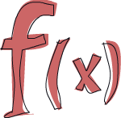

# 简介

## 关于这份教学

欢迎来到 *Haskell 趣学指南*！会想看这篇文章表示你对学习 Haskell 有很大的兴趣。你来对地方了，来让我简单介绍一下这个教学。

撰写这份教学，一方面是让我自己对 Haskell 更熟练，另一方面是希望能够分享我的学习经验，帮助初学者更快进入状况。网路上已经有无数 Haskell 的教学文件，在我学习的过程中，我并不限于只参考一份来源。我常常阅读不同的教学文章，他们每个都从不同的角度出发。参考这些资源让我能将知识化整为零。这份教学是希望提供更多的机会能让你找到你想要得到的解答。

这份教学主要针对已经有使用命令式程式语言 (imperative programming languages) 写程式经验 (C, C++, Java, Python …) 、却未曾接触过函数式程式语言 (functional programming languages) (Haskell, ML, OCaml …) 的读者。就算没有写程式经验也没关系，会想学 Haskell 的人我相信都是很聪明的。

若在学习中遇到什么地方不懂的，Freenode IRC 上的 #Haskell 频道是提问的绝佳去处。那里的人都很友善，有耐心且能体谅初学者。
(译注： Stackoverflow 上的 #haskell tag 也有很多 Haskell 神人们耐心地回答问题，提供给不习惯用 IRC 的人的另一个选择。)

我经历了不少挫折才学会 Haskell，在初学的时候它看起来是如此奇怪的语言。但有一天我突然开窍了，之后的学习便如鱼得水。我想要表达的是：尽管 Haskell 乍看下如此地诡异，但假如你对程式设计十分有兴趣，他非常值得你学习。学习 Haskell 让你想起你第一次写程式的感觉。非常有趣，而且强迫你 Think different。

## 什么是 Haskell？

Haskell 是一门*纯粹函数式程式语言 (purely functional programming language)*。在命令式语言中执行操作需要给电脑安排一组命令，随着命令的执行，状态就会随之发生改变。例如你指派变数 ``a`` 的值为 5，而随后做了其它一些事情之后 a 就可能变成的其它值。有控制流程 (control flow)，你就可以重复执行操作。然而在纯粹函数式程式语言中，你不是像命令式语言那样命令电脑“要做什么”，而是通过用函数来描述出问题“是什么”，如“_阶乘是指从1到某个数的乘积_”，"一个串列中数字的和"是指把第一个数字跟剩余数字的和相加。你用宣告函数是什么的形式来写程式。另外，变数 (variable) 一旦被指定，就不可以更改了，你已经说了 ``a`` 就是 5，就不能再另说 a 是别的什么数。（译注：其实用 variable 来表达造成字义的 overloading，会让人联想到 imperative languages 中 variable 是代表状态，但在 functional languages 中 variable 是相近于数学中使用的 variable。``x=5`` 代表 ``x`` 就是 5，不是说 ``x`` 在 5 这个状态。) 所以说，在纯粹函数式程式语言中的函数能做的唯一事情就是利用引数计算结果，不会产生所谓的"副作用 (side effect)" (译注：也就是改变非函数内部的状态，像是 imperative languages 里面动到 global variable 就是 side effect)。一开始会觉得这限制很大，不过这也是他的优点所在：若以同样的参数呼叫同一个函数两次，得到的结果一定是相同。这被称作“_引用透明 (Referential Transparency)_” (译注：这就跟数学上函数的使用一样)。如此一来编译器就可以理解程式的行为，你也很容易就能验证一个函数的正确性，继而可以将一些简单的函数组合成更复杂的函数。

Haskell 是*惰性 (lazy)* 的。也就是说若非特殊指明，函数在真正需要结果以前不会被求值。再加上引用透明，你就可以把程式仅看作是数据的一系列变形。如此一来就有了很多有趣的特性，如无限长度的资料结构。假设你有一个 List: ``xs = [1,2,3,4,5,6,7,8]``，还有一个函数 ``doubleMe``，它可以将一个 List 中的所有元素都乘以二，返回一个新的 List。若是在命令式语言中，把一个 List 乘以 8，执行 ``doubleMe(doubleMe(doubleMe(xs)))``，得遍历三遍 ``xs`` 才会得到结果。而在惰性语言中，调用 ``doubleMe`` 时并不会立即求值，它会说“嗯嗯，待会儿再做！”。不过一旦要看结果，第一个 ``doubleMe`` 就会对第二个说“给我结果，快！”第二个 ``doubleMe`` 就会把同样的话传给第三个 ``doubleMe``，第三个 ``doubleMe`` 只能将 1 乘以 2 得 2 后交给第二个，第二个再乘以 2 得 4 交给第一个，最终得到第一个元素 8。也就是说，这一切只需要遍历一次 list 即可，而且仅在你真正需要结果时才会执行。惰性语言中的计算只是一组初始数据和变换公式。

Haskell 是*静态类型 (statically typed)* 的。当你编译程式时，编译器需要明确哪个是数字，哪个是字串。这就意味着很大一部分错误都可以在编译时被发现，若试图将一个数字和字串相加，编译器就会报错。Haskell 拥有一套强大的类型系统，支持自动类型推导 (type inference)。这一来你就不需要在每段程式码上都标明它的类型，像计算 ``a=5+4``，你就不需另告诉编译器“ a 是一个数值”，它可以自己推导出来。类型推导可以让你的程式更加简练。假设有个函数是将两个数值相加，你不需要声明其类型，这个函数可以对一切可以相加的值进行计算。

Haskell 采纳了很多高阶程式语言的概念，因而它的程式码*优雅且简练*。与同层次的命令式语言相比，Haskell 的程式码往往会更短，更短就意味着更容易理解，bug 也就更少。

Haskell 这语言是一群非常聪明的人设计的 (他们每个人都有 PhD 学位)。最初的工作始于 1987 年，一群学者聚在一起想设计一个屌到爆的程式语言。到了 2003 年，他们公开了 Haskell Report，这份报告描述了 Haskell 语言的一个稳定版本。(译注：这份报告是 Haskell 98 标准的修订版，Haskell 98 是在 1999 年公开的，是目前 Haskell 各个编译器实现预设支援的标准。在 2010 年又公开了另一份 Haskell 2010 标准，详情可见穆信成老师所撰写的[http://www.iis.sinica.edu.tw/~scm/ncs/2010/07/haskell-2010-report/ 简介]。

##  你需要些什么来使用 Haskell 呢？

一句话版本的答案：一个编辑器和一个编译器。我们不会对编辑器多加着墨，你可以用你喜欢的编辑器。至于编译器，在这份教学中我们会使用目前最流行的版本：GHC。而安装 GHC 最方便的方法就是去下载 Haskell Platform，他包含了许多现成 Runtime Library 让你方便写程式。(译注：Ubuntu 的使用者有现成的套件可以使用，可以直接 ``apt-get install Haskell-platform`` 来安装。但套件的版本有可能比较旧。)

GHC 可以解释执行 Haskell Script （通常是以 ``.hs`` 作为结尾），也可以编译。它还有个互动模式，你可以在里面呼叫 Script 里定义的函数，即时得到结果。 对于学习而言，这比每次修改都编译执行要方便的多。想进入互动模式，只要打开控制台输入 ``ghci`` 即可。假设你在 ``myfunctions.hs`` 里定义了一些函数，在 ghci 中输入 ``:l myfunctions.hs``，ghci 便会载入 ``myfunctions.hs``。之后你便可以呼叫你定义的函数。一旦修改了这个 ``.hs`` 档案的内容，再次执行 ``:l myfunctions.hs`` 或者相同作用的 ``:r`` ，都可以重新载入该档案。我自己通常就是在 ``.hs`` 档案中定义几个函数，再到 ghci 载入，呼叫看看，再修改再重新载入。这也正是我们往后的基本流程。

