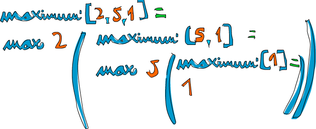

# 递归

## 你好，递归！


前面的章节中我们简要谈了一下递归。而在本章，我们会深入地了解到它为何在 Haskell 中是如此重要，能够以递归思想写出简洁优雅的代码。 

如果你还不知道什么是递归，就读这个句子。哈哈！开个玩笑而已！递归实际上是定义函数以调用自身的方式。在数学定义中，递归随处可见，如斐波那契数列 （fibonacci）。它先是定义两个非递归的数：``F(0)=0,F(1)=1``，表示斐波那契数列的前两个数为 0 和 1。然后就是对其他自然数，其斐波那契数就是它前面两个数字的和，即 ``F(N)=F(N-1)+F(N-2)``。这样一来，``F(3)`` 就是 ``F(2)+F(1)``，进一步便是 ``(F(1)+F(0))+F(1)``。已经下探到了前面定义的非递归斐波那契数，可以放心地说 ``F(3)`` 就是 2 了。在递归定义中声明的一两个非递归的值（如 ``F(0)`` 和 ``F(1)``） 也可以称作*边界条件*，这对递归函数的正确求值至关重要。要是前面没有定义 ``F(0)`` 和 ``F(1)`` 的话，它下探到 0 之后就会进一步到负数，你就永远都得不到结果了。一不留神它就算到了 ``F(-2000)=F(-2001)+F(-2002)``，并且永远都算不到头！ 

递归在 Haskell 中非常重要。命令式语言要求你提供求解的步骤，Haskell 则倾向于让你提供问题的描述。这便是 Haskell 没有 ``while`` 或 ``for`` 循环的原因，递归是我们的替代方案。


## 实作 Maximum

``maximum`` 函数取一组可排序的 List（属于 Ord Typeclass） 做参数，并回传其中的最大值。想想，在命令式风格中这一函数该怎么实现。很可能你会设一个变量来存储当前的最大值，然后用循环遍历该 List，若存在比这个值更大的元素，则修改变量为这一元素的值。到最后，变量的值就是运算结果。唔！描述如此简单的算法还颇费了点口舌呢！

现在看看递归的思路是如何：我们先定下一个边界条件，即处理单个元素的 List 时，回传该元素。如果该 List 的头部大于尾部的最大值，我们就可以假定较长的 List 的最大值就是它的头部。而尾部若存在比它更大的元素，它就是尾部的最大值。就这么简单！现在，我们在 Haskell 中实现它

```haskell
maximum' :: (Ord a) => [a] -> a  
maximum' [] = error "maximum of empty list"  
maximum' [x] = x  
maximum' (x:xs)   
    | x > maxTail = x  
    | otherwise = maxTail  
    where maxTail = maximum' xs
```

如你所见，模式匹配与递归简直就是天造地设！大多数命令式语言中都没有模式匹配，于是你就得造一堆 if-else 来测试边界条件。而在这里，我们仅需要使用模式将其表示出来。第一个模式说，如果该 List 为空，崩溃！就该这样，一个空 List 的最大值能是啥？我不知道。第二个模式也表示一个边缘条件，它说， 如果这个 List 仅包含单个元素，就回传该元素的值。

现在是第三个模式，执行动作的地方。 通过模式匹配，可以取得一个 List 的头部和尾部。这在使用递归处理 List 时是十分常见的。出于习惯，我们用个 ``where`` 语句来表示 ``maxTail`` 作为该 List 中尾部的最大值，然后检查头部是否大于尾部的最大值。若是，回传头部；若非，回传尾部的最大值。

我们取个 List ``[2,5,1]`` 做例子来看看它的工作原理。当调用 ``maximum'`` 处理它时，前两个模式不会被匹配，而第三个模式匹配了它并将其分为 ``2`` 与 ``[5,1]``。 ``where`` 子句再取 ``[5,1]`` 的最大值。于是再次与第三个模式匹配，并将 ``[5,1]`` 分割为 ``5`` 和 ``[1]``。继续，``where`` 子句取 ``[1]`` 的最大值，这时终于到了边缘条件！回传 ``1``。进一步，将 ``5`` 与 ``[1]`` 中的最大值做比较，易得 ``5``，现在我们就得到了 ``[5,1]`` 的最大值。再进一步，将 ``2`` 与 ``[5,1]`` 中的最大值相比较，可得 ``5`` 更大，最终得 ``5``。

改用 ``max`` 函数会使代码更加清晰。如果你还记得，``max`` 函数取两个值做参数并回传其中较大的值。如下便是用 ``max`` 函数重写的 ``maximun'``

```haskell
maximum' :: (Ord a) => [a] -> a  
maximum' [] = error "maximum of empty list"  
maximum' [x] = x  
maximum' (x:xs) = max x (maximum' xs)  
```

太漂亮了！一个 List 的最大值就是它的首个元素与它尾部中最大值相比较所得的结果，简明扼要。




## 来看几个递归函数

现在我们已经了解了递归的思路,接下来就使用递归来实现几个函数. 先实现下 ``replicate`` 函数, 它取一个 ``Int`` 值和一个元素做参数, 回传一个包含多个重复元素的 List, 如 ``replicate 3 5`` 回传 ``[5,5,5]``. 考虑一下, 我觉得它的边界条件应该是负数. 如果要 ``replicate`` 重复某元素零次, 那就是空 List. 负数也是同样, 不靠谱.

```haskell
replicate' :: (Num i, Ord i) => i -> a -> [a]  
replicate' n x  
    | n <= 0    = []  
    | otherwise = x:replicate' (n-1) x
```

在这里我们使用了 guard 而非模式匹配, 是因为这里做的是布林判断. 如果 ``n`` 小于 0 就回传一个空 List, 否则, 回传以 ``x`` 作首个元素并后接重复 ``n-1`` 次 ``x`` 的 List. 最后, ``(n-1)`` 的那部分就会令函数抵达边缘条件.

    *Note*: Num 不是 Ord 的子集, 表示数字不一定得拘泥于排序, 这就是在做加减法比较时要将 Num 与 Ord 型别约束区别开来的原因.

接下来实现 ``take`` 函数, 它可以从一个 List 取出一定数量的元素. 如 ``take 3 [5,4,3,2,1]``, 得 ``[5,4,3]``. 若要取零或负数个的话就会得到一个空 List. 同样, 若是从一个空 List中取值, 它会得到一个空 List. 注意, 这儿有两个边界条件, 写出来:

```haskell
take' :: (Num i, Ord i) => i -> [a] -> [a]  
take' n _  
    | n <= 0   = []  
take' _ []     = []  
take' n (x:xs) = x : take' (n-1) xs 
```


首个模式辨认若为 0 或负数, 回传空 List. 同时注意这里用了一个 guard 却没有指定 ``otherwise`` 部分, 这就表示 ``n`` 若大于 0, 会转入下一模式. 第二个模式指明了若试图从一个空 List 中取值, 则回传空 List. 第三个模式将 List 分割为头部和尾部, 然后表明从一个 List 中取多个元素等同于令 ``x`` 作头部后接从尾部取 ``n-1`` 个元素所得的 List. 假如我们要从 ``[4,3,2,1]`` 中取 3 个元素, 试着从纸上写出它的推导过程

``reverse`` 函数简单地反转一个 List, 动脑筋想一下它的边界条件! 该怎样呢? 想想...是空 List! 空 List 的反转结果还是它自己. Okay, 接下来该怎么办? 好的, 你猜的出来. 若将一个 List 分割为头部与尾部, 那它反转的结果就是反转后的尾部与头部相连所得的 List. 

```haskell
reverse' :: [a] -> [a]  
reverse' [] = []  
reverse' (x:xs) = reverse' xs ++ [x]  
```

继续下去!

Haskell 支持无限 List，所以我们的递归就不必添加边界条件。这样一来，它可以对某值计算个没完, 也可以产生一个无限的数据结构，如无限 List。而无限 List 的好处就在于我们可以在任意位置将它断开. 

``repeat`` 函数取一个元素作参数, 回传一个仅包含该元素的无限 List. 它的递归实现简单的很, 看:

```haskell
repeat' :: a -> [a]  
repeat' x = x:repeat' x  
```

调用 ``repeat 3`` 会得到一个以 3 为头部并无限数量的 3 为尾部的 List, 可以说 ``repeat 3`` 运行起来就是 ``3:repeat 3`` , 然后 ``3:3:3:3`` 等等. 若执行 ``repeat 3``, 那它的运算永远都不会停止。而 ``take 5 (repeat 3)`` 就可以得到 5 个 3, 与 ``replicate 5 3`` 差不多.

``zip`` 取两个 List 作参数并将其捆在一起。``zip [1,2,3] [2,3]`` 回传 ``[(1,2),(2,3)]``, 它会把较长的 List 从中间断开, 以匹配较短的 List. 用 ``zip`` 处理一个 List 与空 List 又会怎样? 嗯, 会得一个空 List, 这便是我们的限制条件, 由于 ``zip`` 取两个参数, 所以要有两个边缘条件

```haskell
zip' :: [a] -> [b] -> [(a,b)]  
zip' _ [] = []  
zip' [] _ = []  
zip' (x:xs) (y:ys) = (x,y):zip' xs ys  
```

前两个模式表示两个 List 中若存在空 List, 则回传空 List. 第三个模式表示将两个 List 捆绑的行为, 即将其头部配对并后跟捆绑的尾部. 用 ``zip`` 处理 ``[1,2,3]`` 与 ``['a','b']`` 的话, 就会在 ``[3]`` 与 ``[]`` 时触及边界条件, 得到 ``(1,'a'):(2,'b'):[]`` 的结果,与 ``[(1,'a'),(2,'b')]`` 等价.

再实现一个标准库函数 -- ``elem``! 它取一个元素与一个 List 作参数, 并检测该元素是否包含于此 List. 而边缘条件就与大多数情况相同, 空 List. 大家都知道空 List 中不包含任何元素, 便不必再做任何判断

```haskell
elem' :: (Eq a) => a -> [a] -> Bool  
elem' a [] = False  
elem' a (x:xs)  
    | a == x    = True  
    | otherwise = a `elem'` xs   
```

这很简单明了。若头部不是该元素, 就检测尾部, 若为空 List 就回传 ``False``.
 
##  "快速"排序 


假定我们有一个可排序的 List, 其中元素的型别为 Ord Typeclass 的成员. 现在我们要给它排序! 有个排序算法非常的酷, 就是快速排序 (quick sort), 睿智的排序方法. 尽管它在命令式语言中也不过 10 行, 但在 Haskell 下边要更短, 更漂亮, 俨然已经成了 Haskell 的招牌了. 嗯, 我们在这里也实现一下. 或许会显得很俗气, 因为每个人都用它来展示 Haskell 究竟有多优雅!

它的型别声明应为 ``quicksort :: (Ord a) => [a] -> [a]``, 没啥奇怪的. 边界条件呢? 如料，空 List。排过序的空 List 还是空 List。接下来便是算法的定义：*排过序的 List 就是令所有小于等于头部的元素在先(它们已经排过了序), 后跟大于头部的元素(它们同样已经拍过了序)*。 注意定义中有两次排序，所以就得递归两次！同时也需要注意算法定义的动词为"是"什么而非"做"这个, "做"那个, 再"做"那个...这便是函数式编程之美！如何才能从 List 中取得比头部小的那些元素呢？List Comprehension。好，动手写出这个函数！

```haskell
quicksort :: (Ord a) => [a] -> [a]  
quicksort [] = []  
quicksort (x:xs) =  
  let smallerSorted = quicksort [a | a <- xs, a <= x] 
      biggerSorted = quicksort [a | a <- xs, a > x]  
  in smallerSorted ++ [x] ++ biggerSorted  
```

小小的测试一下, 看看结果是否正确~

```haskell
ghci> quicksort [10,2,5,3,1,6,7,4,2,3,4,8,9]  
[1,2,2,3,3,4,4,5,6,7,8,9,10]  
ghci> quicksort "the quick brown fox jumps over the lazy dog"  
" abcdeeefghhijklmnoooopqrrsttuuvwxyz"  
```

booyah! 如我所说的一样! 若给 ``[5,1,9,4,6,7,3]`` 排序，这个算法就会取出它的头部，即 5。 将其置于分别比它大和比它小的两个 List 中间，得 ``[1,4,3] ++ [5] ++ [9,6,7]``, 我们便知道了当排序结束之时，5会在第四位，因为有3个数比它小每，也有三个数比它大。好的，接着排 ``[1,4,3]`` 与 ``[9,6,7]``, 结果就出来了！对它们的排序也是使用同样的函数，将它们分成许多小块，最终到达临界条件，即空 List 经排序依然为空，有个插图：

橙色的部分表示已定位并不再移动的元素。从左到右看，便是一个排过序的 List。在这里我们将所有元素与 ``head`` 作比较，而实际上就快速排序算法而言，选择任意元素都是可以的。被选择的元素就被称作锚 （``pivot``），以方便模式匹配。小于锚的元素都在浅绿的部分，大于锚都在深绿部分，这个黄黄的坡就表示了快速排序的执行方式：


## 用递归来思考

我们已经写了不少递归了，也许你已经发觉了其中的固定模式：先定义一个边界条件，再定义个函数，让它从一堆元素中取一个并做点事情后，把余下的元素重新交给这个函数。 这一模式对 List、Tree 等数据结构都是适用的。例如，``sum`` 函数就是一个 List 头部与其尾部的 ``sum`` 的和。一个 List 的积便是该 List 的头与其尾部的积相乘的积，一个 List 的长度就是 1 与其尾部长度的和. 等等


再者就是边界条件。一般而言，边界条件就是为避免进程出错而设置的保护措施，处理 List 时的边界条件大部分都是空 List，而处理 Tree 时的边界条件就是没有子元素的节点。

处理数字时也与之相似。函数一般都得接受一个值并修改它。早些时候我们编写过一个计算 Factorial 的函数，它便是某数与它减一的 Factorial 数的积。让它乘以零就不行了， Factorial 数又都是非负数，边界条件便可以定为 1，即乘法的单比特。 因为任何数乘以 1 的结果还是这个数。而在 ``sum`` 中，加法的单比特就是 0。在快速排序中，边界条件和单比特都是空 List，因为任一 List 与空 List 相加的结果依然是原 List。

使用递归来解决问题时应当先考虑递归会在什么样的条件下不可用, 然后再找出它的边界条件和单比特, 考虑参数应该在何时切开(如对 List 使用模式匹配), 以及在何处执行递归.

