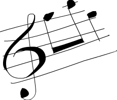

# 高阶函数


Haskell 中的函数可以接受函数作为参数也可以返回函数作为结果，这样的函数就被称作高阶函数。高阶函数可不只是某简单特性而已，它贯穿于 Haskell 的方方面面。要拒绝循环与状态的改变而通过定义问题"是什么"来解决问题，高阶函数必不可少。它们是编码的得力工具。

## Curried functions

本质上，Haskell 的所有函数都只有一个参数，那么我们先前编那么多含有多个参数的函数又是怎么回事? 呵，小伎俩! 所有多个参数的函数都是 Curried functions。 什么意思呢? 取一个例子最好理解，就拿我们的好朋友 ``max`` 函数说事吧。它看起来像是取两个参数，回传较大的那个数。 实际上，执行 ``max 4 5`` 时，它会首先回传一个取一个参数的函数，其回传值不是 4 就是该参数，取决于谁大。 然后，以 5 为参数调用它，并取得最终结果。 这听着挺绕口的，不过这一概念十分的酷! 如下的两个调用是等价的：

```haskell
ghci> max 4 5
5
ghci> (max 4) 5
5
```


把空格放到两个东西之间，称作*函数调用*。它有点像个运算符，并拥有最高的优先级。 看看 ``max`` 函数的型别: ``max :: (Ord a) => a -> a -> a``。 也可以写作: ``max :: (Ord a) => a -> (a -> a)``。 可以读作 ``max`` 取一个参数 ``a``，并回传一个函数(就是那个 ``->``)，这个函数取一个 ``a`` 型别的参数，回传一个a。 这便是为何只用箭头来分隔参数和回传值型别。

这样的好处又是如何? 简言之，我们若以不全的参数来调用某函数，就可以得到一个*不全调用*的函数。 如果你高兴，构造新函数就可以如此便捷，将其传给另一个函数也是同样方便。

看下这个函数，简单至极:

```haskell
multThree :: (Num a) => a -> a -> a -> a
multThree x y z = x * y * z
```

我们若执行 ``mulThree 3 5 9`` 或 ``((mulThree 3) 5) 9``，它背后是如何运作呢？ 首先，按照空格分隔，把 ``3`` 交给 ``mulThree``。 这回传一个回传函数的函数。 然后把 ``5`` 交给它，回传一个取一个参数并使之乘以 ``15`` 的函数。 最后把 ``9`` 交给这一函数，回传 ``135``。 想想，这个函数的型别也可以写作 ``multThree :: (Num a) => a -> (a -> (a -> a))``，``->`` 前面的东西就是函数取的参数，后面的东西就是其回传值。所以说，我们的函数取一个 ``a``，并回传一个型别为 ``(Num a) => a -> (a -> a)`` 的函数，类似，这一函数回传一个取一个 ``a``，回传一个型别为 ``(Num a) => a -> a`` 的函数。 而最后的这个函数就只取一个 ``a`` 并回传一个 ``a``，如下:

```haskell
ghci> let multTwoWithNine = multThree 9
ghci> multTwoWithNine 2 3
54
ghci> let multWithEighteen = multTwoWithNine 2
ghci> multWithEighteen 10
180
```

前面提到，以不全的参数调用函数可以方便地创造新的函数。例如，搞个取一数与 100 比较大小的函数该如何? 大可这样:

```haskell
compareWithHundred :: (Num a, Ord a) => a -> Ordering
compareWithHundred x = compare 100 x
```

用 99 调用它，就可以得到一个 ``GT``。 简单。 注意下在等号两边都有 ``x``。 想想 ``compare 100`` 会回传什么？一个取一数与 100 比较的函数。 Wow，这不正是我们想要的? 这样重写:

```haskell
compareWithHundred :: (Num a, Ord a) => a -> Ordering
compareWithHundred = compare 100
```

型别声明依然相同，因为 ``compare 100`` 回传函数。``compare`` 的型别为 ``(Ord a) => a -> (a -> Ordering)``，用 100 调用它后回传的函数型别为 ``(Num a, Ord a) => a -> Ordering``，同时由于 100 还是 ``Num`` 型别类的实例，所以还得另留一个类约束。

Yo! 你得保证已经弄明白了 Curried functions 与不全调用的原理，它们很重要！

中缀函数也可以不全调用，用括号把它和一边的参数括在一起就行了。 这回传一个取一参数并将其补到缺少的那一端的函数。 一个简单函数如下:

```haskell
divideByTen :: (Floating a) => a -> a
divideByTen = (/10)
```

调用 ``divideByTen 200`` 就是 ``(/10) 200``，和 ``200 / 10`` 等价。 

一个检查字符是否为大写的函数:

```haskell
isUpperAlphanum :: Char -> Bool
isUpperAlphanum = (`elem` ['A'..'Z'])
```

唯一的例外就是 ``-`` 运算符，按照前面提到的定义，``(-4)`` 理应回传一个并将参数减 4 的函数，而实际上，处于计算上的方便，``(-4)`` 表示负 ``4``。 若你一定要弄个将参数减 4 的函数，就用 ``subtract`` 好了，像这样 ``(subtract 4)``.

若不用 ``let`` 给它命名或传到另一函数中，在 ghci 中直接执行 ``multThree 3 4`` 会怎样?
```haskell
ghci> multThree 3 4
:1:0:
No instance for (Show (t -> t))
arising from a use of `print' at :1:0-12
Possible fix: add an instance declaration for (Show (t -> t))
In the expression: print it
In a 'do' expression: print it
```

ghci 说，这一表达式回传了一个 ``a -> a`` 型别的函数，但它不知道该如何显示它。 函数不是 ``Show`` 型别类的实例，所以我们不能得到表示一函数内容的字串。 若在 ghci 中计算 ``1+1``，它会首先计算得 ``2``，然后调用 ``show 2`` 得到该数值的字串表示，即 ``"2"``，再输出到屏幕.

##  是时候了，来点高阶函数！

Haskell 中的函数可以取另一个函数做参数，也可以回传函数。 举个例子，我们弄个取一个函数并调用它两次的函数.

```haskell
applyTwice :: (a -> a) -> a -> a  
applyTwice f x = f (f x)  
```


首先注意这型别声明。 在此之前我们很少用到括号，因为 ``(->)`` 是自然的右结合，不过在这里括号是必须的。 它标明了首个参数是个参数与回传值型别都是a的函数，第二个参数与回传值的型别也都是a。 我们可以用 Curried functions 的思路来理解这一函数，不过免得自寻烦恼，我们姑且直接把它看作是取两个参数回传一个值，其首个参数是个型别为 ``(a->a)`` 的函数,第二个参数是个 ``a``。 该函数的型别可以是 ``(Int->Int)``，也可以是 ``(String->String)``，但第二个参数必须与之一致。

    *Note*: 现在开始我们会直说某函数含有多个参数(除非它真的只有一个参数)。 以简洁之名，我们会说 ``(a->a->a)`` 取两个参数，尽管我们知道它在背后做的手脚.

这个函数是相当的简单，就拿参数 ``f`` 当函数，用 ``x`` 调用它得到的结果再去调用它。也就可以这样玩:

```haskell
ghci> applyTwice (+3) 10  
16  
ghci> applyTwice (++ " HAHA") "HEY"  
"HEY HAHA HAHA"  
ghci> applyTwice ("HAHA " ++) "HEY"  
"HAHA HAHA HEY"  
ghci> applyTwice (multThree 2 2) 9  
144  
ghci> applyTwice (3:) [1]  
[3,3,1]  
```

看，不全调用多神奇! 如果有个函数要我们给它传个一元函数，大可以不全调用一个函数让它剩一个参数，再把它交出去。

接下来我们用高阶函数的编程思想来实现个标准库中的函数，它就是 ``zipWith``。 它取一个函数和两个 List 做参数，并把两个 List 交到一起(使相应的元素去调用该函数)。 如下就是我们的实现:

```haskell
zipWith' :: (a -> b -> c) -> [a] -> [b] -> [c]  
zipWith' _ [] _ = []  
zipWith' _ _ [] = []  
zipWith' f (x:xs) (y:ys) = f x y : zipWith' f xs ys  
```

看下这个型别声明，它的首个参数是个函数，取两个参数处理交叉，其型别不必相同，不过相同也没关系。 第二三个参数都是 List，回传值也是个 List。 第一个 List中元素的型别必须是a，因为这个处理交叉的函数的第一个参数是a。 第二个 List 中元素的型别必为 ``b``，因为这个处理交叉的函数第二个参数的型别是 ``b``。 回传的 List 中元素型别为 ``c``。 如果一个函数说取一个型别为 ``a->b->c`` 的函数做参数，传给它个 ``a->a->c`` 型别的也是可以的，但反过来就不行了。 可以记下，若在使用高阶函数的时候不清楚其型别为何，就先忽略掉它的型别声明，再到 ghci 下用 ``:t`` 命令来看下 Haskell 的型别推导. 

这函数的行为与普通的 ``zip`` 很相似，边界条件也是相同，只不过多了个参数，即处理元素交叉的函数。它关不着边界条件什么事儿，所以我们就只留一个 ``_``。最后一个模式的函数体与 ``zip`` 也很像，只不过这里是 ``f x y`` 而非 ``(x,y)``。 只要足够通用，一个简单的高阶函数可以在不同的场合反复使用。 如下便是我们 ``zipWith'`` 函数本领的冰山一角:

```haskell
ghci> zipWith' (+) [4,2,5,6] [2,6,2,3]  
[6,8,7,9]  
ghci> zipWith' max [6,3,2,1] [7,3,1,5]  
[7,3,2,5]  
ghci> zipWith' (++) ["foo "，"bar "，"baz "] ["fighters"，"hoppers"，"aldrin"]  
["foo fighters","bar hoppers","baz aldrin"]  
ghci> zipWith' (*) (replicate 5 2) [1..]  
[2,4,6,8,10]  
ghci> zipWith' (zipWith' (*)) [[1,2,3],[3,5,6],[2,3,4]] [[3,2,2],[3,4,5],[5,4,3]]  
[[3,4,6],[9,20,30],[10,12,12]]  
```

如你所见，一个简单的高阶函数就可以玩出很多花样。命令式语言使用 ``for``、``while``、赋值、状态检测来实现功能，再包起来留个接口，使之像个函数一样调用。而函数式语言使用高阶函数来抽象出常见的模式，像成对遍历并处理两个 List 或从中筛掉自己不需要的结果。

接下来实现标准库中的另一个函数 ``flip``，``flip``简单地取一个函数作参数并回传一个相似的函数，只是它们的两个参数倒了个。

```haskell
flip' :: (a -> b -> c) -> (b -> a -> c)  
flip' f = g  
    where g x y = f y x  
```

从这型别声明中可以看出，它取一个函数，其参数型别分别为 ``a`` 和 ``b``，而它回传的函数的参数型别为 ``b`` 和 ``a``。 由于函数缺省都是柯里化的，``->`` 为右结合，这里的第二对括号其实并无必要，``(a -> b -> c) -> (b -> a -> c)`` 与 ``(a -> b -> c) -> (b -> (a -> c))`` 等价,也与 ``(a -> b -> c) -> b -> a -> c`` 等价。 前面我们写了 ``g x y = f y x``，既然这样可行，那么 ``f y x = g x y`` 不也一样? 这一来我们可以改成更简单的写法:

```haskell
flip' :: (a -> b -> c) -> b -> a -> c  
flip' f y x = f x y  
```

在这里我们就利用了 Curried functions 的优势，只要调用 ``flip' f`` 而不带 ``y``和``x``，它就会回传一个俩参数倒个的函数。  ``flip`` 处理的函数往往都是用来传给其他函数调用，于是我们可以发挥 Curried functions 的优势，预先想好发生完全调用的情景并处理好回传值.

```haskell
ghci> flip' zip [1,2,3,4,5] "hello"  
[('h',1),('e',2),('l',3),('l',4),('o',5)]  
ghci> zipWith (flip' div) [2,2..] [10,8,6,4,2]  
[5,4,3,2,1]
```

 
##  map 与 filter

**map** 取一个函数和 List 做参数，遍历该 List 的每个元素来调用该函数产生一个新的 List。 看下它的型别声明和实现:

```haskell
map :: (a -> b) -> [a] -> [b]  
map _ [] = []  
map f (x:xs) = f x : map f xs
```

从这型别声明中可以看出，它取一个取 ``a`` 回传 ``b`` 的函数和一组 ``a`` 的 List，并回传一组 ``b``。 这就是 Haskell 的有趣之处：有时只看型别声明就能对函数的行为猜个大致。``map`` 函数多才多艺，有一百万种用法。如下是其中一小部分:

```haskell
ghci> map (+3) [1,5,3,1,6]  
[4,8,6,4,9]  
ghci> map (++ "!") ["BIFF"，"BANG"，"POW"]  
["BIFF!","BANG!","POW!"]  
ghci> map (replicate 3) [3..6]  
[[3,3,3],[4,4,4],[5,5,5],[6,6,6]]  
ghci> map (map (^2)) [[1,2],[3,4,5,6],[7,8]]  
[[1,4],[9,16,25,36],[49,64]]  
ghci> map fst [(1,2),(3,5),(6,3),(2,6),(2,5)]  
[1,3,6,2,2]  
```

你可能会发现，以上的所有代码都可以用 List Comprehension 来替代。``map (+3) [1,5,3,1,6]`` 与 ``[x+3 | x <- [1,5,3,1,6]`` 完全等价。

**filter** 函数取一个限制条件和一个 List，回传该 List 中所有符合该条件的元素。它的型别声明及实现大致如下:
 
```haskell
filter :: (a -> Bool) -> [a] -> [a]  
filter _ [] = []  
filter p (x:xs)   
    | p x       = x : filter p xs  
    | otherwise = filter p xs  
```

很简单。只要 ``p x`` 所得的结果为真，就将这一元素加入新 List，否则就无视之。几个使用范例:

```haskell
ghci> filter (>3) [1,5,3,2,1,6,4,3,2,1]  
[5,6,4]  
ghci> filter (==3) [1,2,3,4,5]  
[3]  
ghci> filter even [1..10]  
[2,4,6,8,10]  
ghci> let notNull x = not (null x) in filter notNull [[1,2,3],[],[3,4,5],[2,2],[],[],[]]  
[[1,2,3],[3,4,5],[2,2]]  
ghci> filter (`elem` ['a'..'z']) "u LaUgH aT mE BeCaUsE I aM diFfeRent"  
"uagameasadifeent"  
ghci> filter (`elem` ['A'..'Z']) "i lauGh At You BecAuse u r aLL the Same"  
"GAYBALLS"  
```

同样，以上都可以用 List Comprehension 的限制条件来实现。并没有教条规定你必须在什么情况下用 ``map`` 和 ``filter`` 还是 List Comprehension，选择权归你，看谁舒服用谁就是。 如果有多个限制条件，只能连着套好几个 ``filter`` 或用 ``&&`` 等逻辑函数的组合之，这时就不如 List comprehension 来得爽了。

还记得上一章的那个 ``quicksort`` 函数么? 我们用到了 List Comprehension 来过滤大于或小于锚的元素。 换做 ``filter`` 也可以实现，而且更加易读：

```haskell
quicksort :: (Ord a) => [a] -> [a]    
quicksort [] = []    
quicksort (x:xs) =     
    let smallerSorted = quicksort (filter (<=x) xs)
        biggerSorted = quicksort (filter (>x) xs)   
    in  smallerSorted ++ [x] ++ biggerSorted  
```


``map`` 和 ``filter`` 是每个函数式程序员的面包黄油(呃，``map`` 和 ``filter`` 还是 List Comprehension 并不重要)。 想想前面我们如何解决给定周长寻找合适直角三角形的问题的? 在命令式编程中，我们可以套上三个循环逐个测试当前的组合是否满足条件，若满足，就打印到屏幕或其他类似的输出。 而在函数式编程中，这行就都交给 ``map`` 和 ``filter``。 你弄个取一参数的函数，把它交给 ``map`` 过一遍 List，再 ``filter`` 之找到合适的结果。 感谢 Haskell 的惰性，即便是你多次 ``map`` 一个 ``List` 也只会遍历一遍该 List，要找出小于 100000 的数中最大的 3829 的倍数，只需过滤结果所在的 List 就行了.

要找出*小于 100000 的 3829 的所有倍数*，我们应当过滤一个已知结果所在的 List.

```haskell
largestDivisible :: (Integral a) => a  
largestDivisible = head (filter p [100000,99999..])  
    where p x = x `mod` 3829 == 0  
```

首先，取一个降序的小于 100000 所有数的 List，然后按照限制条件过滤它。 由于这个 List 是降序的，所以结果 List 中的首个元素就是最大的那个数。惰性再次行动! 由于我们只取这结果 List 的首个元素，所以它并不关心这 List 是有限还是无限的，在找到首个合适的结果处运算就停止了。

接下来，我们就要*找出所有平方小于 10000 且为奇的元素的平方和*，得先提下 **takeWhile** 函数，它取一个限制条件和 List 作参数，然后从头开始遍历这一 List，并回传符合限制条件的元素。 而一旦遇到不符合条件的元素，它就停止了。 如果我们要取出字串  ``"elephants know how to party"`` 中的首个单词，可以 ``takeWhile (/=' ') "elephants know how to party"``，回传 ``"elephants"``。okay，要求所有平方小于 10000 且为奇的元素的平方和，首先就用 ``(^2)`` 函数 ``map`` 掉这个无限的 List ``[1..]`` 。然后过滤之，只取奇数就是了。 在大于 10000 处将它断开，最后前面的所有元素加到一起。 这一切连写函数都不用，在 ghci 下直接搞定.

```haskell
ghci> sum (takeWhile (<10000) (filter odd (map (^2) [1..])))  
166650  
```

不错! 先从几个初始数据(表示所有自然数的无限 List)，再 ``map`` 它，``filter`` 它，切它，直到它符合我们的要求，再将其加起来。 这用 List comprehension 也是可以的，而哪种方式就全看你的个人口味.

```haskell
ghci> sum (takeWhile (<10000) [m | m <- [n^2 | n <- [1..]], odd m])  
166650  
```

感谢 Haskell 的惰性特质，这一切才得以实现。 我们之所以可以 ``map`` 或 ``filter`` 一个无限 List，是因为它的操作不会被立即执行，而是拖延一下。只有我们要求 Haskell 交给我们 ``sum`` 的结果的时候，``sum`` 函数才会跟 ``takeWhile`` 说，它要这些数。``takeWhile`` 就再去要求 ``filter`` 和 ``map`` 行动起来，并在遇到大于等于 10000 时候停止.
下个问题与 Collatz 串行有关，取一个自然数，若为偶数就除以 2。 若为奇数就乘以 3 再加 1。 再用相同的方式处理所得的结果，得到一组数字构成的的链。它有个性质，无论以任何数字开始，最终的结果都会归 1。所以若拿 13 当作起始数，就可以得到这样一个串行 ``13，40，20，10，5，16，8，4，2，1``。``13*3+1`` 得 40，40 除 2 得 20，如是继续，得到一个 10 个元素的链。

好的，我们想知道的是: 以 1 到 100 之间的所有数作为起始数，会有多少个链的长度大于 15?

```haskell
chain :: (Integral a) => a -> [a]  
chain 1 = [1]  
chain n  
    | even n =  n:chain (n `div` 2)  
    | odd n  =  n:chain (n*3 + 1)  
```

该链止于 1，这便是边界条件。标准的递归函数:

```haskell
ghci> chain 10  
[10,5,16,8,4,2,1]  
ghci> chain 1  
[1]  
ghci> chain 30  
[30,15,46,23,70,35,106,53,160,80,40,20,10,5,16,8,4,2,1]  
```

yay! 貌似工作良好。 现在由这个函数来告诉我们结果:

```haskell
numLongChains :: Int  
numLongChains = length (filter isLong (map chain [1..100]))  
    where isLong xs = length xs > 15  
```

我们把 ``chain`` 函数 ``map`` 到 ``[1..100]``，得到一组链的 List，然后用个限制条件过滤长度大于 15 的链。过滤完毕后就可以得出结果list中的元素个数.

    *Note*: 这函数的型别为 ``numLongChains :: Int``。这是由于历史原因，``length`` 回传一个 ``Int`` 而非 ``Num`` 的成员型别，若要得到一个更通用的 ``Num a``，我们可以使用 ``fromIntegral`` 函数来处理所得结果.

用 ``map``，我们可以写出类似 ``map (*) [0..]`` 之类的代码。 如果只是为了例证 Curried functions 和不全调用的函数是真正的值及其原理，那就是你可以把函数传递或把函数装在 List 中(只是你还不能将它们转换为字串)。 迄今为止，我们还只是 ``map`` 单参数的函数到 List，如 ``map (*2) [0..]`` 可得一组型别为 ``(Num a) => [a]`` 的 List，而 ``map (*) [0..]`` 也是完全没问题的。``*`` 的型别为 ``(Num a) => a -> a -> a``，用单个参数调用二元函数会回传一个一元函数。如果用 ``*`` 来 ``map``  一个 ``[0..]`` 的 List，就会得到一组一元函数组成的 List，即 `` (Num a) => [a->a]``。``map (*) [0..]`` 所得的结果写起来大约就是 ``[(0*),(1*),(2*)..]``.

```haskell
ghci> let listOfFuns = map (*) [0..]  
ghci> (listOfFuns !! 4) 5  
20
```
 
取所得 List 的第五个元素可得一函数，与 ``(*4)`` 等价。 然后用 ``5`` 调用它，与 ``(* 4) 5`` 或 `` 4*5 `` 都是等价的.


## lambda


lambda 就是匿名函数。有些时候我们需要传给高阶函数一个函数，而这函数我们只会用这一次，这就弄个特定功能的 lambda。编写 lambda，就写个 ``\`` (因为它看起来像是希腊字母的 lambda -- 如果你斜视的厉害)，后面是用空格分隔的参数，``->`` 后面就是函数体。通常我们都是用括号将其括起，要不然它就会占据整个右边部分。

向上 5 英吋左右，你会看到我们在 ``numLongChain`` 函数中用 ``where`` 语句声明了个 ``isLong`` 函数传递给了 ``filter``。好的，用 lambda 代替它。

```haskell
numLongChains :: Int  
numLongChains = length (filter (\xs -> length xs > 15) (map chain [1..100]))  
```


lambda 是个表达式，因此我们可以任意传递。表达式 ``(\xs -> length xs > 15)`` 回传一个函数，它可以告诉我们一个 List 的长度是否大于 15。

不熟悉 Curried functions 与不全调用的人们往往会写出很多 lambda，而实际上大部分都是没必要的。例如，表达式 ``map (+3) [1,6,3,2]`` 与 ``map (\x -> x+3) [1,6,3,2]`` 等价，``(+3)`` 和 ``(\x -> x+3)`` 都是给一个数加上 3。不用说，在这种情况下不用 lambda 要清爽的多。

和普通函数一样，lambda 也可以取多个参数。

```haskell
ghci> zipWith (\a b -> (a * 30 + 3) / b) [5,4,3,2,1] [1,2,3,4,5]  
[153.0,61.5,31.0,15.75,6.6] 
```

同普通函数一样，你也可以在 lambda 中使用模式匹配，只是你无法为一个参数设置多个模式，如 ``[]`` 和 ``(x:xs)``。lambda 的模式匹配若失败，就会引发一个运行时错误，所以慎用！
 
```haskell
ghci> map (\(a,b) -> a + b) [(1,2),(3,5),(6,3),(2,6),(2,5)]  
[3,8,9,8,7]  
```

一般情况下，lambda 都是括在括号中，除非我们想要后面的整个语句都作为 lambda 的函数体。很有趣，由于有柯里化，如下的两段是等价的：
 
```haskell
addThree :: (Num a) => a -> a -> a -> a  
addThree x y z = x + y + z  
```

```haskell
addThree :: (Num a) => a -> a -> a -> a  
addThree = \x -> \y -> \z -> x + y + z 
```

这样的函数声明与函数体中都有 ``->``，这一来型别声明的写法就很明白了。当然第一段代码更易读，不过第二个函数使得柯里化更容易理解。
 
有些时候用这种语句写还是挺酷的，我觉得这应该是最易读的 ``flip`` 函数实现了：
 
```haskell
flip' :: (a -> b -> c) -> b -> a -> c  
flip' f = \x y -> f y x  
```

尽管这与 ``flip' f x y = f y x`` 等价，但它可以更明白地表示出它会产生一个新的函数。``flip`` 常用来处理一个函数，再将回传的新函数传递给 ``map`` 或 ``filter``。所以如此使用 lambda 可以更明确地表现出回传值是个函数，可以用来传递给其他函数作参数。


##  关键字 fold


回到当初我们学习递归的情景。我们会发现处理 List 的许多函数都有固定的模式，通常我们会将边界条件设置为空 List，再引入 ``(x:xs)`` 模式，对单个元素和余下的 List 做些事情。这一模式是如此常见，因此 Haskell 引入了一组函数来使之简化，也就是 ``fold``。它们与map有点像，只是它们回传的是单个值。
 
一个 ``fold`` 取一个二元函数，一个初始值(我喜欢管它叫累加值)和一个需要折叠的 List。这个二元函数有两个参数，即累加值和 List 的首项(或尾项)，回传值是新的累加值。然后，以新的累加值和新的 List 首项调用该函数，如是继续。到 List 遍历完毕时，只剩下一个累加值，也就是最终的结果。

首先看下 **foldl** 函数，也叫做左折叠。它从 List 的左端开始折叠，用初始值和 List 的头部调用这二元函数，得一新的累加值，并用新的累加值与 List 的下一个元素调用二元函数。如是继续。
 
我们再实现下 ``sum``，这次用 ``fold`` 替代那复杂的递归：

```haskell
sum' :: (Num a) => [a] -> a  
sum' xs = foldl (\acc x -> acc + x) 0 xs  
```

测试下，一二三～
 
```haskell
ghci> sum' [3,5,2,1]  
11
``` 


我们深入看下 ``fold`` 的执行过程：``\acc x-> acc + x`` 是个二元函数，``0`` 是初始值，``xs`` 是待折叠的 List。一开始，累加值为 ``0``，当前项为 ``3``，调用二元函数 ``0+3`` 得 ``3``，作新的累加值。接着来，累加值为 ``3``，当前项为 ``5``，得新累加值 ``8``。再往后，累加值为 ``8``，当前项为 ``2``，得新累加值 ``10``。最后累加值为 ``10``，当前项为 ``1``，得 ``11``。恭喜，你完成了一次折叠 ``(fold)``！

左边的这个图表示了折叠的执行过程，一步又一步(一天又一天!)。浅棕色的数字都是累加值，你可以从中看出 List 是如何从左端一点点加到累加值上的。唔对对对！如果我们考虑到函数的柯里化，可以写出更简单的实现：
 
```haskell
sum' :: (Num a) => [a] -> a  
sum' = foldl (+) 0  
```

这个 lambda 函数 ``(\acc x -> acc + x )`` 与 ``(+)`` 等价。我们可以把 ``xs`` 等一应参数省略掉，反正调用 ``foldl (+) 0`` 会回传一个取 List 作参数的函数。通常，如果你的函数类似 ``foo a = bar b a``， 大可改为 ``foo = bar b``。有柯里化嘛。
 
呼呼，进入右折叠前我们再实现个用到左折叠的函数。大家肯定都知道 ``elem`` 是检查某元素是否属于某 List 的函数吧，我就不再提了(唔，刚提了)。用左折叠实现它:
 
```haskell
elem' :: (Eq a) => a -> [a] -> Bool  
elem' y ys = foldl (\acc x -> if x == y then True else acc) False ys  
```

好好好，这里我们有什么？起始值与累加值都是布尔值。在处理 ``fold`` 时，累加值与最终结果的型别总是相同的。如果你不知道怎样对待起始值，那我告诉你，我们先假设它不存在，以 ``False`` 开始。我们要是 ``fold`` 一个空 List，结果就是 ``False``。然后我们检查当前元素是否为我们寻找的，如果是，就令累加值为 ``True``，如果否，就保留原值不变。若 ``False``，及表明当前元素不是。若 ``True``，就表明已经找到了。
 
右折叠 **foldr** 的行为与左折叠相似，只是累加值是从 List 的右边开始。同样，左折叠的二元函数取累加值作首个参数，当前值为第二个参数(即 ``\acc x -> ...``)，而右折叠的二元函数参数的顺序正好相反(即 ``\x acc -> ...``)。这倒也正常，毕竟是从右端开始折叠。
 
累加值可以是任何型别，可以是数值，布尔值，甚至一个新的 List。我们可以用右 ``fold`` 实现 ``map`` 函数，累加值就是个 List。将 ``map`` 处理过的元素一个一个连到一起。很容易想到，起始值就是空 List。
 
```haskell
map' :: (a -> b) -> [a] -> [b]  
map' f xs = foldr (\x acc -> f x : acc) [] xs  
```

如果我们用 ``(+3)`` 来映射 ``[1,2,3]``，它就会先到达 List 的右端，我们取最后那个元素，也就是 ``3`` 来调用 ``(+3)``，得 ``6``。追加 ``(:)`` 到累加值上，``6:[]`` 得 ``[6]`` 并成为新的累加值。用 ``2`` 调用 ``(+3)``，得 ``5``，追加到累加值，于是累加值成了 ``[5,6]``。再对 ``1`` 调用 ``(+3)``，并将结果 4 追加到累加值，最终得结果 ``[4,5,6]``。
 
当然，我们也完全可以用左折叠来实现它，``map' f xs = foldl (\acc x -> acc ++ [f x]) [] xs`` 就行了。不过问题是，使用 ``(++)`` 往 List 后面追加元素的效率要比使用 ``(:)`` 低得多。所以在生成新 List 的时候人们一般都是使用右折叠。


反转一个 List，既也可以通过右折叠，也可以通过左折叠。有时甚至不需要管它们的分别，如 ``sum`` 函数的左右折叠实现都是十分相似。不过有个大的不同，那就是右折叠可以处理无限长度的数据结构，而左折叠不可以。将无限 List 从中断开执行左折叠是可以的，不过若是向右，就永远到不了头了。
 
*所有遍历 List 中元素并据此回传一个值的操作都可以交给 ``fold`` 实现*。无论何时需要遍历 List 并回传某值，都可以尝试下 ``fold``。因此，``fold``的地位可以说与 ``map``和 ``filter``并驾齐驱，同为函数式编程中最常用的函数之一。
 
**foldl1** 与 **foldr1** 的行为与 ``foldl`` 和 ``foldr`` 相似，只是你无需明确提供初始值。他们假定 List 的首个(或末尾)元素作为起始值，并从旁边的元素开始折叠。这一来，``sum`` 函数大可这样实现：``sum = foldl1 (+)``。这里待折叠的 List 中至少要有一个元素，若使用空 List 就会产生一个运行时错误。不过 ``foldl`` 和 ``foldr`` 与空 List 相处的就很好。所以在使用 ``fold`` 前，应该先想下它会不会遇到空 List，如果不会遇到，大可放心使用 ``foldr1`` 和 ``foldl1``。
 
为了体会 ``fold`` 的威力，我们就用它实现几个库函数：
 
```haskell
maximum' :: (Ord a) => [a] -> a  
maximum' = foldr1 (\x acc -> if x > acc then x else acc)  

reverse' :: [a] -> [a]  
reverse' = foldl (\acc x -> x : acc) []  

product' :: (Num a) => [a] -> a  
product' = foldr1 (*)  

filter' :: (a -> Bool) -> [a] -> [a]  
filter' p = foldr (\x acc -> if p x then x : acc else acc) []  

head' :: [a] -> a  
head' = foldr1 (\x _ -> x)  

last' :: [a] -> a  
last' = foldl1 (\_ x -> x)  

```
 
仅靠模式匹配就可以实现 ``head`` 函数和 ``last`` 函数，而且效率也很高。这里只是为了演示，用 ``fold`` 的实现方法。我觉得我们这个 ``reverse'`` 定义的相当聪明，用一个空 List 做初始值，并向左展开 List，从左追加到累加值，最后得到一个反转的新 List。``\acc x -> x : acc`` 有点像 ``:`` 函数，只是参数顺序相反。所以我们可以改成 `` foldl (flip (:)) []``。
 
有个理解折叠的思路：假设我们有个二元函数 ``f``，起始值 ``z``，如果从右折叠 ``[3,4,5,6]``，实际上执行的就是 ``f 3 (f 4 (f 5 (f 6 z)))``。``f`` 会被 List 的尾项和累加值调用，所得的结果会作为新的累加值传入下一个调用。假设 ``f`` 是 ``(+)``，起始值 ``z`` 是 ``0``，那么就是 ``3 + (4 + (5 + (6 + 0)))``，或等价的首码形式：``(+) 3 ((+) 4 ((+) 5 ((+) 6 0)))``。相似，左折叠一个 List，以 ``g`` 为二元函数，``z`` 为累加值，它就与 ``g (g (g (g z 3) 4) 5) 6`` 等价。如果用 ``flip (:)`` 作二元函数，``[]`` 为累加值(看得出，我们是要反转一个 List)，这就与 ``flip (:) (flip (:) (flip (:) (flip (:) [] 3) 4) 5) 6`` 等价。显而易见，执行该表达式的结果为 ``[6,5,4,3]``。
 
**scanl** 和 **scanr** 与 ``foldl`` 和 ``foldr`` 相似，只是它们会记录下累加值的所有状态到一个 List。也有 **scanl1** 和 **scanr1**。
 
```haskell
ghci> scanl (+) 0 [3,5,2,1]  
[0,3,8,10,11]  
ghci> scanr (+) 0 [3,5,2,1]  
[11,8,3,1,0]  
ghci> scanl1 (\acc x -> if x > acc then x else acc) [3,4,5,3,7,9,2,1]  
[3,4,5,5,7,9,9,9]  
ghci> scanl (flip (:)) [] [3,2,1]  
[[],[3],[2,3],[1,2,3]]  
```

当使用 ``scanl`` 时，最终结果就是 List 的最后一个元素。而在 ``scanr`` 中则是第一个。

```haskell
sqrtSums :: Int  
sqrtSums = length (takeWhile (<1000) (scanl1 (+) (map sqrt [1..]))) + 1  
```

```haskell
ghci> sqrtSums  
131  
ghci> sum (map sqrt [1..131])  
1005.0942035344083  
ghci> sum (map sqrt [1..130])  
993.6486803921487  
```

``scan`` 可以用来跟踪 ``fold`` 函数的执行过程。想想这个问题，*取所有自然数的平方根的和，寻找在何处超过 1000*？ 先``map sqrt [1..]``，然后用个 ``fold`` 来求它们的和。但在这里我们想知道求和的过程，所以使用 ``scan``，``scan`` 完毕时就可以得到小于 1000 的所有和。所得结果 List 的第一个元素为 1，第二个就是 1+根2，第三个就是 1+根2+根3。若有 ``x`` 个和小于 1000，那结果就是 ``x+1``。


##  有$的函数调用

好的，接下来看看 **$** 函数。它也叫作*函数调用符*。先看下它的定义：
 
```haskell
($) :: (a -> b) -> a -> b  
f $ x = f x  
```


什么鬼东西？这没啥意义的操作符？它只是个函数调用符罢了？好吧，不全是，但差不多。普通的函数调用符有最高的优先级，而 ``$`` 的优先级则最低。用空格的函数调用符是左结合的，如 ``f a b c`` 与 ``((f a) b) c`` 等价，而 ``$`` 则是右结合的。
 
听着不错。但有什么用？它可以减少我们代码中括号的数目。试想有这个表达式： ``sum (map sqrt [1..130])``。由于低优先级的 ``$``，我们可以将其改为 ``sum $ map sqrt [1..130]``，可以省敲不少键！``sqrt 3 + 4 + 9`` 会怎样？这会得到 9，4 和根3 的和。若要取 ``(3+4+9)`` 的平方根，就得 ``sqrt (3+4+9)`` 或用 ``$``：``sqrt $ 3+4+9``。因为 ``$`` 有最低的优先级，所以你可以把$看作是在右面写一对括号的等价形式。
 
``sum (filter (> 10) (map (*2) [2..10]))`` 该如何？嗯，``$`` 是右结合，``f (g (z x))`` 与 ``f $ g $ z x`` 等价。所以我么可以将 ``sum (filter (> 10) (map (*2) [2..10])`` 重写为 ``sum $ filter (> 10) $ map (*2) [2..10]``。
 
除了减少括号外，``$`` 还可以将数据作为函数使用。例如映射一个函数调用符到一组函数组成的 List：
 
```haskell
ghci> map ($ 3) [(4+),(10*),(^2),sqrt]  
[7.0,30.0,9.0,1.7320508075688772]  
```


 
##  Function composition
 
在数学中，函数组合是这样定义的： ，表示组合两个函数成为一个函数。以 ``x`` 调用这一函数，就与用 ``x`` 调用 ``g`` 再用所得的结果调用 ``f`` 等价。
 
Haskell 中的函数组合与之很像，即 **.** 函数。其定义为：
 
```haskell
(.) :: (b -> c) -> (a -> b) -> a -> c  
f . g = \x -> f (g x)  
```



注意下这型别声明，``f`` 的参数型别必须与 ``g`` 的回传型别相同。所以得到的组合函数的参数型别与 ``g`` 相同，回传型别与 ``f`` 相同。表达式 ``negate . (*3)`` 回传一个求一数字乘以 3 后的负数的函数。
 
函数组合的用处之一就是生成新函数，并传递给其它函数。当然我们可以用 lambda 实现，但大多数情况下，使用函数组合无疑更清楚。假设我们有一组由数字组成的 List，要将其全部转为负数，很容易就想到应先取其绝对值，再取负数，像这样：
 
```haskell
ghci> map (\x -> negate (abs x)) [5,-3,-6,7,-3,2,-19,24]  
[-5,-3,-6,-7,-3,-2,-19,-24]  
```

注意下这个 lambda 与那函数组合是多么的相像。用函数组合，我们可以将代码改为：

```haskell
ghci> map (negate . abs) [5,-3,-6,7,-3,2,-19,24]  
[-5,-3,-6,-7,-3,-2,-19,-24]  
```

漂亮！函数组合是右结合的，我们同时组合多个函数。表达式 ``f (g (z x))``与 ``(f . g . z) x`` 等价。按照这个思路，我们可以将

```haskell
ghci> map (\xs -> negate (sum (tail xs))) [[1..5],[3..6],[1..7]]  
[-14,-15,-27]  
```

改为：

```haskell
ghci> map (negate . sum . tail) [[1..5],[3..6],[1..7]]  
[-14,-15,-27]  
```

不过含多个参数的函数该怎么办？好，我们可以使用不全调用使每个函数都只剩下一个参数。``sum (replicate 5 (max 6.7 8.9))`` 可以重写为 ``(sum . replicate 5 . max 6.7) 8.9`` 或 `` sum . replicate 5 . max 6.7 $ 8.9``。在这里会产生一个函数，它取与 ``max 6.7`` 同样的参数，并使用结果调用 ``replicate 5`` 再用 ``sum`` 求和。最后用 ``8.9`` 调用该函数。不过一般你可以这么读，用 8.9 调用 ``max 6.7``，然后使它 ``replicate 5``，再 ``sum`` 之。如果你打算用函数组合来替掉那堆括号，可以先在最靠近参数的函数后面加一个 ``$``，接着就用 ``.`` 组合其所有函数调用，而不用管最后那个参数。如果有这样一段代码：``replicate 100 (product (map (*3) (zipWith max [1,2,3,4,5] [4,5,6,7,8])))``，可以改为：``replicate 100 . product . map (*3) . zipWith max [1,2,3,4,5] $ [4,5,6,7,8]``。如果表达式以 3 个括号结尾，就表示你可以将其修改为函数组合的形式。
 
函数组合的另一用途就是定义 point free style (也称作 pointless style) 的函数。就拿我们之前写的函数作例子：
 
```haskell
sum' :: (Num a) => [a] -> a     
sum' xs = foldl (+) 0 xs    
```

等号的两端都有个 ``xs``。由于有柯里化 (Currying)，我们可以省掉两端的 ``xs``。``foldl (+) 0`` 回传的就是一个取一 List 作参数的函数，我们把它修改为 ``sum' = foldl (+) 0``，这就是 point free style。下面这个函数又该如何改成 point free style 呢？
 
```haskell
fn x = ceiling (negate (tan (cos (max 50 x))))  
```

像刚才那样简单去掉两端的 ``x`` 是不行的，函数定义中 ``x`` 的右边还有括号。``cos (max 50)`` 是有错误的，你不能求一个函数的余弦。我们的解决方法就是，使用函数组合。

```haskell
fn = ceiling . negate . tan . cos . max 50  
```

漂亮！point free style 会令你去思考函数的组合方式，而非数据的传递方式，更加简洁明了。你可以将一组简单的函数组合在一起，使之形成一个复杂的函数。不过函数若过于复杂，再使用 point free style 往往会适得其反，因此构造较长的函数组合链是不被鼓励的(虽然我本人热衷于函数组合)。更好的解决方法，就是使用 ``let`` 语句给中间的运算结果绑定一个名字，或者说把问题分解成几个小问题再组合到一起。这样一来我们代码的读者就可以轻松些，不必要纠结那巨长的函数组合链了。
 
在 ``map`` 和 ``filter`` 那节中，我们求了小于 10000 的所有奇数的平方的和。如下就是将其置于一个函数中的样子：

```haskell
oddSquareSum :: Integer  
oddSquareSum = sum (takeWhile (<10000) (filter odd (map (^2) [1..])))    
```

身为函数组合狂人，我可能会这么写：

```haskell
oddSquareSum :: Integer  
oddSquareSum = sum . takeWhile (<10000) . filter odd . map (^2) $ [1..]  
```

不过若是给别人看，我可能就这么写了：

```haskell
oddSquareSum :: Integer  
oddSquareSum =   
    let oddSquares = filter odd $ map (^2) [1..]  
        belowLimit = takeWhile (<10000) oddSquares  
    in  sum belowLimit  
```

这段代码可赢不了代码花样大赛，不过我们的读者可能会觉得它比函数组合链更好看。

