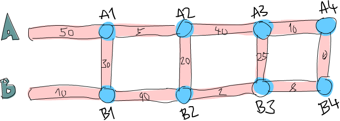

# 函数式地思考来解决问题

在这一章中，我们会检视几个有趣的问题，并尝试用函数式的方式来漂亮地解决他们。我们并不会介绍新的概念，我们只是练习我们刚学到的写程式的技巧。每一节都会探讨不同的问题。会先描述问题，然后用最好的方式解决他。


## 运算逆波兰表示法(Reverse Polish notation form)

我们在学校学习数学的时候，我们多半都是用中置(infix)的方式来写数学式。例如说，我们会写 ``10 - (4 + 3) * 2``。``+``, ``*``, ``-`` 是中置运算子(infix operators)。在 Haskell 中就像是 ``+`` 或 ``elem`` 一样。这种写法对于人类来说很容易阅读与理解，但缺点是我们必须用括号来描述运算的优先顺序。


逆波兰表示法是另外一种数学式的描述方法。乍看之下显得怪异，但他其实很容易理解并使用。因为我们不需要括弧来描述，也很容易放进计算机里面运算。尽管现在的计算机都是用中置的方式让你输入，有些人仍坚持用 RPN 的计算机。前述的算式如果表达成 RPN 的话会是 ``10 4 3 + 2 * -``。我们要如何计算他的结果呢？可以想想堆叠，基本上你是从左向右阅读算式。每当碰到一个数值，就把他堆上堆叠。当我们碰到一个运算子。就把两个数值从堆叠上拿下来，用运算子运算两个数值然后把结果推回堆叠中。当你消耗完整个算式的时候，而且假设你的算式是合法的，那你就应该只剩一个数值在堆叠中，


我们再接着看 ``10 4 3 + 2 * -``。首先我们把 ``10`` 推到堆叠上，所以堆叠现在是 ``10``。下一个接着的输入是 ``4``，我们也把他推上堆叠。堆叠的状态便变成 ``10, 4``。接着也对下一个输入 ``3`` 做同样的事，所以堆叠变成 ``10, 4, 3``。然后便碰到了第一个运算子 ``+``。我们把堆叠最上层的两个数值取下来（所以堆叠变成 ``10``）把两个数值加起来然后推回堆叠上。堆叠的状态便变成 ``10, 7``。我们再把输入 ``2`` 推上堆叠，堆叠变成 ``10, 7, 2``。我们又碰到另一个运算子，所以把 ``7`` 跟 ``2`` 取下，把他们相乘起来然后推回堆叠上。``7`` 跟 ``2`` 相乘的结果是 ``14``，所以堆叠的状态是 ``10, 14``。最后我们碰到了 ``-``。我们把 ``10`` 跟 ``14`` 取下，将他们相减然后推回堆叠上。所以现在堆叠的状态变成 ``-4``。而我们已经把所有数值跟运算子的消耗完了，所以 ``-4`` 便是我们的结果。


现在我们知道我们如何手算 RPN 运算式了，接下来可以思考一下我们写一个 Haskell 的函数，当他接到一个 RPN 运算式，像是 ``"10 4 3 + 2 * -"`` 时，他可以给出结果。


这个函数的型别会是什么样呢？我们希望他接受一个字串当作参数，并产出一个数值作为结果。所以应该会是 ``solveRPN :: (Num a) => String -> a``。


    小建议：在你去实作函数之前，先想一下你会怎么宣告这个函数的型别能够帮助你厘清问题。在 Haskell 中由于我们有够强的型别系统，光从函数的宣告就可以得到许多资讯。


当我们要实作一个问题的解法时，你可以先动手一步一步解看看，尝试从里面得到一些灵感。我们这边把每一个用空白隔开的数值或运算子都当作独立的一项。所以把 ``"10 4 3 + 2 * -"`` 这样一个字串断成一串 list ``["10","4","3","+","2","*","-"]`` 应该会有帮助。


接下来我们要如何应用这个断好的 list 呢？我们从左至右来走一遍，并保存一个工作用的堆叠。这样有让你想到些什么可以用的吗？没错，在 ``folds`` 的那一章里面，我们提到基本上当你需要从左至右或由右至左走过一遍 list 的时候并产生些结果的时候。我们都能用 fold 来实作他。


在这个 case 中由于我们是从左边走到右边，所以我们采取 left fold。accumulator 则是选用堆叠，而 fold 的结果也会是一个堆叠，只是里面只有一个元素而已。


另外要多考虑一件事是我们用什么来代表我们的堆叠？我们可以用 list 来代替，list 的 head 就可以当作是堆叠的顶端。毕竟要把一个元素加到 list 的 head 要比加到最后要有效率多。所以如果我们有一个堆叠，里面有 ``10, 4, 3``，那我们可以用 ``[3,4,10]`` 来代表他。


现在我们有了足够的资讯来写出我们的函数。他会接受一个字串 ``"10 4 3 + 2 * -"``，随即用 ``words`` 来断成 list ``["10","4","3","+","2","*","-"]``。接下来我们做一个 left fold 来产生出只有一个元素的堆叠，也就是 ``[-4]``。我们把这个元素从 list 取出便是最后的结果。

来看看我们的实作：

```haskell
import Data.List  
  
solveRPN :: (Num a) => String -> a  
solveRPN expression = head (foldl foldingFunction [] (words expression))  
    where   foldingFunction stack item = ...  
```

我们接受一个运算式并把他断成一串 List。然后我们用一个 folding 函数来 fold 这串 list。注意到我们用 ``[]`` 来当作起始的 accumulator。这个 accumulator 就是我们的堆叠，所以 ``[]`` 代表一个空的堆叠。在运算之后我们得到一个只有一个元素的堆叠，我们呼叫 ``head`` 来取出他并用 ``read`` 来转换他。

所以我们现在只缺一个接受堆叠的 folding 函数，像是可以接受 ``[4,10]`` 跟 ``"3"``，然后得到 ``[3,4,10]``。如果是 ``[4,10]`` 跟 ``"*"``，那就会得到 ``[40]``。但在实作之前，我们先把我们的函数改写成 point-free style，这样可以省下许多括号。

```haskell
import Data.List  
  
solveRPN :: (Num a) => String -> a  
solveRPN = head . foldl foldingFunction [] . words  
      where   foldingFunction stack item = ...  
```

看起来好多了。我们的 folding 函数会接受一个堆叠、新的项，并回传一个新的堆叠。我们使用模式匹配的方式来取出堆叠最上层的元素，然后对 ``"*"`` 跟 ``"-"`` 做匹配。

```haskell
solveRPN :: (Num a, Read a) => String -> a  
solveRPN = head . foldl foldingFunction [] . words  
    where   foldingFunction (x:y:ys) "*" = (x * y):ys  
            foldingFunction (x:y:ys) "+" = (x + y):ys  
            foldingFunction (x:y:ys) "-" = (y - x):ys  
            foldingFunction xs numberString = read numberString:xs  
```

我们用展开成四个模式匹配。模式会从第一个开始尝试匹配。所以 folding 函数会看看目前的项是否是 ``"*"``。如果是，那就会将 ``[3,4,9,3]`` 的头两个元素绑定到 ``x``，``y`` 两个名称。所以 ``x`` 会是 ``3`` 而 ``y`` 等于 ``4``。``ys`` 便会是 ``[9,3]``。他会回传一个 list，只差在 ``x`` 跟 ``y`` 相乘的结果为第一个元素。也就是说会把最上层两个元素取出，相乘后再放回去。如果第一个元素不是 ``"*"``，那模式匹配就会比对到 ``"+"``，以此类推。

如果项并未匹配到任何一个运算子，那我们就会假设这个字串是一个数值。如果他是一个数值，我们会用 ``read`` 来把字串转换成数值。并把这个数值推到堆叠上。

另外注意到我们加了 ``Read a`` 这像 class constraint，毕竟我们要使用到 ``read`` 来转换成数值。所以我们必须要宣告成他要属于 ``Num`` 跟 ``Read`` 两种 typeclass。（譬如说 ``Int``,``Float`` 等）

我们是从左至右走过 ``["2","3","+"]``。一开始堆叠的状态是 ``[]``。首先他会用 ``[]`` 跟 ``"2"`` 来喂给 folding 函数。由于此项并不是一个运算子。他会用 ``read`` 读取后加到 ``[]`` 的开头。所以堆叠的状态变成 ``[2]``。接下来就是用 ``[2]`` 跟 ``["3"]`` 来喂给 folding 函数，而得到 ``[3,2]``。最后再用 ``[3,2]`` 跟 ``"+"`` 来呼叫 folding 函数。这会堆叠顶端的两个数值，加起来后推回堆叠。最后堆叠变成 ``[5]``，这就是我们回传的数值。

我们来试试看我们新写的函数：


```haskell
ghci> solveRPN "10 4 3 + 2 * -"  
-4  
ghci> solveRPN "2 3 +"  
5  
ghci> solveRPN "90 34 12 33 55 66 + * - +"  
-3947  
ghci> solveRPN "90 34 12 33 55 66 + * - + -"  
4037  
ghci> solveRPN "90 34 12 33 55 66 + * - + -"  
4037  
ghci> solveRPN "90 3 -"  
87  
```

看起来运作良好。这个函数有一个特色就是他很容易改写来支持额外的运算子。他们也不一定要是二元运算子。例如说我们可以写一个运算子叫做 ``"log"``，他会从堆叠取出一个数值算出他的 log 后推回堆叠。我们也可以用三元运算子来从堆叠取出三个数值，并把结果放回堆叠。甚至是像是 ``"sum"`` 这样的运算子，取出所有数值并把他们的和推回堆叠。


我们来改写一下我们的函数让他多支援几个运算子。为了简单起见，我们改写宣告让他回传 ``Float`` 型别。

```haskell
import Data.List  
  
solveRPN :: String -> Float  
solveRPN = head . foldl foldingFunction [] . words  
where   foldingFunction (x:y:ys) "*" = (x * y):ys  
        foldingFunction (x:y:ys) "+" = (x + y):ys  
        foldingFunction (x:y:ys) "-" = (y - x):ys  
        foldingFunction (x:y:ys) "/" = (y / x):ys  
        foldingFunction (x:y:ys) "^" = (y ** x):ys  
        foldingFunction (x:xs) "ln" = log x:xs  
        foldingFunction xs "sum" = [sum xs]  
        foldingFunction xs numberString = read numberString:xs  
```

看起来不错，没有疑问地 ``/`` 是除法而 ``**`` 是取 exponential。至于 log 运算子，我们只需要模式匹配一个元素，毕竟 log 只需要一个元素。而 sum 运算子，我们只回传一个仅有一个元素的堆叠，包含了所有元素的和。

```haskell
ghci> solveRPN "2.7 ln"  
0.9932518  
ghci> solveRPN "10 10 10 10 sum 4 /"  
10.0  
ghci> solveRPN "10 10 10 10 10 sum 4 /"  
12.5  
ghci> solveRPN "10 2 ^"  
100.0  
```

由于 ``read`` 知道如何转换浮点数，我们也可在运算适中使用他。

```haskell
ghci> solveRPN "43.2425 0.5 ^"  
6.575903  
```

有这样一个容易拓展到浮点数而且动到的程式码又在十行以内的函数，我想是非常棒的。


有一件事要留意的是这个函数对于错误处理并不好。当我们碰到非法输入的时候，他就会直接当掉。之后我们碰到 Monad 的时候我们会写一个容错的版本，他的型别会是 ``solveRPN :: String -> Maybe Float``。当然我们现在也可以写一个，不过那会有点麻烦，因为会有一大堆检查 ``Nothing`` 的动作。如果你希望挑战的话，也可以尽管尝试。（提示：你可以用 ``reads`` 来看看一次 read 是否会成功）


## 路径规划

我们接下来的问题是：你的飞机刚刚降落在英格兰的希思罗机场。你接下来有一个会议，你租了一台车希望尽速从机场前往伦敦市中心。

从希思罗机场到伦敦有两条主要道路，他们中间有很多小路连接彼此。如果你要走小路的话都会花掉一定的时间。你的问题就是要选一条最佳路径让你可以尽快前往伦敦。你从图的最左边出发，中间可能穿越小路来前往右边。


你可以从图中看到，从希思罗机场到伦敦在这个路径配置下的最短路径是先选主要道路 B，经由小路到 A 之后，再走一小段，转到 B 之后继续往前走。如果采取这个路径的话，会花去 75 分钟。如果选其他道路的话，就会花更多时间。

我们任务就是要写一个程式，他接受道路配置的输入，然后印出对应的最短路径。我们的输入看起来像是这样：

```haskell
50  
10  
30  
5  
90  
20  
40  
2  
25  
10  
8  
0  
```

我们在心中可以把输入的数值三个三个看作一组。每一组由道路 A,道路 B,还有交叉的小路组成。而要能够这样组成，我们必须让最后有一条虚拟的交叉小路，只需要走 0 分钟就可以穿越他。因为我们并不会在意在伦敦里面开车的成本，毕竟我们已经到达伦敦了。

正如我们在解 RPN 计算机的问题的时候，我们是用三步骤来解题：

  * 首先忘掉 Haskell，想想我们自己是怎么一步步解题的。
  * 想想如何在 Haskell 中表达我们的资料。
  * 在 Haskell 中要如何对这些资料做运算来产生出解答。

在介绍 RPN 计算机的章节中，我们首先自己用人脑计算表达式，在心中维持一个堆叠然后一项一项处理。我们决定用一个字串来表达我们的表达式。最后，我们用 left fold 来走过我们这一串 list，并算出结果。

究竟我们要怎么用手算出从希思罗机场到伦敦的最短路径呢？我们可以观察整章图片，猜测哪一条是最短路径然后希望我们有猜对。这样的作法对于很小的输入可以成功，但如果我们的路径超过 10000 组呢？这样我们不知道我们的解法是不是最佳解，我们只能说可能是。

所以那并不是一个好作法。这边有一张简化过后的图。




你能想出来到道路 A 上第一个交叉点的最短路径吗？（标记成 A1 的点）这太容易了。我们只要看看从道路 A 出发或是从道路 B 出发穿越至道路 A 两种作法哪种比较短就好。很明显的，从道路 B 出发的比较短，只要花费 40 分钟，然而从道路 A 则要花费 50 分钟。那到交叉点 B1 呢？同样的作法可以看出从道路 B 出发只要花费 10 分钟，远比从道路 A 出发然后穿越小路要花费少，后者要花费 80 分钟！


现在我们知道要到达 A1 的最短路径是经由 B 然后邹小路到达，共花费 40。而我们知道要达到 B1 的最短路径则是直接走 B，花费 10。这样的知识有办法帮助我们得知到下一个交叉点的最短路径吗？可以的。


我们来看看到达 A2 的最短路径是什么。要到达 A2，我们必须要从 A1 走到 A2 或是从 B1 走小路。由于我们知道到达 A1 跟 B1 的成本，我们可以很容易的想出到达 A2 的最佳路径。到达 A1 要花费 40，而从 A1 到 A2 需要 5。所以 ``B, C, A`` 总共要 45。而要到达 B1 只要 10，但需要额外花费 110 分钟来到达 B2 然后走小路到达 A2。所以最佳路径就是 ``B, C, A``。同样地到达 B2 最好的方式就是走 A1 然后走小路。

	
	也许你会问如果先在 B1 跨到道路 A 然后走到 A2 的情况呢？我们已经考虑过了从 B1 到 A1 的情况，所以我们不需要再把他考虑进去。

现在我们有了至 A2 跟 B2 的最佳路径，我们可以一直重复这个过程直到最右边。一旦我们到达了 A4 跟 B4，那其中比较短的就是我们的最佳路径了。

基本上对于第二组而言，我们只是不断地重复之前的步骤，只是我们考虑进在前面的最佳路径而已。当然我们也可以说在第一步就考虑进了前面的最佳路径，只是他们都是 0 而已。


总结一下。要得到从希思罗机场到伦敦的最短路径。我们首先看看到达下一个道路 A 上的交叉点的最短路径。共有两种选择的路径，一是直接从道路 A 出发然后走到交叉点，要不然就是从道路 B 出发，走到第一个交叉点然后走小路。得到结果后记住结果。接着再用同样的方法来得到走到道路 B 上下一个交叉点的最短路径，并也记住结果。然后我们看看要走到再下一个道路 A 上的交叉点，究竟是从这个道路 A 上的交叉点往前走，或是从对应的道路 B 上的交叉点往前走再走到对面，两种选择哪种比较好。记下比较好的选择，然后也对对应的道路 B 上的交叉点做一次这个过程。做完全部组之后就到达最右边。一旦到达最右边，最佳的选择就是我们的最短路径了。

基本上当我们到达最右边的时候，我们记下了最后停在道路 A 的最短路径跟最后停在道路 B 的最短路径。其中比较短的是我们真正的最短路径。现在我们已经知道怎么用手算出答案。如果你有闲工夫，你可以拿纸笔对于任何一组道路配置算出他的最短路径。

接下来的问题是，我们要如何用 Haskell 的型别来代表这里的道路配置呢？一种方式就是把起始点跟交叉点都当作图的节点，并连到其他的交叉点。如果我们想像其实起点也有一条长度为 1 的虚拟道路连接彼此，那每个交叉点或是节点就都连接对面的节点了。同时他们也连到下一个交叉点。唯一的例外是最后一个节点，他们只连接到对面。


```haskell
data Node = Node Road Road | EndNode Road  
data Road = Road Int Node 
```

一个节点要码是一个普通的节点，他包含有通往下一个交叉点的路径资讯，还有往对面道路的资讯。或是一个终端点，只包含往对面节点的道路资讯。一条道路包含他多长，还有他指向哪里。例如说，道路 A 的第一个部份就可写成 ``Road 50 a1``。其中 ``a1`` 是 ``Node x y`` 这样一个节点。而 ``x`` 跟 ``y`` 则分别指向 B1 跟 A2。

另一种方式就是用 ``Maybe`` 来代表往下一个交叉点走的路。每个节点有指到对面节点的路径部份，但只有不是终端节点的节点才有指向下一个交叉点的路。

```haskell
data Node = Node Road (Maybe Road)  
data Road = Road Int Node  
```

这些是用 Haskell 来代表道路系统的方式，而我们也能靠他们来解决问题。但也许我们可以想出更简单的模型？如果我们想想之前手算的方式，我们每次检查都只有检查三条路径的长度而已。在道路 A 的部份，跟在道路 B 的部份，还有接触两个部份并将他们连接起来的部份。当我们观察到 A1 跟 B1 的最短路径时，我们只考虑第一组的三个部份，他们分别花费 50, 10 跟 30。所以道路系统可以用四组来表示：``50, 10, 30``，``5, 90, 20``，``40, 2, 25`` 跟 ``10, 8, 0``。

让我们资料型别越简单越好，不过这样已经是极限了。

```haskell
data Section = Section { getA :: Int, getB :: Int, getC :: Int } deriving (Show)  
type RoadSystem = [Section]  
```

这样很完美，而且对于我们的实作也有帮助。``Section`` 是一个 algebraic data type，包含三个整数，分别代表三个不同部份的道路长。我们也定义了型别同义字，说 ``RoadSystem`` 代表包含 section 的 list。


	当然我们也可以用一个 tuple ``(Int, Int, Int)`` 来代表一个 section。使用 tuple 对于一些简单的情况是比较方便，但对于比较复杂的情况定义自己的 algebraic data type 会比较好。他让型别系统获得比较多的资讯。``(Int, Int, Int)`` 毕竟也可能被使用在定义三维空间中的一个向量，只用 tuple 让我们可能把这两种情形混杂起来使用。如果我们用 ``Section`` 跟 ``Vector`` 的话就不会不小心搞混了。


从希思罗机场到伦敦的道路系统便可以这样表示：

```haskell
heathrowToLondon :: RoadSystem  
heathrowToLondon = [Section 50 10 30, Section 5 90 20, Section 40 2 25, Section 10 8 0]  
```

我们现在要做的就是用 Haskell 实作我们先前的解法。所以我们应该怎样宣告我们计算最短路径函数的型别呢？他应该接受一个道路系统作为参数，然后回传一个路径。我们会用一个 list 来代表我们的路径。我们定义了 ``Label`` 来表示 ``A``, ``B`` 或 ``C``。并且也定义一个同义词 ``Path``：

```haskell
data Label = A | B | C deriving (Show)  
type Path = [(Label, Int)] 
```

而我们的函数 ``optimalPath`` 应该要有 ``optimalPath :: RoadSystem -> Path`` 这样的型别。如果被喂给 ``heathrowToLondon`` 这样的道路系统，他应该要回传下列的路径：

```haskell
[(B,10),(C,30),(A,5),(C,20),(B,2),(B,8)]      
```

我们接下来就从左至右来走一遍 list，并沿路上记下 A 的最佳路径跟 B 的最佳路径。我们会 accumulate 我们的最佳路径。这听起来有没有很熟悉？没错！就是 left fold。


当我们手动做解答的时候，有一个步骤是我们不断重复的。就是检查现有 A 跟 B 的最佳路径以及目前的 section，产生出新的 A 跟 B 的最佳路径。举例来说，最开始我们的最佳路径是 ``[]`` 跟 ``[]``。我们看过 ``Section 50 10 30`` 后就得到新的到 A1 的最佳路径为 ``[(B,10),(C,30)]``，而到 B1 的最佳路径是 ``[(B,10)]``。如果你们把这个步骤看作是一个函数，他接受一对路径跟一个 section，并产生出新的一对路径。所以型别是 ``(Path, Path) -> Section -> (Path, Path)``。我们接下来继续实作这个函数。


	提示：把 ``(Path, Path) -> Section -> (Path, Path)`` 当作 left fold 用的二元函数，fold 要求的型态是 ``a -> b -> a``。


```haskell
roadStep :: (Path, Path) -> Section -> (Path, Path)  
roadStep (pathA, pathB) (Section a b c) =   
    let priceA = sum $ map snd pathA  
        priceB = sum $ map snd pathB  
        forwardPriceToA = priceA + a  
        crossPriceToA = priceB + b + c  
        forwardPriceToB = priceB + b  
        crossPriceToB = priceA + a + c  
        newPathToA = if forwardPriceToA <= crossPriceToA  
                        then (A,a):pathA  
                        else (C,c):(B,b):pathB  
        newPathToB = if forwardPriceToB <= crossPriceToB  
                        then (B,b):pathB  
                        else (C,c):(A,a):pathA  
    in  (newPathToA, newPathToB)  
```


上面的程式究竟写了些什么？首先他根据先前 A 的最佳解计算出道路 A 的最佳解，之后也如法炮制计算 B 的最佳解。使用 ``sum $ map snd pathA``，所以如果 ``pathA`` 是 ``[(A,100),(C,20)]``。``priceA`` 就是 ``120``。``forwardPriceToA`` 就会是我们要付的成本。如果我们是从先前在 A 上的交叉点前往。那他就会等于我们至先前交叉点的最佳解加上目前 section 中 A 的部份。``crossPriceToA`` 则是我们从先前在 B 上的交叉点前往 A 所要付出的代价。他是先前 B 的最佳解加上 section 中 B 的部份加上 C 的长。同样地方式也可以决定 ``forwardPriceToB`` 跟 ``crossPriceToB``。


现在我们知道了到 A 跟 B 的最佳路径，我们需要根据这些资讯来构造到 A 跟 B 的整体路径。如果直接走到 A 耗费较少的话，我们就把 ``newPathToA`` 设定成 ``(A,a):pathA``。这样做的事就是把 ``Label`` ``A`` 跟 section 的长度 ``a`` 接到最佳路径的前面。要记得 ``A`` 是一个 label，而 ``a`` 的型别是 ``Int``。我们为什么要接在前面而不是 ``pathA ++ [(A,a)]`` 呢？因为接在 list 的前面比起接在后端要有效率多了。不过这样产生出来的 list 就会相反。但要把 list 再反过来并不难。如果先走到 B 再穿越小路走到 A 比较短的话，那 ``newPathToA`` 就会包含这样走的路线。同样的道理也可以套用在 ``newPathToB`` 上。


最后我们回传 ``newPathToA`` 跟 ``newPathToB`` 这一对结果。


我们把 ``heathrowToLondon`` 的第一个 section 喂给我们的函数。由于他是第一个 section，所以到 A 跟 B 的最佳路径就是一对空的 list。


```haskell
ghci> roadStep ([], []) (head heathrowToLondon)  
([(C,30),(B,10)],[(B,10)])  
```

要记住包含的路径是反过来的，要从右边往左边读。所以到 A 的最佳路径可以解读成从 B 出发，然后穿越到道路 A。而 B 的最佳路径则是直接从 B 出发走到下一个交叉点。


	优化小技巧：当我们写 ``priceA = sum $ map snd pathA`` 的时候。我们是在计算每步的成本。如果我们实作 ``roadStep`` 成 ``(Path, Path, Int, Int) -> Section -> (Path, Path, Int, Int)`` 的话就可以不必那么做。其中的整数型别代表 A 跟 B 上的最小成本。


现在我们有了一个函数他接受一对路径跟一个 section，并产生新的最佳路径。我们可以用一个 left fold 来做。我们用 ``([],[])`` 跟第一个 section 来喂给 ``roadStep`` 并得到一对最佳路径。然后他又被喂给这个新得到的最佳路径跟下一个 section。以此类推。当我们走过全部的 section 的时候，我们就会得到一对最佳路径，而其中比较短的那个就是解答。有了这样的想法，我们便可以实作 ``optimalPath``。


```haskell
optimalPath :: RoadSystem -> Path  
optimalPath roadSystem = 
    let (bestAPath, bestBPath) = foldl roadStep ([],[]) roadSystem  
    in  if sum (map snd bestAPath) <= sum (map snd bestBPath)  
                then reverse bestAPath  
                else reverse bestBPath  
```

我们对 ``roadSystem`` 做 left fold。而用的起始 accumulator 是一对空的路径。fold 的结果也是一对路径，我们用模式匹配的方式来把路径从结果取出。然后我们检查哪一个路径比较短便回传他。而且在回传之前也顺便把整个结果反过来。因为我们先前提到的我们是用接在前头的方式来构造结果的。

我们来测试一下吧！

```haskell
ghci> optimalPath heathrowToLondon  
[(B,10),(C,30),(A,5),(C,20),(B,2),(B,8),(C,0)]  
```

这正是我们应该得到的结果！不过跟我们预期的结果仍有点差异，在最后有一步 ``(C,0)``，那代表我们已经在伦敦了仍然跨越小路。不过由于他的成本是 0，所以依然可以算做正确的结果。


我们找出最佳路径的函数，现在要做的只需要从标准输入读取文字形式道路系统，并把他转成 ``RoadSystem``，然后用 ``optimalPath`` 来把他跑一遍就好了。


首先，我们写一个函数，他接受一串 list 并把他切成同样大小的 group。我们命名他为 ``groupOf``。当参数是 ``[1..10]`` 时，``groupOf 3`` 应该回传 ``[[1,2,3],[4,5,6],[7,8,9],[10]]``。

```haskell
groupsOf :: Int -> [a] -> [[a]]  
groupsOf 0 _ = undefined  
groupsOf _ [] = []  
groupsOf n xs = take n xs : groupsOf n (drop n xs)
```

一个标准的递回函数。对于 ``xs`` 等于 ``[1..10]`` 且 ``n`` 等于 ``3``，这可以写成 ``[1,2,3] : groupsOf 3 [4,5,6,7,8,9,10]``。当这个递回结束的时候，我们的 list 就三个三个分好组。而下列是我们的 ``main`` 函数，他从标准输入读取资料，构造 ``RoadSystem`` 并印出最短路径。

```haskell
import Data.List  
  
main = do  
    contents <- getContents  
    let threes = groupsOf 3 (map read $ lines contents)  
        roadSystem = map (\[a,b,c] -> Section a b c) threes  
        path = optimalPath roadSystem  
        pathString = concat $ map (show . fst) path  
        pathPrice = sum $ map snd path  
    putStrLn $ "The best path to take is: " ++ pathString  
    putStrLn $ "The price is: " ++ show pathPrice  
```

首先，我们从标准输入获取所有的资料。然后我们呼叫 ``lines`` 来把 ``"50\n10\n30\n...`` 转换成 ``["50","10","30"..``，然后我们 map ``read`` 来把这些转成包含数值的 list。我们呼叫 ``groupsOf 3`` 来把 list 的 list，其中子 list 长度为 3。我们接着对这个 list 来 map 一个 lambda ``(\[a,b,c] -> Section a b c)``。正如你看到的，这个 lambda 接受一个长度为 3 的 list 然后把他变成 Section。所以 ``roadSystem`` 现在就是我们的道路配置，而且是正确的型别 ``RoadSystem``。我们呼叫 ``optimalPath`` 而得到一个路径跟对应的代价，之后再印出来。

我们将下列文字存成档案。


```haskell
50  
10  
30  
5  
90  
20  
40  
2  
25  
10  
8  
0  
```


存成一个叫 ``paths.txt`` 的档案然后喂给我们的程式。

```haskell
$ cat paths.txt | runhaskell heathrow.hs  
The best path to take is: BCACBBC  
The price is: 75  
```

执行成功！你可以用你对 ``Data.Random`` 的了解来产生一个比较大的路径配置，然后你可以把产生的乱数资料喂给你的程式。如果你碰到堆叠溢出，试试看用 ``foldl'`` 而不要用 ``foldl``。``foldl'`` 是 strict 的可以减少记忆体消耗。

