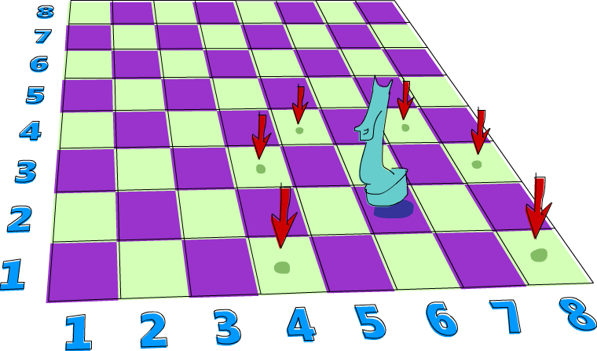

# 来看看几种 Monad

当我们第一次谈到 Functor 的时候，我们了解到他是一个抽象概念，代表是一种可以被 map over 的值。然后我们再将其概念提升到 Applicative Functor，他代表一种带有 context 的型态，我们可以用函数操作他而且同时还保有他的 context。

在这一章，我们会学到 Monad，基本上他是一种加强版的 Applicative Functor，正如 Applicative Functor 是 Functor 的加强版一样。


我们介绍到 Functor 是因为我们观察到有许多态态都可以被 function 给 map over，了解到这个目的，便抽象化了 ``Functor`` 这个 typeclass 出来。但这让我们想问：如果给定一个 ``a -> b`` 的函数以及 ``f a`` 的型态，我们要如何将函数 map over 这个型态而得到 ``f b``？我们知道要如何 map over ``Maybe a``，``[a]`` 以及 ``IO a``。我们甚至还知道如何用 ``a -> b`` map over ``r -> a``，并且会得到 ``r -> b``。要回答这个问题，我们只需要看 ``fmap`` 的型态就好了：

```haskell
fmap :: (Functor f) => (a -> b) -> f a -> f b      
```

然后只要针对 ``Functor`` instance 撰写对应的实作。

之后我们又看到一些可以针对 Functor 改进的地方，例如 ``a -> b`` 也被包在一个 Functor value 里面呢？像是 ``Just (*3)``，我们要如何 apply ``Just 5`` 给他？如果我们不要 apply ``Just 5`` 而是 ``Nothing`` 呢？甚至给定 ``[(*2),(+4)]``，我们要如何 apply 他们到 ``[1,2,3]`` 呢？对于此，我们抽象出 ``Applicative`` typeclass，这就是我们想要问的问题：

```haskell
(<*>) :: (Applicative f) => f (a -> b) -> f a -> f b     
```

我们也看到我们可以将一个正常的值包在一个数据型态中。例如说我们可以拿一个 ``1`` 然后把他包成 ``Just 1``。或是把他包成 ``[1]``。也可以是一个 I/O action 会产生一个 ``1``。这样包装的 function 我们叫他做 ``pure``。

如我们说得，一个 applicative value 可以被看作一个有附加 context 的值。例如说，``'a'`` 只是一个普通的字符，但 ``Just 'a'`` 是一个附加了 context 的字符。他不是 ``Char`` 而是 ``Maybe Char``，这型态告诉我们这个值可能是一个字符，也可能什么都没有。

来看看 ``Applicative`` typeclass 怎样让我们用普通的 function 操作他们，同时还保有 context：
```haskell
ghci> (*) <$> Just 2 <*> Just 8  
Just 16  
ghci> (++) <$> Just "klingon" <*> Nothing  
Nothing  
ghci> (-) <$> [3,4] <*> [1,2,3]  
[2,1,0,3,2,1]  
```

所以我们可以视他们为 applicative values，``Maybe a`` 代表可能会失败的 computation，``[a]`` 代表同时有好多结果的 computation (non-deterministic computation)，而 ``IO a`` 代表会有 side-effects 的 computation。

Monad 是一个从 Applicative functors 很自然的一个演进结果。对于他们我们主要考量的点是：如果你有一个具有 context 的值 ``m a``，你能如何把他丢进一个只接受普通值 ``a`` 的函数中，并回传一个具有 context 的值？也就是说，你如何套用一个型态为 ``a -> m b`` 的函数至 ``m a``？基本上，我们要求的函数是：

```haskell
(>>=) :: (Monad m) => m a -> (a -> m b) -> m b
```

如果我们有一个漂亮的值跟一个函数接受普通的值但回传漂亮的值，那我们要如何要把漂亮的值丢进函数中？这就是我们使用 Monad 时所要考量的事情。我们不写成 ``f a`` 而写成 ``m a`` 是因为 ``m`` 代表的是 ``Monad``，但 monad 不过就是支持 ``>>=`` 操作的 applicative functors。``>>=`` 我们称呼他为 bind。

当我们有一个普通值 ``a`` 跟一个普通函数 ``a -> b``，要套用函数是一件很简单的事。但当你在处理具有 context 的值时，就需要多考虑些东西，要如何把漂亮的值喂进函数中，并如何考虑他们的行为，但你将会了解到他们其实不难。

## 动手做做看: Maybe Monad


现在对于什么是 Monad 已经有了些模糊的概念，
我们来看看要如何让这概念更具体一些。

不意外地，``Maybe`` 是一个 Monad，
所以让我们对于他多探讨些，看看是否能跟我们所知的 Monad 概念结合起来。

    到这边要确定你了解什么是 Applicatives。如果你知道好几种 ``Applicative`` 的 instance 还有他们代表的意含就更好了，因为 monad 不过就是对 applicative 的概念进行一次升级。


一个 ``Maybe a`` 型态的值代表型态为 ``a`` 的值而且具备一个可能造成错误的 context。而 ``Just "dharma"`` 的值代表他不是一个 ``"dharma"`` 的字串就是字串不见时的 ``Nothing``。如果你把字串当作计算的结果，``Nothing`` 就代表计算失败了。

当我们把 ``Maybe`` 视作 functor，我们其实要的是一个 ``fmap`` 来把一个函数针对其中的元素做套用。他会对 ``Just`` 中的元素进行套用，要不然就是保留 ``Nothing`` 的状态，其代表里面根本没有元素。

```haskell
ghci> fmap (++"!") (Just "wisdom")  
Just "wisdom!"  
ghci> fmap (++"!") Nothing  
Nothing  
```

或者视为一个 applicative functor，他也有类似的作用。只是 applicative 也把函数包了起来。``Maybe`` 作为一个 applicative functor，我们能用 ``<*>`` 来套用一个存在 ``Maybe`` 中的函数至包在另外一个 ``Maybe`` 中的值。他们都必须是包在 ``Just`` 来代表值存在，要不然其实就是 ``Nothing``。当你在想套用函数到值上面的时候，缺少了函数或是值都会造成错误，所以这样做是很合理的。

```haskell
ghci> Just (+3) <*> Just 3  
Just 6  
ghci> Nothing <*> Just "greed"  
Nothing  
ghci> Just ord <*> Nothing  
Nothing  
```

当我们用 applicative 的方式套用函数至 ``Maybe`` 型态的值时，就跟上面描述的差不多。过程中所有值都必须是 ``Just``，要不然结果一定会是 ``Nothing``。

```haskell
ghci> max <$> Just 3 <*> Just 6  
Just 6  
ghci> max <$> Just 3 <*> Nothing  
Nothing  
```

我们来思考一下要怎么为 ``Maybe`` 实作 ``>>=``。正如我们之前提到的，``>>=`` 接受一个 monadic value，以及一个接受普通值的函数，这函数会回传一个 monadic value。``>>=`` 会帮我们套用这个函数到这个 monadic value。在函数只接受普通值的情况侠，函数是如何作到这件事的呢？要作到这件事，他必须要考虑到 monadic value 的 context。

在这个案例中，``>>=`` 会接受一个 ``Maybe a`` 以及一个型态为 ``a -> Maybe b`` 的函数。他会套用函数到 ``Maybe a``。要厘清他怎么作到的，首先我们注意到 ``Maybe`` 的 applicative functor 特性。假设我们有一个函数 ``\x -> Just (x+1)``。他接受一个数字，把他加 ``1`` 后再包回 ``Just``。

```haskell
ghci> (\x -> Just (x+1)) 1  
Just 2  
ghci> (\x -> Just (x+1)) 100  
Just 101 
```

如果我们喂给函数 ``1``，他会计算成 ``Just 2``。如果我们喂给函数 ``100``，那结果便是 ``Just 101``。但假如我们喂一个 ``Maybe`` 的值给函数呢？如果我们把 ``Maybe`` 想成一个 applicative functor，那答案便很清楚。如果我们拿到一个 ``Just``，就把包在 ``Just`` 里面的值喂给函数。如果我们拿到一个 ``Nothing``，我们就说结果是 ``Nothing``。

我们调用 ``applyMaybe`` 而不调用 ``>>=``。他接受 ``Maybe a`` 跟一个回传 ``Maybe b`` 的函数，并套用函数至 ``Maybe a``。

```haskell
applyMaybe :: Maybe a -> (a -> Maybe b) -> Maybe b  
applyMaybe Nothing f  = Nothing  
applyMaybe (Just x) f = f x  
```

我们套用一个 infix 函数，这样 ``Maybe`` 的值可以写在左边且函数是在右边：

```haskell
ghci> Just 3 `applyMaybe` \x -> Just (x+1)  
Just 4  
ghci> Just "smile" `applyMaybe` \x -> Just (x ++ " :")""  
Just "smile :""  
ghci> Nothing `applyMaybe` \x -> Just (x+1)  
Nothing  
ghci> Nothing `applyMaybe` \x -> Just (x ++ " :")")  
Nothing 
```

在上述的范例中，我们看到在套用 ``applyMaybe`` 的时候，函数是套用在 ``Just`` 里面的值。当我们试图套用到 ``Nothing``，那整个结果便是 ``Nothing``。假如函数回传 ``Nothing`` 呢？

```haskell
ghci> Just 3 `applyMaybe` \x -> if x > 2 then Just x else Nothing  
Just 3  
ghci> Just 1 `applyMaybe` \x -> if x > 2 then Just x else Nothing  
Nothing  
```

这正是我们期待的结果。如果左边的 monadic value 是 ``Nothing``，那整个结果就是 ``Nothing``。如果右边的函数是 ``Nothing``，那结果也会是 ``Nothing``。这跟我们之前把 ``Maybe`` 当作 applicative 时，过程中有任何一个 ``Nothing`` 整个结果就会是 ``Nothing`` 一样。

对于 ``Maybe`` 而言，我们已经找到一个方法处理漂亮值的方式。我们作到这件事的同时，也保留了 ``Maybe`` 代表可能造成错误的计算的意义。

你可能会问，这样的结果有用吗？由于 applicative functors 让我们可以拿一个接受普通值的函数，并让他可以操作具有 context 的值，这样看起来 applicative functors 好像比 monad 强。但我们会看到 monad 也能作到，因为他只是 applicative functors 的升级版。他们同时也能作到 applicative functors 不能作到的事情。

稍候我们会再继续探讨 ``Maybe``，但我们先来看看 monad 的 type class。


## Monad type class

正如 functors 有 ``Functor`` 这个 type class，而 applicative functors 有一个 ``Applicative`` 这个 type class，monad 也有他自己的 type class：``Monad`` 他看起来像这样：

```haskell
class Monad m where  
    return :: a -> m a  

    (>>=) :: m a -> (a -> m b) -> m b  

    (>>) :: m a -> m b -> m b  
    x >> y = x >>= \_ -> y  

    fail :: String -> m a  
    fail msg = error msg  
```


我们从第一行开始看。他说 ``class Monad m where``。但我们之前不是提到 monad 是 applicative functors 的加强版吗？不是应该有一个限制说一个型态必须先是一个 applicative functor 才可能是一个 monad 吗？像是 ``class (Applicative m) = > Monad m where``。他的确应该要有，但当 Haskell 被创造的早期，人们没有想到 applicative functor 适合被放进语言中，所以最后没有这个限制。但的确每个 monad 都是 applicative functor，即使 ``Monad`` 并没有这么宣告。

在 ``Monad`` typeclass 中定义的第一个函数是 ``return``。他其实等价于 ``pure``，只是名字不同罢了。他的型态是 ``(Monad m) => a -> m a``。他接受一个普通值并把他放进一个最小的 context 中。也就是说他把普通值包进一个 monad 里面。他跟 ``Applicative`` 里面 ``pure`` 函数做的事情一样，所以说其实我们已经认识了 ``return``。我们已经用过 ``return`` 来处理一些 I/O。我们用他来做一些假的 I/O，印出一些值。对于 ``Maybe`` 来说他就是接受一个普通值然后包进 ``Just``。


    提醒一下：``return`` 跟其他语言中的 ``return`` 是完全不一样的。他并不是结束一个函数的执行，他只不过是把一个普通值包进一个 context 里面。


接下来定义的函数是 bind: ``>>=``。他就像是函数套用一样，只差在他不接受普通值，他是接受一个 monadic value（也就是具有 context 的值）并且把他喂给一个接受普通值的函数，并回传一个 monadic value。


接下来，我们定义了 ``>>``。我们不会介绍他，因为他有一个事先定义好的实作，基本上我们在实作 ``Monad`` typeclass 的时候都不会去理他。

最后一个函数是 ``fail``。我们通常在我们程序中不会具体写出来。他是被 Haskell 用在处理语法错误的情况。我们目前不需要太在意 ``fail``。

我们知道了 ``Monad`` typeclass 长什么样子，我们来看一下 ``Maybe`` 的 ``Monad`` instance。

```haskell
instance Monad Maybe where  
    return x = Just x  
    Nothing >>= f = Nothing  
    Just x >>= f  = f x  
    fail _ = Nothing  
```

``return``跟``pure``是等价的。这没什么困难的。我们跟我们在定义``Applicative``的时候做一样的事，只是把他用``Just``包起来。

``>>=``跟我们的``applyMaybe``是一样的。当我们将``Maybe a``塞给我们的函数，我们保留住context，并且在输入是``Nothing``的时候回传``Nothing``。毕竟当没有值的时候套用我们的函数是没有意义的。当输入是``Just``的时候则套用``f``并将他包在``Just``里面。


我们可以试着感觉一下``Maybe``是怎样表现成Monad的。

```haskell
ghci> return "WHAT" :: Maybe String  
Just "WHAT"  
ghci> Just 9 >>= \x -> return (x*10)  
Just 90  
ghci> Nothing >>= \x -> return (x*10)  
Nothing 
```

第一行没什么了不起，我们已经知道 ``return`` 就是 ``pure`` 而我们又对 ``Maybe`` 操作过 ``pure`` 了。至于下两行就比较有趣点。

留意我们是如何把 ``Just 9`` 喂给 ``\x -> return (x*10)``。在函数中 ``x`` 绑定到 ``9``。他看起好像我们能不用 pattern matching 的方式就从 ``Maybe`` 中抽取出值。但我们并没有丧失掉 ``Maybe`` 的 context，当他是 ``Nothing`` 的时候，``>>=`` 的结果也会是 ``Nothing``。


## 走钢索


我们已经知道要如何把 ``Maybe a`` 喂进 ``a -> Maybe b`` 这样的函数。我们可以看看我们如何重复使用 ``>>=`` 来处理多个 ``Maybe a`` 的值。

首先来说个小故事。皮尔斯决定要辞掉他的工作改行试着走钢索。他对走钢索蛮在行的，不过仍有个小问题。就是鸟会停在他拿的平衡竿上。他们会飞过来停一小会儿，然后再飞走。这样的情况在两边的鸟的数量一样时并不是个太大的问题。但有时候，所有的鸟都会想要停在同一边，皮尔斯就失去了平衡，就会让他从钢索上掉下去。

我们这边假设两边的鸟差异在三个之内的时候，皮尔斯仍能保持平衡。所以如果是右边有一只，左边有四只的话，那还撑得住。但如果左边有五只，那就会失去平衡。

我们要写个程序来仿真整个情况。我们想看看皮尔斯究竟在好几只鸟来来去去后是否还能撑住。例如说，我们想看看先来了一只鸟停在左边，然后来了四只停在右边，然后左边那只飞走了。之后会是什么情形。

我们用一对整数来代表我们的平衡竿状态。头一个位置代表左边的鸟的数量，第二个位置代表右边的鸟的数量。

```haskell
type Birds = Int  
type Pole = (Birds,Birds)  
```

由于我们用整数来代表有多少只鸟，我们便先来定义 ``Int`` 的同义型态，叫做 ``Birds``。然后我们把 ``(Birds, Birds)`` 定义成 ``Pole``。

接下来，我们定义一个函数他接受一个数字，然后把他放在竿子的左边，还有另外一个函数放在右边。

```haskell
landLeft :: Birds -> Pole -> Pole  
landLeft n (left,right) = (left + n,right)  
  
landRight :: Birds -> Pole -> Pole  
landRight n (left,right) = (left,right + n)  
```

我们来试着执行看看：

```haskell
ghci> landLeft 2 (0,0)  
(2,0)  
ghci> landRight 1 (1,2)  
(1,3)  
ghci> landRight (-1) (1,2)  
(1,1)  
```

要仿真鸟飞走的话我们只要给定一个负数就好了。 由于这些操作是接受 ``Pole`` 并回传 ``Pole``， 所以我们可以把函数串在一起。

```haskell
ghci> landLeft 2 (landRight 1 (landLeft 1 (0,0)))  
(3,1)
```

当我们喂 ``(0,0)`` 给 ``landLeft 1`` 时，我们会得到 ``(1,0)``。接着我们仿真右边又停了一只鸟，状态就变成 ``(1,1)``。最后又有两只鸟停在左边，状态变成 ``(3,1)``。我们这边的写法是先写函数名称，然后再套用参数。但如果先写 pole 再写函数名称会比较清楚，所以我们会想定义一个函数

```haskell
x -: f = f x
```

我们能先套用参数然后再写函数名称：

```haskell
ghci> 100 -: (*3)  
300  
ghci> True -: not  
False  
ghci> (0,0) -: landLeft 2  
(2,0)  
```

有了这个函数，我们便能写得比较好读一些：

```haskell
ghci> (0,0) -: landLeft 1 -: landRight 1 -: landLeft 2  
(3,1)  
```

这个范例跟先前的范例是等价的，只不过好读许多。很清楚的看出我们是从 ``(0,0)`` 开始，然后停了一只在左边，接着右边又有一只，最后左边多了两只。

到目前为止没什么问题，但如果我们要停 10 只在左边呢？

``` 
ghci> landLeft 10 (0,3)  
(10,3)  
```

你说左边有 10 只右边却只有 3 只？那不是早就应该掉下去了？这个例子太明显了，如果换个比较不明显的例子。

```haskell
ghci> (0,0) -: landLeft 1 -: landRight 4 -: landLeft (-1) -: landRight (-2)  
(0,2)  
```

表面看起来没什么问题，但如果你仔细看的话，有一瞬间是右边有四只，但左边没有鸟。要修正这个错误，我们要重新查看 ``landLeft`` 跟 ``landRight``。我们其实是希望这些函数产生失败的情况。那就是在维持平衡的时候回传新的 pole，但失败的时候告诉我们失败了。这时候 ``Maybe`` 就刚刚好是我们要的 context 了。我们用 ``Maybe`` 重新写一次：

```haskell
landLeft :: Birds -> Pole -> Maybe Pole  
landLeft n (left,right)  
    | abs ((left + n) - right) < 4 = Just (left + n, right)  
    | otherwise                    = Nothing  
          
landRight :: Birds -> Pole -> Maybe Pole  
landRight n (left,right)  
    | abs (left - (right + n)) < 4 = Just (left, right + n)  
    | otherwise                    = Nothing  
```

现在这些函数不回传 ``Pole`` 而回传 ``Maybe Pole`` 了。他们仍接受鸟的数量跟旧的的 pole，但他们现在会检查是否有太多鸟会造成皮尔斯失去平衡。我们用 guards 来检查是否有差异超过三的情况。如果没有，那就包一个在 ``Just`` 中的新的 pole，如果是，那就回传 ``Nothing``。

再来执行看看：

```haskell
ghci> landLeft 2 (0,0)  
Just (2,0)  
ghci> landLeft 10 (0,3)  
Nothing  
```

一如预期，当皮尔斯不会掉下去的时候，我们就得到一个包在 ``Just`` 中的新 pole。当太多鸟停在同一边的时候，我们就会拿到 ``Nothing``。这样很棒，但我们却不知道怎么把东西串在一起了。我们不能做 ``landLeft 1 (landRight 1 (0,0))``，因为当我们对 ``(0,0)`` 使用 ``landRight 1`` 时，我们不是拿到 ``Pole`` 而是拿到 ``Maybe Pole``。``landLeft 1`` 会拿到 ``Pole`` 而不是拿到 ``Maybe Pole``。

我们需要一种方法可以把拿到的 ``Maybe Pole`` 塞到拿 ``Pole`` 的函数中，然后回传 ``Maybe Pole``。而我们有 ``>>=``，他对 ``Maybe`` 做的事就是我们要的

```haskell
ghci> landRight 1 (0,0) >>= landLeft 2  
Just (2,1)  
```

``landLeft 2`` 的型态是 ``Pole -> Maybe Pole``。我们不能喂给他 ``Maybe Pole`` 的东西。而 ``landRight 1 (0,0)`` 的结果就是 ``Maybe Pole``，所以我们用 ``>>=`` 来接受一个有 context 的值然后拿给 ``landLeft 2``。``>>=`` 的确让我们把 ``Maybe`` 当作有 context 的值，因为当我们丢 ``Nothing`` 给 ``landLeft 2`` 的时候，结果会是 ``Nothing``。

``` 
ghci> Nothing >>= landLeft 2  
Nothing  
```

这样我们可以把这些新写的用 ``>>=`` 串在一起。让 monadic value 可以喂进只吃普通值的函数。

来看看些例子：

```haskell
ghci> return (0,0) >>= landRight 2 >>= landLeft 2 >>= landRight 2  
Just (2,4)  
```

我们最开始用 ``return`` 回传一个 pole 并把他包在 ``Just`` 里面。我们可以像往常套用 ``landRight 2``，不过我们不那么做，我们改用 ``>>=``。``Just (0,0)`` 被喂到 ``landRight 2``，得到 ``Just (0,2)``。接着被喂到 ``landLeft 2``，得到 ``Just (2,2)``。

还记得我们之前引入失败情况的例子吗？

```haskell
ghci> (0,0) -: landLeft 1 -: landRight 4 -: landLeft (-1) -: landRight (-2)  
(0,2)  
```

之前的例子并不会反应失败的情况。但如果我们用 ``>>=`` 的话就可以得到失败的结果。

```haskell
ghci> return (0,0) >>= landLeft 1 >>= landRight 4 >>= landLeft (-1) >>= landRight (-2)  
Nothing  
```


正如预期的，最后的情形代表了失败的情况。我们再进一步看看这是怎么产生的。首先 ``return`` 把 ``(0,0)`` 放到一个最小的 context 中，得到 ``Just (0,0)``。然后是 ``Just (0.0) >>= landLeft 1``。由于 ``Just (0,0)`` 是一个 ``Just`` 的值。``landLeft 1`` 被套用至 ``(0,0)`` 而得到 ``Just (1,0)``。这反应了我们仍保持在平衡的状态。接着是 ``Just (1,0) >>= landright 4`` 而得到了 ``Just (1,4)``。距离不平衡只有一步之遥了。他又被喂给 ``landLeft (-1)``，这组合成了 ``landLeft (-1) (1,4)``。由于失去了平衡，我们变得到了 ``Nothing``。而我们把 ``Nothing`` 喂给 ``landRight (-2)``，由于他是 ``Nothing``，也就自动得到了 ``Nothing``。

如果只把 ``Maybe`` 当作 applicative 用的话是没有办法达到我们要的效果的。你试着做一遍就会卡住。因为 applicative functor 并不允许 applicative value 之间有弹性的交互。他们最多就是让我们可以用 applicative style 来传递参数给函数。applicative operators 能拿到他们的结果并把他用 applicative 的方式喂给另一个函数，并把最终的 applicative 值放在一起。但在每一步之间并没有太多允许我们作手脚的机会。而我们的范例需要每一步都倚赖前一步的结果。当每一只鸟降落的时候，我们都会把前一步的结果拿出来看看。好知道结果到底应该成功或失败。

我们也能写出一个函数，完全不管现在究竟有几只鸟停在竿子上，只是要害皮尔斯滑倒。我们可以称呼这个函数叫做 ``banana``：

```haskell
banana :: Pole -> Maybe Pole  
banana _ = Nothing  
```

现在我们能把香蕉皮串到我们的过程中。他绝对会让遇到的人滑倒。他完全不管前面的状态是什么都会产生失败。

```haskell
ghci> return (0,0) >>= landLeft 1 >>= banana >>= landRight 1  
Nothing  
```

``Just (1,0)`` 被喂给 ``banana``，而产生了 ``Nothing``，之后所有的结果便都是 ``Nothing`` 了。

要同样表示这种忽略前面的结果，只注重眼前的 monadic value 的情况，其实我们可以用 ``>>`` 来表达。

```haskell
(>>) :: (Monad m) => m a -> m b -> m b  
m >> n = m >>= \_ -> n  
```

一般来讲，碰到一个完全忽略前面状态的函数，他就应该只会回传他想回传的值而已。但碰到 Monad，他们的 context 还是必须要被考虑到。来看一下 ``>>`` 串接 ``Maybe`` 的情况。

```haskell
ghci> Nothing >> Just 3  
Nothing  
ghci> Just 3 >> Just 4  
Just 4  
ghci> Just 3 >> Nothing  
Nothing  
```

如果你把 ``>>`` 换成 ``>>= \_ ->``，那就很容易看出他的意思。

我们也可以把 ``banana`` 改用 ``>>`` 跟 ``Nothing`` 来表达：

```haskell
ghci> return (0,0) >>= landLeft 1 >> Nothing >>= landRight 1  
Nothing 
```

我们得到了保证的失败。


我们也可以看看假如我们故意不用把 ``Maybe`` 视为有 context 的值的写法。他会长得像这样：

```haskell
routine :: Maybe Pole  
routine = case landLeft 1 (0,0) of  
    Nothing -> Nothing  
    Just pole1 -> case landRight 4 pole1 of   
            Nothing -> Nothing  
            Just pole2 -> case landLeft 2 pole2 of  
                    Nothing -> Nothing  
                    Just pole3 -> landLeft 1 pole3  
```


左边先停了一只鸟，然后我们停下来检查有没有失败。当失败的时候我们回传 ``Nothing``。当成功的时候，我们在右边停一只鸟，然后再重复前面做的事情。把这些琐事转换成 ``>>=`` 证明了 ``Maybe`` Monad 的力量，可以省去我们不少的时间。

注意到 ``Maybe`` 对 ``>>=`` 的实作，他其实就是在做碰到 ``Nothing`` 就会传 ``Nothing``，碰到正确值就继续用 ``Just`` 传递值。

在这个章节中，我们看过了好几个函数，也见识了用 ``Maybe`` monad 来表示失败的 context 的力量。把普通的函数套用换成了 ``>>=``，让我们可以轻松地应付可能会失败的情况，并帮我们传递 context。这边的 context 就代表失败的可能性，当我们套用函数到 context 的时候，就代表考虑进了失败的情况。

## do 表示法

Monad 在 Haskell 中是十分重要的，所以我们还特别为了操作他设置了特别的语法：``do`` 表示法。我们在介绍 I/O 的时候已经用过 ``do`` 来把小的 I/O action 串在一起了。其实 ``do`` 并不只是可以用在 ``IO``，他可以用在任何 monad 上。他的原则是简单明了，把 monadic value 串成一串。我们这边来细看 ``do`` 是如何使用，以及为什么我们十分倚赖他。

来看一下熟悉的例子：

```haskell
ghci> Just 3 >>= (\x -> Just (show x ++ "!"))  
Just "3!"  
```

你说这没什么了不起，不过就是把 monadic value 喂给一个函数罢了。其中 ``x`` 就指定成 ``3``。也从 monadic value 变成了普通值。那如果我们要在 lambda 中使用 ``>>=`` 呢？

```haskell
ghci> Just 3 >>= (\x -> Just "!" >>= (\y -> Just (show x ++ y)))  
Just "3!"  
```

我们嵌一个 ``>>=`` 在另外一个 ``>>=`` 中。在外层的 lambda，我们把 ``Just "!"`` 喂给 ``\y -> Just (show x ++ y)``。在内层的 lambda，``y`` 被指定成 ``"!"``。``x`` 仍被指定成 ``3``，是因为我们是从外层的 lambda 取值的。这些行为让我们回想到下列式子：

```haskell
ghci> let x = 3; y = "!" in show x ++ y  
"3!"  
```

差别在于前述的值是 monadic，具有失败可能性的 context。我们可以把其中任何一步代换成失败的状态：

```haskell
ghci> Nothing >>= (\x -> Just "!" >>= (\y -> Just (show x ++ y)))  
Nothing  
ghci> Just 3 >>= (\x -> Nothing >>= (\y -> Just (show x ++ y)))  
Nothing  
ghci> Just 3 >>= (\x -> Just "!" >>= (\y -> Nothing))  
Nothing  
```

第一行中，把 ``Nothing`` 喂给一个函数，很自然地会回传 ``Nothing``。第二行里，我们把 ``Just 3`` 喂给一个函数，所以 ``x`` 就成了 ``3``。但我们把 ``Nothing`` 喂给内层的 lambda 所有的结果就成了 ``Nothing``，这也进一步使得外层的 lambda 成了 ``Nothing``。这就好比我们在 ``let`` expression 中来把值指定给变量一般。只差在我们这边的值是 monadic value。


要再说得更清楚点，我们来把 script 改写成每行都处理一个 ``Maybe``：

```haskell
foo :: Maybe String  
foo = Just 3   >>= (\x -> 
      Just "!" >>= (\y -> 
      Just (show x ++ y)))  
```

为了摆脱这些烦人的 lambda，Haskell 允许我们使用 ``do`` 表示法。他让我们可以把先前的程序写成这样：

```haskell
foo :: Maybe String  
foo = do  
    x <- Just 3  
    y <- Just "!"  
    Just (show x ++ y)  
```


这看起来好像让我们不用在每一步都去检查 ``Maybe`` 的值究竟是 ``Just`` 或 ``Nothing``。这蛮方便的，如果在任何一个步骤我们取出了 ``Nothing``。那整个 ``do`` 的结果就会是 ``Nothing``。我们把整个责任都交给 ``>>=``，他会帮我们处理所有 context 的问题。这边的 ``do`` 表示法不过是另外一种语法的形式来串连所有的 monadic value 罢了。


在 ``do`` expression 中，每一行都是一个 monadic value。要检查处理的结果的话，就要使用 ``<-``。如果我们拿到一个 ``Maybe String``，并用 ``<-`` 来绑定给一个变量，那个变量就会是一个 ``String``，就像是使用 ``>>=`` 来将 monadic value 带给 lambda 一样。至于 ``do`` expression 中的最后一个值，好比说 ``Just (show x ++ y)``，就不能用 ``<-`` 来绑定结果，因为那样的写法当转换成 ``>>=`` 的结果时并不合理。他必须要是所有 monadic value 黏起来后的总结果，要考虑到前面所有可能失败的情形。


举例来说，来看看下面这行：

```haskell
ghci> Just 9 >>= (\x -> Just (x > 8))  
Just True  
```

由于 ``>>=`` 左边的参数是一个 ``Just`` 型态的值，当 lambda 被套用至 ``9`` 就会得到 ``Just True``。如果我们重写整个式子，改用 ``do`` 表示法：我们会得到：

```haskell
marySue :: Maybe Bool  
marySue = do   
    x <- Just 9  
    Just (x > 8)  
```

如果我们比较这两种写法，就很容易看出为什么整个 monadic value 的结果会是在 ``do`` 表示法中最后一个 monadic value 的值。他串连了全面所有的结果。


我们走钢索的仿真程序也可以改用 ``do`` 表示法重写。``landLeft`` 跟 ``landRight`` 接受一个鸟的数字跟一个竿子来产生一个包在 ``Just`` 中新的竿子。而在失败的情况会产生 ``Nothing``。我们使用 ``>>=`` 来串连所有的步骤，每一步都倚赖前一步的结果，而且都带有可能失败的 context。这边有一个范例，先是有两只鸟停在左边，接着有两只鸟停在右边，然后是一只鸟停在左边：

```haskell
routine :: Maybe Pole  
routine = do  
    start <- return (0,0)  
    first <- landLeft 2 start  
    second <- landRight 2 first  
    landLeft 1 second  
```

我们来看看成功的结果：

```haskell
ghci> routine  
Just (3,2) 
```

当我们要把这些 routine 用具体写出的 ``>>=``，我们会这样写：``return (0,0) >>= landLeft 2``，而有了 ``do`` 表示法，每一行都必须是一个 monadic value。所以我们清楚地把前一个 ``Pole`` 传给 ``landLeft`` 跟 ``landRight``。如果我们查看我们绑定 ``Maybe`` 的变量，``start`` 就是 ``(0,0)``，而 ``first`` 就会是 ``(2,0)``。

由于 ``do`` 表示法是一行一行写，他们会看起来很像是命令式的写法。但实际上他们只是代表串行而已，每一步的值都倚赖前一步的结果，并带着他们的 context 继续下去。

我们再重新来看看如果我们没有善用 ``Maybe`` 的 monad 性质的程序：

```haskell
routine :: Maybe Pole  
    routine =   
        case Just (0,0) of   
            Nothing -> Nothing  
            Just start -> case landLeft 2 start of  
                Nothing -> Nothing  
                Just first -> case landRight 2 first of  
                    Nothing -> Nothing  
                    Just second -> landLeft 1 second  
```

在成功的情形下，``Just (0,0)`` 变成了 ``start``，
而 ``landLeft 2 start`` 的结果成了 ``first``。

如果我们想在 ``do`` 表示法里面对皮尔斯丢出香蕉皮，我们可以这样做：

```haskell
routine :: Maybe Pole  
routine = do  
    start <- return (0,0)  
    first <- landLeft 2 start  
    Nothing  
    second <- landRight 2 first  
    landLeft 1 second  
```

当我们在 ``do`` 表示法写了一行运算，但没有用到 ``<-`` 来绑定值的话，其实实际上就是用了 ``>>``，他会忽略掉计算的结果。我们只是要让他们有序，而不是要他们的结果，而且他比写成 ``_ <- Nothing`` 要来得漂亮的多。

你会问究竟我们何时要使用 ``do`` 表示法或是 ``>>=``，这完全取决于你的习惯。在这个例子由于有每一步都倚赖于前一步结果的特性，所以我们使用 ``>>=``。如果用 ``do`` 表示法，我们就必须清楚写出鸟究竟是停在哪根竿子上，但其实每一次都是前一次的结果。不过他还是让我们了解到怎么使用 ``do``。

在 ``do`` 表示法中，我们其实可以用模式匹配来绑定 monadic value，就好像我们在 ``let`` 表达式，跟函数参数中使用模式匹配一样。这边来看一个在 ``do`` 表示法中使用模式匹配的范例： 

```haskell
justH :: Maybe Char  
justH = do  
    (x:xs) <- Just "hello"  
    return x 
```

我们用模式匹配来取得 ``"hello"`` 的第一个字符，然后回传结果。所以 ``justH`` 计算会得到 ``Just 'h'``。

如果模式匹配失败怎么办？当定义一个函数的时候，一个模式不匹配就会跳到下一个模式。如果所有都不匹配，那就会造成错误，整个程序就当掉。另一方面，如果在 ``let`` 中进行模式匹配失败会直接造成错误。毕竟在 ``let`` 表达式的情况下并没有失败就跳下一个的设计。至于在 ``do`` 表示法中模式匹配失败的话，那就会调用 ``fail`` 函数。他定义在 ``Monad`` 的 type class 定义猪。他允许在现在的 monad context 底下，失败只会造成失败而不会让整个程序当掉。他缺省的实作如下：

```haskell
fail :: (Monad m) => String -> m a  
fail msg = error msg  
```

可见缺省的实作的确是让程序挂掉，但在某些考虑到失败的可能性的 Monad（像是 ``Maybe``）常常会有他们自己的实作。对于 ``Maybe``，他的实作像是这样：

```haskell
fail _ = Nothing
```

他忽略错误消息，并直接回传 ``Nothing``。所以当在 ``do`` 表示法中的 ``Maybe`` 模式匹配失败的时候，整个结果就会是 ``Nothing``。这种方式比起让程序挂掉要好多了。这边来看一下 ``Maybe`` 模式匹配失败的范例：

```haskell
wopwop :: Maybe Char  
wopwop = do  
    (x:xs) <- Just ""  
    return x  
```

模式匹配的失败，所以那一行的效果相当于一个 ``Nothing``。我们来看看执行结果：

```haskell
ghci> wopwop  
Nothing  
```

这样模式匹配的失败只会限制在我们 monad 的 context 中，而不是整个程序的失败。这种处理方式要好多了。


## List Monad


我们已经了解了 ``Maybe`` 可以被看作具有失败可能性 context 的值，也见识到如何用 ``>>=`` 来把这些具有失败考量的值传给函数。在这一个章节中，我们要看一下如何利用 list 的 monadic 的性质来写 non-deterministic 的程序。

我们已经讨论过在把 list 当作 applicatives 的时候他们具有 non-deterministic 的性质。像 ``5`` 这样一个值是 deterministic 的。他只有一种结果，而且我们清楚的知道他是什么结果。另一方面，像 ``[3,8,9]`` 这样的值包含好几种结果，所以我们能把他看作是同时具有好几种结果的值。把 list 当作 applicative functors 展示了这种特性：

```haskell
ghci> (*) <$> [1,2,3] <*> [10,100,1000]  
[10,100,1000,20,200,2000,30,300,3000]  
```

将左边 list 中的元素乘上右边 list 中的元素这样所有的组合全都被放进结果的 list 中。当处理 non-determinism 的时候，这代表我们有好几种选择可以选，我们也会每种选择都试试看，因此最终的结果也会是一个 non-deterministic 的值。只是包含更多不同可能罢了。

non-determinism 这样的 context 可以被漂亮地用 monad 来考虑。所以我们这就来看看 list 的 ``Monad`` instance 的定义：

```haskell
instance Monad [] where  
    return x = [x]  
    xs >>= f = concat (map f xs)  
    fail _ = []  
```


``return`` 跟 ``pure`` 是做同样的事，所以我们应该算已经理解了 ``return`` 的部份。他接受一个值，并把他放进一个最小的一个 context 中。换种说法，就是他做了一个只包含一个元素的 list。这样对于我们想要操作普通值的时候很有用，可以直接把他包起来变成 non-deterministic value。

要理解 ``>>=`` 在 list monad 的情形下是怎么运作的，让我们先来回归基本。``>>=`` 基本上就是接受一个有 context 的值，把他喂进一个只接受普通值的函数，并回传一个具有 context 的值。如果操作的函数只会回传普通值而不是具有 context 的值，那 ``>>=`` 在操作一次后就会失效，因为 context 不见了。让我们来试着把一个 non-deterministic value 塞到一个函数中：

```haskell
ghci> [3,4,5] >>= \x -> [x,-x]  
[3,-3,4,-4,5,-5]  
```

当我们对 ``Maybe`` 使用 ``>>=``，是有考虑到可能失败的 context。在这边 ``>>=`` 则是有考虑到 non-determinism。``[3,4,5]`` 是一个 non-deterministic value，我们把他喂给一个回传 non-deterministic value 的函数。那结果也会是 non-deterministic。而且他包含了所有从 ``[3,4,5]`` 取值，套用 ``\x -> [x,-x]`` 后的结果。这个函数他接受一个数值并产生两个数值，一个原来的数值与取过负号的数值。当我们用 ``>>=`` 来把一个 list 喂给这个函数，所有在 list 中的数值都保留了原有的跟取负号过的版本。``x`` 会针对 list 中的每个元素走过一遍。

要看看结果是如何算出来的，只要看看实作就好了。首先我们从 ``[3,4,5]`` 开始。然后我们用 lambda 映射过所有元素得到：

```haskell
[[3,-3],[4,-4],[5,-5]]      
```

lambda 会扫过每个元素，所以我们有一串包含一堆 list 的 list，最后我们在把这些 list 压扁，得到一层的 list。这就是我们得到 non-deterministic value 的过程。

non-determinism 也有考虑到失败的可能性。``[]`` 其实等价于 ``Nothing``，因为他什么结果也没有。所以失败等同于回传一个空的 list。所有的错误消息都不用。让我们来看看范例：

```haskell
ghci> [] >>= \x -> ["bad","mad","rad"]  
[]  
ghci> [1,2,3] >>= \x -> []  
[] 
```

第一行里面，一个空的 list 被丢给 lambda。因为 list 没有任何元素，所以函数收不到任何东西而产生空的 list。这跟把 ``Nothing`` 喂给函数一样。第二行中，每一个元素都被喂给函数，但所有元素都被丢掉，而只回传一个空的 list。因为所有的元素都造成了失败，所以整个结果也代表失败。

就像 ``Maybe`` 一样，我们可以用 ``>>=`` 把他们串起来：

```haskell
ghci> [1,2] >>= \n -> ['a','b'] >>= \ch -> return (n,ch)  
[(1,'a'),(1,'b'),(2,'a'),(2,'b')]  
```


``[1,2]`` 被绑定到 ``n`` 而 ``['a','b']`` 被绑定到 ``ch``。最后我们用 ``return (n,ch)`` 来把他放到一个最小的 context 中。在这个案例中，就是把 ``(n,ch)`` 放到 list 中，这代表最低程度的 non-determinism。整套结构要表达的意思就是对于 ``[1,2]`` 的每个元素，以及 ``['a','b']`` 的每个元素，我们产生一个 tuple，每项分别取自不同的 list。

一般来说，由于 ``return`` 接受一个值并放到最小的 context 中，他不会多做什么额外的东西仅仅是展示出结果而已。

    当你要处理 non-deterministic value 的时候，你可以把 list 中的每个元素想做计算路线的一个 branch。

这边把先前的表达式用 ``do`` 重写：

```haskell
listOfTuples :: [(Int,Char)]  
listOfTuples = do  
    n <- [1,2]  
    ch <- ['a','b']  
    return (n,ch)  
```

这样写可以更清楚看到 ``n`` 走过 ``[1,2]`` 中的每一个值，而 ``ch`` 则取过 ``['a','b']`` 中的每个值。正如 ``Maybe`` 一般，我们从 monadic value 中取出普通值然后喂给函数。``>>=`` 会帮我们处理好一切 context 相关的问题，只差在这边的 context 指的是 non-determinism。

使用 ``do`` 来对 list 操作让我们回想起之前看过的一些东西。来看看下列的片段：

```haskell
ghci> [ (n,ch) | n <- [1,2], ch <- ['a','b'] ]  
[(1,'a'),(1,'b'),(2,'a'),(2,'b')]  
```

没错，就是 list comprehension。在先前的范例中，``n`` 会走过 ``[1,2]`` 的每个元素，而 ``ch`` 会走过 ``['a','b']`` 的每个元素。同时我们又把 ``(n,ch)`` 放进一个 context 中。这跟 list comprehension 的目的一样，只是我们在 list comprehension 里面不用在最后写一个 ``return`` 来得到 ``(n,ch)`` 的结果。

实际上，list comprehension 不过是一个语法糖。不论是 list comprehension 或是用 ``do`` 表示法来表示，他都会转换成用 ``>>=`` 来做计算。

List comprehension 允许我们 filter 我们的结果。举例来说，我们可以只要包含 ``7`` 在表示位数里面的数值。

```haskell
ghci> [ x | x <- [1..50], '7' `elem` show x ]  
[7,17,27,37,47]  
```

我们用 ``show`` 跟 ``x`` 来把数值转成字串，然后检查 ``'7'`` 是否包含在字串里面。要看看 filtering 要如何转换成用 list monad 来表达，我们可以考虑使用 ``guard`` 函数，还有 ``MonadPlus`` 这个 type class。``MonadPlus`` 这个 type class 是用来针对可以同时表现成 monoid 的 monad。下面是他的定义：

```haskell
class Monad m => MonadPlus m where  
    mzero :: m a  
    mplus :: m a -> m a -> m a  
```

``mzero`` 是其实是 ``Monoid`` 中 ``mempty`` 的同义词，而 ``mplus`` 则对应到 ``mappend``。因为 list 同时是 monoid 跟 monad，他们可以是 ``MonadPlus`` 的 instance。

```haskell
instance MonadPlus [] where  
    mzero = []  
    mplus = (++) 
```

对于 list 而言，``mzero`` 代表的是不产生任何结果的 non-deterministic value，也就是失败的结果。而 ``mplus`` 则把两个 non-deterministic value 结合成一个。``guard`` 这个函数被定义成下列形式：

```haskell
guard :: (MonadPlus m) => Bool -> m ()  
guard True = return ()  
guard False = mzero  
```

这函数接受一个布林值，如果他是 ``True`` 就回传一个包在缺省 context 中的 ``()``。如果他失败就产生 mzero。

```haskell
ghci> guard (5 > 2) :: Maybe ()  
Just ()  
ghci> guard (1 > 2) :: Maybe ()  
Nothing  
ghci> guard (5 > 2) :: [()]  
[()]  
ghci> guard (1 > 2) :: [()]  
[]  
```

看起来蛮有趣的，但用起来如何呢？我们可以用他来过滤 non-deterministic 的计算。

```haskell
ghci> [1..50] >>= (\x -> guard ('7' `elem` show x) >> return x)  
[7,17,27,37,47]  
```

这边的结果跟我们之前 list comprehension 的结果一致。究竟 ``guard`` 是如何办到的？我们先看看 ``guard`` 跟 ``>>`` 是如何交互：

```haskell
ghci> guard (5 > 2) >> return "cool" :: [String]  
["cool"]  
ghci> guard (1 > 2) >> return "cool" :: [String]  
[]  
```

如果 ``guard`` 成功的话，结果就会是一个空的 tuple。接着我们用 ``>>`` 来忽略掉空的 tuple，而呈现不同的结果。另一方面，如果 ``guard`` 失败的话，后面的 ``return`` 也会失败。这是因为用 ``>>=`` 把空的 list 喂给函数总是会回传空的 list。基本上 ``guard`` 的意思就是：如果一个布林值是 ``False`` 那就产生一个失败状态，不然的话就回传一个基本的 ``()``。这样计算就可以继续进行。


这边我们把先前的范例用 ``do`` 改写：

```haskell
sevensOnly :: [Int]  
sevensOnly = do  
    x <- [1..50]  
    guard ('7' `elem` show x)  
    return x  
```

如果我们不写最后一行 ``return x``，那整个 list 就会是包含一堆空 tuple 的 list。

把上述范例写成 list comprehension 的话就会像这样：

```haskell
ghci> [ x | x <- [1..50], '7' `elem` show x ]  
[7,17,27,37,47]  
```

所以 list comprehension 的 filtering 基本上跟 ``guard`` 是一致的。

### A knight's quest

这边来看一个可以用 non-determinism 解决的问题。假设你有一个西洋棋盘跟一只西洋棋中的骑士摆在上面。我们希望知道是否这只骑士可以在三步之内移到我们想要的位置。我们只要用一对数值来表示骑士在棋盘上的位置。第一个数值代表棋盘的行，而第二个数值代表棋盘的列。



我们先帮骑士的位置定义一个 type synonym。

```haskell
type KnightPos = (Int,Int)      
```

假设骑士现在是在 ``(6,2)``。究竟他能不能够在三步内移动到 ``(6,1)`` 呢？你可能会先考虑究竟哪一步是最佳的一步。但不如全部一起考虑吧！要好好利用所谓的 non-determinism。所以我们不是只选择一步，而是选择全部。我们先写一个函数回传所有可能的下一步：

```haskell
moveKnight :: KnightPos -> [KnightPos]  
moveKnight (c,r) = do  
    (c',r') <- [(c+2,r-1),(c+2,r+1),(c-2,r-1),(c-2,r+1)  
                ,(c+1,r-2),(c+1,r+2),(c-1,r-2),(c-1,r+2)  
                ]  
    guard (c' `elem` [1..8] && r' `elem` [1..8])
    return (c',r')  
```

骑士有可能水平或垂直移动一步或二步，但问题是他们必须要同时水平跟垂直移动。``(c',r')`` 走过 list 中的每一个元素，而 ``guard`` 会保证产生的结果会停留在棋盘上。如果没有，那就会产生一个空的 list，表示失败的结果，``return (c',r')`` 也就不会被执行。


这个函数也可以不用 list monad 来写，但我们这边只是写好玩的。下面是一个用 ``filter`` 实现的版本：

```haskell
moveKnight :: KnightPos -> [KnightPos]  
moveKnight (c,r) = filter onBoard  
    [(c+2,r-1),(c+2,r+1),(c-2,r-1),(c-2,r+1)  
    ,(c+1,r-2),(c+1,r+2),(c-1,r-2),(c-1,r+2)  
    ]  
    where onBoard (c,r) = c `elem` [1..8] && r `elem` [1..8]
```

两个函数做的都是相同的事，所以选个你喜欢的吧。

```haskell
ghci> moveKnight (6,2)  
[(8,1),(8,3),(4,1),(4,3),(7,4),(5,4)]  
ghci> moveKnight (8,1)  
[(6,2),(7,3)] 
```

我们接受一个位置然后产生所有可能的移动方式。所以我们有一个 non-deterministic 的下一个位置。我们用 ``>>=`` 来喂给 ``moveKnight``。接下来我们就可以写一个三步内可以达到的所有位置：

```haskell
in3 :: KnightPos -> [KnightPos]  
in3 start = do   
    first <- moveKnight start  
    second <- moveKnight first  
    moveKnight second  
```

如果你传 ``(6,2)``，得到的 list 会很大，因为会有不同种方式来走到同样的一个位置。我们也可以不用 ``do`` 来写：

```haskell
in3 start = return start >>= moveKnight >>= moveKnight >>= moveKnight      
```

第一次 ``>>=`` 给我们移动一步的所有结果，第二次 ``>>=`` 给我们移动两步的所有结果，第三次则给我们移动三步的所有结果。

用 ``return`` 来把一个值放进缺省的 context 然后用 ``>>=`` 喂给一个函数其实跟函数调用是同样的，只是用不同的写法而已。
接着我们写一个函数接受两个位置，然后可以测试是否可以在三步内从一个位置移到另一个位置：

```haskell
canReachIn3 :: KnightPos -> KnightPos -> Bool  
canReachIn3 start end = end `elem` in3 start  
```


我们产生所有三步的可能位置，然后看看其中一个位置是否在里面。所以我们可以看看是否可以在三步内从 ``(6,2)`` 走到 ``(6,1)``：

```haskell
ghci> (6,2) `canReachIn3` (6,1)  
True 
```

那从 ``(6,2)`` 到 ``(7,3)`` 呢？

```haskell
ghci> (6,2) `canReachIn3` (7,3)  
False  
```

答案是不行。你可以修改函数改成当可以走到的时候，他还会告诉你实际的步骤。之后你也可以改成不只限定成三步，可以任意步。


## Monad laws (单子律)


正如 applicative functors 以及 functors，Monad 也有一些要遵守的定律。我们定义一个 ``Monad`` 的 instance 并不代表他是一个 monad，只代表他被定义成那个 type class 的 instance。一个型态要是 monad，则必须遵守单子律。这些定律让我们可以对这个型态的行为做一些合理的假设。

Haskell 允许任何型态是任何 type class 的 instance。但他不会检查单子律是否有被遵守，所以如果我们要写一个 ``Monad`` 的 instance，那最好我们确定他有遵守单子律。我们可以不用担心标准函式库中的型态是否有遵守单子律。但之后我们定义自己的型态时，我们必须自己检查是否有遵守单子律。不用担心，他们不会很复杂。

### Left identity

单子律的第一项说当我们接受一个值，将他用 ``return`` 放进一个缺省的 context 并把他用 ``>>=`` 喂进一个函数的结果，应该要跟我们直接做函数调用的结果一样。

  * ``retrun x >>= f`` 应该等于 ``f x``

如果你是把 monadic value 视为把一个值放进最小的 context 中，仅仅是把同样的值放进结果中的话， 那这个定律应该很直觉。因为把这个值放进 context 中然后丢给函数，应该要跟直接把这个值丢给函数做调用应该没有差别。

对于 ``Maybe`` monad，``return`` 被定义成 ``Just``。``Maybe`` monad 讲的是失败的可能性，如果我们有普通值要把他放进 context 中，那把这个动作当作是计算成功应该是很合理的，毕竟我们都知道那个值是很具体的。这边有些范例：

```haskell
ghci> return 3 >>= (\x -> Just (x+100000))  
Just 100003  
ghci> (\x -> Just (x+100000)) 3  
Just 100003  
```

对于 list monad 而言，``return`` 是把值放进一个 list 中，变成只有一个元素的 list。``>>=`` 则会走过 list 中的每个元素，并把他们丢给函数做运算，但因为在单一元素的 list 中只有一个值，所以跟直接对那元素做运算是等价的：

```haskell
ghci> return "WoM" >>= (\x -> [x,x,x])  
["WoM","WoM","WoM"]  
ghci> (\x -> [x,x,x]) "WoM"  
["WoM","WoM","WoM"]  
```

至于 ``IO``，我们已经知道 ``return`` 并不会造成副作用，只不过是在结果中呈现原有值。所以这个定律对于 ``IO`` 也是有效的。

### Right identity

单子律的第二个规则是如果我们有一个 monadic value，而且我们把他用 ``>>=`` 喂给 ``return``，那结果就会是原有的 monadic value。

  * ``m >>= return`` 会等于 ``m``

这一个可能不像第一定律那么明显，但我们还是来看看为什么会遵守这条。当我们把一个 monadic value 用 ``>>=`` 喂给函数，那些函数是接受普通值并回传具有 context 的值。``return`` 也是在他们其中。如果你仔细看他的型态，``return`` 是把一个普通值放进一个最小 context 中。这就表示，对于 ``Maybe`` 他并没有造成任何失败的状态，而对于 list 他也没有多加 non-determinism。

```haskell
ghci> Just "move on up" >>= (\x -> return x)  
Just "move on up"  
ghci> [1,2,3,4] >>= (\x -> return x)  
[1,2,3,4]  
ghci> putStrLn "Wah!" >>= (\x -> return x)  
Wah!  
```

如果我们仔细查看 list monad 的范例，会发现 ``>>=`` 的实作是：

```haskell
xs >>= f = concat (map f xs)      
```

所以当我们将 ``[1,2,3,4]`` 丢给 ``return``，第一个 ``return`` 会把 ``[1,2,3,4]`` 映射成 ``[[1],[2],[3],[4]]``，然后再把这些小 list 串接成我们原有的 list。

Left identity 跟 right identity 是描述 ``return`` 的行为。他重要的原因是因为他把普通值转换成具有 context 的值，如果他出错的话会很头大。

### Associativity

单子律最后一条是说当我们用 ``>>=`` 把一串 monadic function 串在一起，他们的先后顺序不应该影响结果：

  * ``(m >>= f) >>= g`` 跟 ``m >>= (\x -> f x >>= g)`` 是相等的

究竟这边说的是什么呢？我们有一个 monadic value ``m``，以及两个 monadic function ``f`` 跟 ``g``。当我们写下 ``(m >>= f) >>= g``，代表的是我们把 ``m`` 喂给 ``f``，他的结果是一个 monadic value。然后我们把这个结果喂给 ``g``。而在 ``m >>= (\x -> f x >>= g)`` 中，我们接受一个 monadic value 然后喂给一个函数，这个函数会把 ``f x`` 的结果丢给 ``g``。我们不太容易直接看出两者相同，所以先来看个范例比较好理解。

还记得之前皮尔斯的范例吗？要仿真鸟停在他的平衡竿上，我们把好几个函数串在一起

```haskell
ghci> return (0,0) >>= landRight 2 >>= landLeft 2 >>= landRight 2  
Just (2,4) 
```

从 ``Just (0,0)`` 出发，然后把值传给 ``landRight 2``。他的结果又被绑到下一个 monadic function，以此类推。如果我们用括号清楚标出优先级的话会是这样：

```haskell
ghci> ((return (0,0) >>= landRight 2) >>= landLeft 2) >>= landRight 2  
Just (2,4)  
```

我们也可以改写成这样：

```haskell
return (0,0) >>= (\x -> 
landRight 2 x >>= (\y -> 
landLeft 2 y >>= (\z -> 
landRight 2 z)))     
```

``return (0,0)`` 等价于 ``Just (0,0)``，当我们把他喂给 lambda，里面的 ``x`` 就等于 ``(0,0)``。``landRight`` 接受一个数值跟 pole，算出来的结果是 ``Just (0,2)`` 然后把他喂给另一个 lambda，里面的 ``y`` 就变成了 ``(0,2)``。这样的操作持续下去，直到最后一只鸟降落，而得到 ``Just (2,4)`` 的结果，这也是整个操作的总结果。

这些 monadic function 的优先级并不重要，重点是他们的意义。从另一个角度来看这个定律：考虑两个函数 ``f`` 跟 ``g``，将两个函数组合起来的定义像是这样：

```haskell
(.) :: (b -> c) -> (a -> b) -> (a -> c)  
f . g = (\x -> f (g x))  
```

如果 ``g`` 的型态是 ``a -> b`` 且 ``f`` 的型态是 ``b -> c``，我们可以把他们合成一个型态是 ``a -> c`` 的新函数。所以中间的参数都有自动带过。现在假设这两个函数是 monadic function，也就是说如果他们的回传值是 monadic function？如果我们有一个函数他的型态是 ``a -> m b``，我们并不能直接把结果丢给另一个型态为 ``b -> m c`` 的函数，因为后者只接受型态为 ``b`` 的普通值。然而，我们可以用 ``>>=`` 来做到我们想要的事。有了 ``>>=``，我们可以合成两个 monadic function：

```haskell
(<=<) :: (Monad m) => (b -> m c) -> (a -> m b) -> (a -> m c)  
f <=< g = (\x -> g x >>= f)  
```

所以现在我们可以合成两个 monadic functions：

```haskell
ghci> let f x = [x,-x]  
ghci> let g x = [x*3,x*2]  
ghci> let h = f <=< g  
ghci> h 3  
[9,-9,6,-6]  
```

至于这跟结合律有什么关系呢？当我们把这定律看作是合成的定律，他就只是说了 ``f <=< (g <=< h)`` 跟 ``(f <=< g) <=< h`` 应该等价。只是他是针对 monad 而已。

如果我们把头两个单子律用 ``<=<`` 改写，那 left identity 不过就是说对于每个 monadic function ``f``，``f <=< return`` 跟 ``f`` 是等价，而 right identity 说 ``return <=< f`` 跟 ``f`` 是等价。

如果看看普通函数的情形，就会发现很像，``(f . g) . h`` 等价于 ``f . (g . h)``，``f . id`` 跟 ``f`` 等价，且 ``id . f`` 等价于 ``f``。

在这一章中，我们查看了 monad 的基本性质，而且也了解了 ``Maybe`` monad 跟 list monad 的运作方式。在下一章，我们会看看其他一些有特色的 monad，我们也会学到如何定义自己的 monad。

