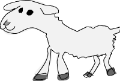
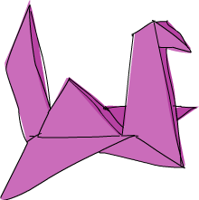

# 高階函數


Haskell 中的函數可以接受函數作為參數也可以返回函數作為結果，這樣的函數就被稱作高階函數。高階函數可不只是某簡單特性而已，它貫穿于 Haskell 的方方面面。要拒絶循環與狀態的改變而通過定義問題"是什麼"來解決問題，高階函數必不可少。它們是編碼的得力工具。

## Curried functions

本質上，Haskell 的所有函數都只有一個參數，那麼我們先前編那麼多含有多個參數的函數又是怎麼回事? 呵，小伎倆! 所有多個參數的函數都是 Curried functions。 什麼意思呢? 取一個例子最好理解，就拿我們的好朋友 ``max`` 函數說事吧。它看起來像是取兩個參數，回傳較大的那個數。 實際上，執行 ``max 4 5`` 時，它會首先回傳一個取一個參數的函數，其回傳值不是 4 就是該參數，取決於誰大。 然後，以 5 為參數呼叫它，並取得最終結果。 這聽著挺繞口的，不過這一概念十分的酷! 如下的兩個呼叫是等價的：

```haskell
ghci> max 4 5
5
ghci> (max 4) 5
5
```


把空格放到兩個東西之間，稱作*函數呼叫*。它有點像個運算符，並擁有最高的優先順序。 看看 ``max`` 函數的型別: ``max :: (Ord a) => a -> a -> a``。 也可以寫作: ``max :: (Ord a) => a -> (a -> a)``。 可以讀作 ``max`` 取一個參數 ``a``，並回傳一個函數(就是那個 ``->``)，這個函數取一個 ``a`` 型別的參數，回傳一個a。 這便是為何只用箭頭來分隔參數和回傳值型別。

這樣的好處又是如何? 簡言之，我們若以不全的參數來呼叫某函數，就可以得到一個*不全呼叫*的函數。 如果你高興，構造新函數就可以如此便捷，將其傳給另一個函數也是同樣方便。

看下這個函數，簡單至極:

```haskell
multThree :: (Num a) => a -> a -> a -> a
multThree x y z = x * y * z
```

我們若執行 ``mulThree 3 5 9`` 或 ``((mulThree 3) 5) 9``，它背後是如何運作呢？ 首先，按照空格分隔，把 ``3`` 交給 ``mulThree``。 這回傳一個回傳函數的函數。 然後把 ``5`` 交給它，回傳一個取一個參數並使之乘以 ``15`` 的函數。 最後把 ``9`` 交給這一函數，回傳 ``135``。 想想，這個函數的型別也可以寫作 ``multThree :: (Num a) => a -> (a -> (a -> a))``，``->`` 前面的東西就是函數取的參數，後面的東西就是其回傳值。所以說，我們的函數取一個 ``a``，並回傳一個型別為 ``(Num a) => a -> (a -> a)`` 的函數，類似，這一函數回傳一個取一個 ``a``，回傳一個型別為 ``(Num a) => a -> a`` 的函數。 而最後的這個函數就只取一個 ``a`` 並回傳一個 ``a``，如下:

```haskell
ghci> let multTwoWithNine = multThree 9
ghci> multTwoWithNine 2 3
54
ghci> let multWithEighteen = multTwoWithNine 2
ghci> multWithEighteen 10
180
```

前面提到，以不全的參數呼叫函數可以方便地創造新的函數。例如，搞個取一數與 100 比較大小的函數該如何? 大可這樣:

```haskell
compareWithHundred :: (Num a, Ord a) => a -> Ordering
compareWithHundred x = compare 100 x
```

用 99 呼叫它，就可以得到一個 ``GT``。 簡單。 注意下在等號兩邊都有 ``x``。 想想 ``compare 100`` 會回傳什麼？一個取一數與 100 比較的函數。 Wow，這不正是我們想要的? 這樣重寫:

```haskell
compareWithHundred :: (Num a, Ord a) => a -> Ordering
compareWithHundred = compare 100
```

型別聲明依然相同，因為 ``compare 100`` 回傳函數。``compare`` 的型別為 ``(Ord a) => a -> (a -> Ordering)``，用 100 呼叫它後回傳的函數型別為 ``(Num a, Ord a) => a -> Ordering``，同時由於 100 還是 ``Num`` 型別類的實例，所以還得另留一個類約束。

Yo! 你得保證已經弄明白了 Curried functions 與不全呼叫的原理，它們很重要！

中綴函數也可以不全呼叫，用括號把它和一邊的參數括在一起就行了。 這回傳一個取一參數並將其補到缺少的那一端的函數。 一個簡單函數如下:

```haskell
divideByTen :: (Floating a) => a -> a
divideByTen = (/10)
```

呼叫 ``divideByTen 200`` 就是 ``(/10) 200``，和 ``200 / 10`` 等價。 

一個檢查字元是否為大寫的函數:

```haskell
isUpperAlphanum :: Char -> Bool
isUpperAlphanum = (`elem` ['A'..'Z'])
```

唯一的例外就是 ``-`` 運算符，按照前面提到的定義，``(-4)`` 理應回傳一個並將參數減 4 的函數，而實際上，處于計算上的方便，``(-4)`` 表示負 ``4``。 若你一定要弄個將參數減 4 的函數，就用 ``subtract`` 好了，像這樣 ``(subtract 4)``.

若不用 ``let`` 給它命名或傳到另一函數中，在 ghci 中直接執行 ``multThree 3 4`` 會怎樣?
```haskell
ghci> multThree 3 4
:1:0:
No instance for (Show (t -> t))
arising from a use of `print' at :1:0-12
Possible fix: add an instance declaration for (Show (t -> t))
In the expression: print it
In a 'do' expression: print it
```

ghci 說，這一表達式回傳了一個 ``a -> a`` 型別的函數，但它不知道該如何顯示它。 函數不是 ``Show`` 型別類的實例，所以我們不能得到表示一函數內容的字串。 若在 ghci 中計算 ``1+1``，它會首先計算得 ``2``，然後呼叫 ``show 2`` 得到該數值的字串表示，即 ``"2"``，再輸出到屏幕.

##  是時候了，來點高階函數！

Haskell 中的函數可以取另一個函數做參數，也可以回傳函數。 舉個例子，我們弄個取一個函數並呼叫它兩次的函數.

```haskell
applyTwice :: (a -> a) -> a -> a  
applyTwice f x = f (f x)  
```


首先注意這型別聲明。 在此之前我們很少用到括號，因為 ``(->)`` 是自然的右結合，不過在這裡括號是必須的。 它標明了首個參數是個參數與回傳值型別都是a的函數，第二個參數與回傳值的型別也都是a。 我們可以用 Curried functions 的思路來理解這一函數，不過免得自尋煩惱，我們姑且直接把它看作是取兩個參數回傳一個值，其首個參數是個型別為 ``(a->a)`` 的函數,第二個參數是個 ``a``。 該函數的型別可以是 ``(Int->Int)``，也可以是 ``(String->String)``，但第二個參數必須與之一致。

    *Note*: 現在開始我們會直說某函數含有多個參數(除非它真的只有一個參數)。 以簡潔之名，我們會說 ``(a->a->a)`` 取兩個參數，儘管我們知道它在背後做的手腳.

這個函數是相當的簡單，就拿參數 ``f`` 當函數，用 ``x`` 呼叫它得到的結果再去呼叫它。也就可以這樣玩:

```haskell
ghci> applyTwice (+3) 10  
16  
ghci> applyTwice (++ " HAHA") "HEY"  
"HEY HAHA HAHA"  
ghci> applyTwice ("HAHA " ++) "HEY"  
"HAHA HAHA HEY"  
ghci> applyTwice (multThree 2 2) 9  
144  
ghci> applyTwice (3:) [1]  
[3,3,1]  
```

看，不全呼叫多神奇! 如果有個函數要我們給它傳個一元函數，大可以不全呼叫一個函數讓它剩一個參數，再把它交出去。

接下來我們用高階函數的編程思想來實現個標準庫中的函數，它就是 ``zipWith``。 它取一個函數和兩個 List 做參數，並把兩個 List 交到一起(使相應的元素去呼叫該函數)。 如下就是我們的實現:

```haskell
zipWith' :: (a -> b -> c) -> [a] -> [b] -> [c]  
zipWith' _ [] _ = []  
zipWith' _ _ [] = []  
zipWith' f (x:xs) (y:ys) = f x y : zipWith' f xs ys  
```

看下這個型別聲明，它的首個參數是個函數，取兩個參數處理交叉，其型別不必相同，不過相同也沒關係。 第二三個參數都是 List，回傳值也是個 List。 第一個 List中元素的型別必須是a，因為這個處理交叉的函數的第一個參數是a。 第二個 List 中元素的型別必為 ``b``，因為這個處理交叉的函數第二個參數的型別是 ``b``。 回傳的 List 中元素型別為 ``c``。 如果一個函數說取一個型別為 ``a->b->c`` 的函數做參數，傳給它個 ``a->a->c`` 型別的也是可以的，但反過來就不行了。 可以記下，若在使用高階函數的時候不清楚其型別為何，就先忽略掉它的型別聲明，再到 ghci 下用 ``:t`` 命令來看下 Haskell 的型別推導. 

這函數的行為與普通的 ``zip`` 很相似，邊界條件也是相同，只不過多了個參數，即處理元素交叉的函數。它關不着邊界條件什麼事兒，所以我們就只留一個 ``_``。後一個模式的函數體與 ``zip`` 也很像，只不過這裡是 ``f x y`` 而非 ``(x,y)``。 只要足夠通用，一個簡單的高階函數可以在不同的場合反覆使用。 如下便是我們 ``zipWith'`` 函數本領的冰山一角:

```haskell
ghci> zipWith' (+) [4,2,5,6] [2,6,2,3]  
[6,8,7,9]  
ghci> zipWith' max [6,3,2,1] [7,3,1,5]  
[7,3,2,5]  
ghci> zipWith' (++) ["foo "，"bar "，"baz "] ["fighters"，"hoppers"，"aldrin"]  
["foo fighters","bar hoppers","baz aldrin"]  
ghci> zipWith' (*) (replicate 5 2) [1..]  
[2,4,6,8,10]  
ghci> zipWith' (zipWith' (*)) [[1,2,3],[3,5,6],[2,3,4]] [[3,2,2],[3,4,5],[5,4,3]]  
[[3,4,6],[9,20,30],[10,12,12]]  
```

如你所見，一個簡單的高階函數就可以玩出很多花樣。命令式語言使用 ``for``、``while``、賦值、狀態檢測來實現功能，再包起來留個介面，使之像個函數一樣呼叫。而函數式語言使用高階函數來抽象出常見的模式，像成對遍歷並處理兩個 List 或從中篩掉自己不需要的結果。

接下來實現標準庫中的另一個函數 ``flip``，``flip``簡單地取一個函數作參數並回傳一個相似的函數，只是它們的兩個參數倒了個。

```haskell
flip' :: (a -> b -> c) -> (b -> a -> c)  
flip' f = g  
    where g x y = f y x  
```

從這型別聲明中可以看出，它取一個函數，其參數型別分別為 ``a`` 和 ``b``，而它回傳的函數的參數型別為 ``b`` 和 ``a``。 由於函數預設都是柯裡化的，``->`` 為右結合，這裡的第二對括號其實並無必要，``(a -> b -> c) -> (b -> a -> c)`` 與 ``(a -> b -> c) -> (b -> (a -> c))`` 等價,也與 ``(a -> b -> c) -> b -> a -> c`` 等價。 前面我們寫了 ``g x y = f y x``，既然這樣可行，那麼 ``f y x = g x y`` 不也一樣? 這一來我們可以改成更簡單的寫法:

```haskell
flip' :: (a -> b -> c) -> b -> a -> c  
flip' f y x = f x y  
```

在這裡我們就利用了 Curried functions 的優勢，只要呼叫 ``flip' f`` 而不帶 ``y``和``x``，它就會回傳一個倆參數倒個的函數。  ``flip`` 處理的函數往往都是用來傳給其他函數呼叫，於是我們可以發揮 Curried functions 的優勢，預先想好發生完全呼叫的情景並處理好回傳值.

```haskell
ghci> flip' zip [1,2,3,4,5] "hello"  
[('h',1),('e',2),('l',3),('l',4),('o',5)]  
ghci> zipWith (flip' div) [2,2..] [10,8,6,4,2]  
[5,4,3,2,1]
```

 
##  map 與 filter

**map** 取一個函數和 List 做參數，遍歷該 List 的每個元素來呼叫該函數產生一個新的 List。 看下它的型別聲明和實現:

```haskell
map :: (a -> b) -> [a] -> [b]  
map _ [] = []  
map f (x:xs) = f x : map f xs
```

從這型別聲明中可以看出，它取一個取 ``a`` 回傳 ``b`` 的函數和一組 ``a`` 的 List，並回傳一組 ``b``。 這就是 Haskell 的有趣之處：有時只看型別聲明就能對函數的行為猜個大致。``map`` 函數多才多藝，有一百萬種用法。如下是其中一小部分:

```haskell
ghci> map (+3) [1,5,3,1,6]  
[4,8,6,4,9]  
ghci> map (++ "!") ["BIFF"，"BANG"，"POW"]  
["BIFF!","BANG!","POW!"]  
ghci> map (replicate 3) [3..6]  
[[3,3,3],[4,4,4],[5,5,5],[6,6,6]]  
ghci> map (map (^2)) [[1,2],[3,4,5,6],[7,8]]  
[[1,4],[9,16,25,36],[49,64]]  
ghci> map fst [(1,2),(3,5),(6,3),(2,6),(2,5)]  
[1,3,6,2,2]  
```

你可能會發現，以上的所有程式碼都可以用 List Comprehension 來替代。``map (+3) [1,5,3,1,6]`` 與 ``[x+3 | x <- [1,5,3,1,6]`` 完全等價。

**filter** 函數取一個限制條件和一個 List，回傳該 List 中所有符合該條件的元素。它的型別聲明及實現大致如下:
 
```haskell
filter :: (a -> Bool) -> [a] -> [a]  
filter _ [] = []  
filter p (x:xs)   
    | p x       = x : filter p xs  
    | otherwise = filter p xs  
```

很簡單。只要 ``p x`` 所得的結果為真，就將這一元素加入新 List，否則就無視之。幾個使用範例:

```haskell
ghci> filter (>3) [1,5,3,2,1,6,4,3,2,1]  
[5,6,4]  
ghci> filter (==3) [1,2,3,4,5]  
[3]  
ghci> filter even [1..10]  
[2,4,6,8,10]  
ghci> let notNull x = not (null x) in filter notNull [[1,2,3],[],[3,4,5],[2,2],[],[],[]]  
[[1,2,3],[3,4,5],[2,2]]  
ghci> filter (`elem` ['a'..'z']) "u LaUgH aT mE BeCaUsE I aM diFfeRent"  
"uagameasadifeent"  
ghci> filter (`elem` ['A'..'Z']) "i lauGh At You BecAuse u r aLL the Same"  
"GAYBALLS"  
```

同樣，以上都可以用 List Comprehension 的限制條件來實現。並沒有教條規定你必須在什麼情況下用 ``map`` 和 ``filter`` 還是 List Comprehension，選擇權歸你，看誰舒服用誰就是。 如果有多個限制條件，只能連着套好幾個 ``filter`` 或用 ``&&`` 等邏輯函數的組合之，這時就不如 List comprehension 來得爽了。

還記得上一章的那個 ``quicksort`` 函數麼? 我們用到了 List Comprehension 來過濾大於或小於錨的元素。 換做 ``filter`` 也可以實現，而且更加易讀：

```haskell
quicksort :: (Ord a) => [a] -> [a]    
quicksort [] = []    
quicksort (x:xs) =     
    let smallerSorted = quicksort (filter (<=x) xs)
        biggerSorted = quicksort (filter (>x) xs)   
    in  smallerSorted ++ [x] ++ biggerSorted  
```


``map`` 和 ``filter`` 是每個函數式程序員的麵包黃油(呃，``map`` 和 ``filter`` 還是 List Comprehension 並不重要)。 想想前面我們如何解決給定周長尋找合適直角三角形的問題的? 在命令式編程中，我們可以套上三個循環逐個測試當前的組合是否滿足條件，若滿足，就打印到屏幕或其他類似的輸出。 而在函數式編程中，這行就都交給 ``map`` 和 ``filter``。 你弄個取一參數的函數，把它交給 ``map`` 過一遍 List，再 ``filter`` 之找到合適的結果。 感謝 Haskell 的惰性，即便是你多次 ``map`` 一個 ``List` 也只會遍歷一遍該 List，要找出小於 100000 的數中最大的 3829 的倍數，只需過濾結果所在的 List 就行了.

要找出*小於 100000 的 3829 的所有倍數*，我們應當過濾一個已知結果所在的 List.

```haskell
largestDivisible :: (Integral a) => a  
largestDivisible = head (filter p [100000,99999..])  
    where p x = x `mod` 3829 == 0  
```

首先，取一個降序的小於 100000 所有數的 List，然後按照限制條件過濾它。 由於這個 List 是降序的，所以結果 List 中的首個元素就是最大的那個數。惰性再次行動! 由於我們只取這結果 List 的首個元素，所以它並不關心這 List 是有限還是無限的，在找到首個合適的結果處運算就停止了。

接下來，我們就要*找出所有小於 10000 且为奇的平方的和*，得先提下 **takeWhile** 函數，它取一個限制條件和 List 作參數，然後從頭開始遍歷這一 List，並回傳符合限制條件的元素。 而一旦遇到不符合條件的元素，它就停止了。 如果我們要取出字串  ``"elephants know how to party"`` 中的首個單詞，可以 ``takeWhile (/=' ') "elephants know how to party"``，回傳 ``"elephants"``。okay，要求所有小於 10000 的奇數的平方的和，首先就用 ``(^2)`` 函數 ``map`` 掉這個無限的 List ``[1..]`` 。然後過濾之，只取奇數就是了。 在大於 10000 處將它斷開，最後前面的所有元素加到一起。 這一切連寫函數都不用，在 ghci 下直接搞定.

```haskell
ghci> sum (takeWhile (<10000) (filter odd (map (^2) [1..])))  
166650  
```

不錯! 先從幾個初始數據(表示所有自然數的無限 List)，再 ``map`` 它，``filter`` 它，切它，直到它符合我們的要求，再將其加起來。 這用 List comprehension 也是可以的，而哪種方式就全看你的個人口味.

```haskell
ghci> sum (takeWhile (<10000) [m | m <- [n^2 | n <- [1..]], odd m])  
166650  
```

感謝 Haskell 的惰性特質，這一切才得以實現。 我們之所以可以 ``map`` 或 ``filter`` 一個無限 List，是因為它的操作不會被立即執行，而是拖延一下。只有我們要求 Haskell 交給我們 ``sum`` 的結果的時候，``sum`` 函數才會跟 ``takeWhile`` 說，它要這些數。``takeWhile`` 就再去要求 ``filter`` 和 ``map`` 行動起來，並在遇到大於等於 10000 時候停止.
下個問題與 Collatz 序列有關，取一個自然數，若為偶數就除以 2。 若為奇數就乘以 3 再加 1。 再用相同的方式處理所得的結果，得到一組數字構成的的鏈。它有個性質，無論任何以任何數字開始，最終的結果都會歸 1。所以若拿 13 當作起始數，就可以得到這樣一個序列 ``13，40，20，10，5，16，8，4，2，1``。``13*3+1`` 得 40，40 除 2 得 20，如是繼續，得到一個 10 個元素的鏈。

好的，我們想知道的是: 以 1 到 100 之間的所有數作為起始數，會有多少個鏈的長度大於 15?

```haskell
chain :: (Integral a) => a -> [a]  
chain 1 = [1]  
chain n  
    | even n =  n:chain (n `div` 2)  
    | odd n  =  n:chain (n*3 + 1)  
```

該鏈止於 1，這便是邊界條件。標準的遞歸函數:

```haskell
ghci> chain 10  
[10,5,16,8,4,2,1]  
ghci> chain 1  
[1]  
ghci> chain 30  
[30,15,46,23,70,35,106,53,160,80,40,20,10,5,16,8,4,2,1]  
```

yay! 貌似工作良好。 現在由這個函數來告訴我們結果:

```haskell
numLongChains :: Int  
numLongChains = length (filter isLong (map chain [1..100]))  
    where isLong xs = length xs > 15  
```

我們把 ``chain`` 函數 ``map`` 到 ``[1..100]``，得到一組鏈的 List，然後用個限制條件過濾長度大於 15 的鏈。過濾完畢後就可以得出結果list中的元素個數.

    *Note*: 這函數的型別為 ``numLongChains :: Int``。這是由於歷史原因，``length`` 回傳一個 ``Int`` 而非 ``Num`` 的成員型別，若要得到一個更通用的 ``Num a``，我們可以使用 ``fromIntegral`` 函數來處理所得結果.

用 ``map``，我們可以寫出類似 ``map (*) [0..]`` 之類的程式碼。 如果只是為了例證 Curried functions 和不全呼叫的函數是真正的值及其原理，那就是你可以把函數傳遞或把函數裝在 List 中(只是你還不能將它們轉換為字串)。 迄今為止，我們還只是 ``map`` 單參數的函數到 List，如 ``map (*2) [0..]`` 可得一組型別為 ``(Num a) => [a]`` 的 List，而 ``map (*) [0..]`` 也是完全沒問題的。``*`` 的型別為 ``(Num a) => a -> a -> a``，用單個參數呼叫二元函數會回傳一個一元函數。如果用 ``*`` 來 ``map``  一個 ``[0..]`` 的 List，就會得到一組一元函數組成的 List，即 `` (Num a) => [a->a]``。``map (*) [0..]`` 所得的結果寫起來大約就是 ``[(0*),(1*),(2*)..]``.

```haskell
ghci> let listOfFuns = map (*) [0..]  
ghci> (listOfFuns !! 4) 5  
20
```
 
取所得 List 的第五個元素可得一函數，與 ``(*4)`` 等價。 然後用 ``5`` 呼叫它，與 ``(* 4) 5`` 或 `` 4*5 `` 都是等價的.


## lambda



lambda 就是匿名函數。有些時候我們需要傳給高階函數一個函數，而這函數我們只會用這一次，這就弄個特定功能的 lambda。編寫 lambda，就寫個 ``\`` (因為它看起來像是希臘字母的 lambda -- 如果你斜視的厲害)，後面是用空格分隔的參數，``->`` 後面就是函數體。通常我們都是用括號將其括起，要不然它就會佔據整個右邊部分。

向上 5 英吋左右，你會看到我們在 ``numLongChain`` 函數中用 ``where`` 語句聲明了個 ``isLong`` 函數傳遞給了 ``filter``。好的，用 lambda 代替它。

```haskell
numLongChains :: Int  
numLongChains = length (filter (\xs -> length xs > 15) (map chain [1..100]))  
```


lambda 是個表達式，因此我們可以任意傳遞。表達式 ``(\xs -> length xs > 15)`` 回傳一個函數，它可以告訴我們一個 List 的長度是否大於 15。

不熟悉 Curried functions 與不全呼叫的人們往往會寫出很多 lambda，而實際上大部分都是沒必要的。例如，表達式 ``map (+3) [1,6,3,2]`` 與 ``map (\x -> x+3) [1,6,3,2]`` 等價，``(+3)`` 和 ``(\x -> x+3)`` 都是給一個數加上 3。不用說，在這種情況下不用 lambda 要清爽的多。

和普通函數一樣，lambda 也可以取多個參數。

```haskell
ghci> zipWith (\a b -> (a * 30 + 3) / b) [5,4,3,2,1] [1,2,3,4,5]  
[153.0,61.5,31.0,15.75,6.6] 
```

同普通函數一樣，你也可以在 lambda 中使用模式匹配，只是你無法為一個參數設置多個模式，如 ``[]`` 和 ``(x:xs)``。lambda 的模式匹配若失敗，就會引發一個運行時錯誤，所以慎用！
 
```haskell
ghci> map (\(a,b) -> a + b) [(1,2),(3,5),(6,3),(2,6),(2,5)]  
[3,8,9,8,7]  
```

一般情況下，lambda 都是括在括號中，除非我們想要後面的整個語句都作為 lambda 的函數體。很有趣，由於有柯裡化，如下的兩段是等價的：
 
```haskell
addThree :: (Num a) => a -> a -> a -> a  
addThree x y z = x + y + z  
```

```haskell
addThree :: (Num a) => a -> a -> a -> a  
addThree = \x -> \y -> \z -> x + y + z 
```

這樣的函數聲明與函數體中都有 ``->``，這一來型別聲明的寫法就很明白了。當然第一段程式碼更易讀，不過第二個函數使得柯裡化更容易理解。
 
有些時候用這種語句寫還是挺酷的，我覺得這應該是最易讀的 ``flip`` 函數實現了：
 
```haskell
flip' :: (a -> b -> c) -> b -> a -> c  
flip' f = \x y -> f y x  
```

儘管這與 ``flip' f x y = f y x`` 等價，但它可以更明白地表示出它會產生一個新的函數。``flip`` 常用來處理一個函數，再將回傳的新函數傳遞給 ``map`` 或 ``filter``。所以如此使用 lambda 可以更明確地表現出回傳值是個函數，可以用來傳遞給其他函數作參數。


##  關鍵字 fold



回到當初我們學習遞歸的情景。我們會發現處理 List 的許多函數都有固定的模式，通常我們會將邊界條件設置為空 List，再引入 ``(x:xs)`` 模式，對單個元素和餘下的 List 做些事情。這一模式是如此常見，因此 Haskell 引入了一組函數來使之簡化，也就是 ``fold``。它們與map有點像，只是它們回傳的是單個值。
 
一個 ``fold`` 取一個二元函數，一個初始值(我喜歡管它叫累加值)和一個需要摺疊的 List。這個二元函數有兩個參數，即累加值和 List 的首項(或尾項)，回傳值是新的累加值。然後，以新的累加值和新的 List 首項呼叫該函數，如是繼續。到 List 遍歷完畢時，只剩下一個累加值，也就是最終的結果。

首先看下 **foldl** 函數，也叫做左摺疊。它從 List 的左端開始摺疊，用初始值和 List 的頭部呼叫這二元函數，得一新的累加值，並用新的累加值與 List 的下一個元素呼叫二元函數。如是繼續。
 
我們再實現下 ``sum``，這次用 ``fold`` 替代那複雜的遞歸：

```haskell
sum' :: (Num a) => [a] -> a  
sum' xs = foldl (\acc x -> acc + x) 0 xs  
```

測試下，一二三～
 
```haskell
ghci> sum' [3,5,2,1]  
11
``` 


我們深入看下 ``fold`` 的執行過程：``\acc x-> acc + x`` 是個二元函數，``0`` 是初始值，``xs`` 是待摺疊的 List。一開始，累加值為 ``0``，當前項為 ``3``，呼叫二元函數 ``0+3`` 得 ``3``，作新的累加值。接着來，累加值為 ``3``，當前項為 ``5``，得新累加值 ``8``。再往後，累加值為 ``8``，當前項為 ``2``，得新累加值 ``10``。最後累加值為 ``10``，當前項為 ``1``，得 ``11``。恭喜，你完成了一次摺疊 ``(fold)``！

左邊的這個圖表示了摺疊的執行過程，一步又一步(一天又一天!)。淺棕色的數字都是累加值，你可以從中看出 List 是如何從左端一點點加到累加值上的。唔對對對！如果我們考慮到函數的柯裡化，可以寫出更簡單的實現：
 
```haskell
sum' :: (Num a) => [a] -> a  
sum' = foldl (+) 0  
```

這個 lambda 函數 ``(\acc x -> acc + x )`` 與 ``(+)`` 等價。我們可以把 ``xs`` 等一應參數省略掉，反正呼叫 ``foldl (+) 0`` 會回傳一個取 List 作參數的函數。通常，如果你的函數類似 ``foo a = bar b a``， 大可改為 ``foo = bar b``。有柯裡化嘛。
 
呼呼，進入右摺疊前我們再實現個用到左摺疊的函數。大家肯定都知道 ``elem`` 是檢查某元素是否屬於某 List 的函數吧，我就不再提了(唔，剛提了)。用左摺疊實現它:
 
```haskell
elem' :: (Eq a) => a -> [a] -> Bool  
elem' y ys = foldl (\acc x -> if x == y then True else acc) False ys  
```

好好好，這裡我們有什麼？起始值與累加值都是布爾值。在處理 ``fold`` 時，累加值與最終結果的型別總是相同的。如果你不知道怎樣對待起始值，那我告訴你，我們先假設它不存在，以 ``False`` 開始。我們要是 ``fold`` 一個空 List，結果就是 ``False``。然後我們檢查當前元素是否為我們尋找的，如果是，就令累加值為 ``True``，如果否，就保留原值不變。若 ``False``，及表明當前元素不是。若 ``True``，就表明已經找到了。
 
右摺疊 **foldr** 的行為與左摺疊相似，只是累加值是從 List 的右邊開始。同樣，左摺疊的二元函數取累加值作首個參數，當前值為第二個參數(即 ``\acc x -> ...``)，而右摺疊的二元函數參數的順序正好相反(即 ``\x acc -> ...``)。這倒也正常，畢竟是從右端開始摺疊。
 
累加值可以是任何型別，可以是數值，布爾值，甚至一個新的 List。我們可以用右 ``fold`` 實現 ``map`` 函數，累加值就是個 List。將 ``map`` 處理過的元素一個一個連到一起。很容易想到，起始值就是空 List。
 
```haskell
map' :: (a -> b) -> [a] -> [b]  
map' f xs = foldr (\x acc -> f x : acc) [] xs  
```

如果我們用 ``(+3)`` 來映射 ``[1,2,3]``，它就會先到達 List 的右端，我們取最後那個元素，也就是 ``3`` 來呼叫 ``(+3)``，得 ``6``。追加 ``(:)`` 到累加值上，``6:[]`` 得 ``[6]`` 並成為新的累加值。用 ``2`` 呼叫 ``(+3)``，得 ``5``，追加到累加值，於是累加值成了 ``[5,6]``。再對 ``1`` 呼叫 ``(+3)``，並將結果 4 追加到累加值，最終得結果 ``[4,5,6]``。
 
當然，我們也完全可以用左摺疊來實現它，``map' f xs = foldl (\acc x -> acc ++ [f x]) [] xs`` 就行了。不過問題是，使用 ``(++)`` 往 List 後面追加元素的效率要比使用 ``(:)`` 低得多。所以在生成新 List 的時候人們一般都是使用右摺疊。


反轉一個 List，既也可以通過右摺疊，也可以通過左摺疊。有時甚至不需要管它們的分別，如 ``sum`` 函數的左右摺疊實現都是十分相似。不過有個大的不同，那就是右摺疊可以處理無限長度的資料結構，而左摺疊不可以。將無限 List 從中斷開執行左摺疊是可以的，不過若是向右，就永遠到不了頭了。
 
*所有遍歷 List 中元素並據此回傳一個值的操作都可以交給 ``fold`` 實現*。無論何時需要遍歷 List 並回傳某值，都可以嘗試下 ``fold``。因此，``fold``的地位可以說與 ``map``和 ``filter``並駕齊驅，同為函數式編程中最常用的函數之一。
 
**foldl1** 與 **foldr1** 的行為與 ``foldl`` 和 ``foldr`` 相似，只是你無需明確提供初始值。他們假定 List 的首個(或末尾)元素作為起始值，並從旁邊的元素開始摺疊。這一來，``sum`` 函數大可這樣實現：``sum = foldl1 (+)``。這裡待摺疊的 List 中至少要有一個元素，若使用空 List 就會產生一個運行時錯誤。不過 ``foldl`` 和 ``foldr`` 與空 List 相處的就很好。所以在使用 ``fold`` 前，應該先想下它會不會遇到空 List，如果不會遇到，大可放心使用 ``foldr1`` 和 ``foldl1``。
 
為了體會 ``fold`` 的威力，我們就用它實現幾個庫函數：
 
```haskell
maximum' :: (Ord a) => [a] -> a  
maximum' = foldr1 (\x acc -> if x > acc then x else acc)  

reverse' :: [a] -> [a]  
reverse' = foldl (\acc x -> x : acc) []  

product' :: (Num a) => [a] -> a  
product' = foldr1 (*)  

filter' :: (a -> Bool) -> [a] -> [a]  
filter' p = foldr (\x acc -> if p x then x : acc else acc) []  

head' :: [a] -> a  
head' = foldr1 (\x _ -> x)  

last' :: [a] -> a  
last' = foldl1 (\_ x -> x)  

```
 
僅靠模式匹配就可以實現 ``head`` 函數和 ``last`` 函數，而且效率也很高。這裡只是為了演示，用 ``fold`` 的實現方法。我覺得我們這個 ``reverse'`` 定義的相當聰明，用一個空 List 做初始值，並向左展開 List，從左追加到累加值，最後得到一個反轉的新 List。``\acc x -> x : acc`` 有點像 ``:`` 函數，只是參數順序相反。所以我們可以改成 `` foldl (flip (:)) []``。
 
有個理解摺疊的思路：假設我們有個二元函數 ``f``，起始值 ``z``，如果從右摺疊 ``[3,4,5,6]``，實際上執行的就是 ``f 3 (f 4 (f 5 (f 6 z)))``。``f`` 會被 List 的尾項和累加值呼叫，所得的結果會作為新的累加值傳入下一個呼叫。假設 ``f`` 是 ``(+)``，起始值 ``z`` 是 ``0``，那麼就是 ``3 + (4 + (5 + (6 + 0)))``，或等價的首碼形式：``(+) 3 ((+) 4 ((+) 5 ((+) 6 0)))``。相似，左摺疊一個 List，以 ``g`` 為二元函數，``z`` 為累加值，它就與 ``g (g (g (g z 3) 4) 5) 6`` 等價。如果用 ``flip (:)`` 作二元函數，``[]`` 為累加值(看得出，我們是要反轉一個 List)，這就與 ``flip (:) (flip (:) (flip (:) (flip (:) [] 3) 4) 5) 6`` 等價。顯而易見，執行該表達式的結果為 ``[6,5,4,3]``。
 
**scanl** 和 **scanr** 與 ``foldl`` 和 ``foldr`` 相似，只是它們會記錄下累加值的所有狀態到一個 List。也有 **scanl1** 和 **scanr1**。
 
```haskell
ghci> scanl (+) 0 [3,5,2,1]  
[0,3,8,10,11]  
ghci> scanr (+) 0 [3,5,2,1]  
[11,8,3,1,0]  
ghci> scanl1 (\acc x -> if x > acc then x else acc) [3,4,5,3,7,9,2,1]  
[3,4,5,5,7,9,9,9]  
ghci> scanl (flip (:)) [] [3,2,1]  
[[],[3],[2,3],[1,2,3]]  
```

當使用 ``scanl`` 時，最終結果就是 List 的最後一個元素。而在 ``scanr`` 中則是第一個。

```haskell
sqrtSums :: Int  
sqrtSums = length (takeWhile (<1000) (scanl1 (+) (map sqrt [1..]))) + 1  
```

```haskell
ghci> sqrtSums  
131  
ghci> sum (map sqrt [1..131])  
1005.0942035344083  
ghci> sum (map sqrt [1..130])  
993.6486803921487  
```

``scan`` 可以用來跟蹤 ``fold`` 函數的執行過程。想想這個問題，*取所有自然數的平方根的和，尋找在何處超過 1000*？ 先``map sqrt [1..]``，然後用個 ``fold`` 來求它們的和。但在這裡我們想知道求和的過程，所以使用 ``scan``，``scan`` 完畢時就可以得到小於 1000 的所有和。所得結果 List 的第一個元素為 1，第二個就是 1+根2，第三個就是 1+根2+根3。若有 ``x`` 個和小於 1000，那結果就是 ``x+1``。


##  有$的函數呼叫

好的，接下來看看 **$** 函數。它也叫作*函數呼叫符*。先看下它的定義：
 
```haskell
($) :: (a -> b) -> a -> b  
f $ x = f x  
```


什麼鬼東西？這沒啥意義的操作符？它只是個函數呼叫符罷了？好吧，不全是，但差不多。普通的函數呼叫符有最高的優先順序，而 ``$`` 的優先順序則最低。用空格的函數呼叫符是左結合的，如 ``f a b c`` 與 ``((f a) b) c`` 等價，而 ``$`` 則是右結合的。
 
聽著不錯。但有什麼用？它可以減少我們程式碼中括號的數目。試想有這個表達式： ``sum (map sqrt [1..130])``。由於低優先順序的 ``$``，我們可以將其改為 ``sum $ map sqrt [1..130]``，可以省敲不少鍵！``sqrt 3 + 4 + 9`` 會怎樣？這會得到 9，4 和根3 的和。若要取 ``(3+4+9)`` 的平方根，就得 ``sqrt (3+4+9)`` 或用 ``$``：``sqrt $ 3+4+9``。因為 ``$`` 有最低的優先順序，所以你可以把$看作是在右面寫一對括號的等價形式。
 
``sum (filter (> 10) (map (*2) [2..10]))`` 該如何？嗯，``$`` 是右結合，``f (g (z x))`` 與 ``f $ g $ z x`` 等價。所以我麼可以將 ``sum (filter (> 10) (map (*2) [2..10])`` 重寫為 ``sum $ filter (> 10) $ map (*2) [2..10]``。
 
除了減少括號外，``$`` 還可以將數據作為函數使用。例如映射一個函數呼叫符到一組函數組成的 List：
 
```haskell
ghci> map ($ 3) [(4+),(10*),(^2),sqrt]  
[7.0,30.0,9.0,1.7320508075688772]  
```


 
##  Function composition
 
在數學中，函數組合是這樣定義的： ，表示組合兩個函數成為一個函數。以 ``x`` 呼叫這一函數，就與用 ``x`` 呼叫 ``g`` 再用所得的結果呼叫 ``f`` 等價。
 
Haskell 中的函數組合與之很像，即 **.** 函數。其定義為：
 
```haskell
(.) :: (b -> c) -> (a -> b) -> a -> c  
f . g = \x -> f (g x)  
```


注意下這型別聲明，``f`` 的參數型別必須與 ``g`` 的回傳型別相同。所以得到的組合函數的參數型別與 ``g`` 相同，回傳型別與 ``f`` 相同。表達式 ``negate . (*3)`` 回傳一個求一數字乘以 3 後的負數的函數。
 
函數組合的用處之一就是生成新函數，並傳遞給其它函數。當然我們可以用 lambda 實現，但大多數情況下，使用函數組合無疑更清楚。假設我們有一組由數字組成的 List，要將其全部轉為負數，很容易就想到應先取其絶對值，再取負數，像這樣：
 
```haskell
ghci> map (\x -> negate (abs x)) [5,-3,-6,7,-3,2,-19,24]  
[-5,-3,-6,-7,-3,-2,-19,-24]  
```

注意下這個 lambda 與那函數組合是多麼的相像。用函數組合，我們可以將程式碼改為：

```haskell
ghci> map (negate . abs) [5,-3,-6,7,-3,2,-19,24]  
[-5,-3,-6,-7,-3,-2,-19,-24]  
```

漂亮！函數組合是右結合的，我們同時組合多個函數。表達式 ``f (g (z x))``與 ``(f . g . z) x`` 等價。按照這個思路，我們可以將

```haskell
ghci> map (\xs -> negate (sum (tail xs))) [[1..5],[3..6],[1..7]]  
[-14,-15,-27]  
```

改為：

```haskell
ghci> map (negate . sum . tail) [[1..5],[3..6],[1..7]]  
[-14,-15,-27]  
```

不過含多個參數的函數該怎麼辦？好，我們可以使用不全呼叫使每個函數都只剩下一個參數。``sum (replicate 5 (max 6.7 8.9))`` 可以重寫為 ``(sum . replicate 5 . max 6.7) 8.9`` 或 `` sum . replicate 5 . max 6.7 $ 8.9``。在這裡會產生一個函數，它取與 ``max 6.7`` 同樣的參數，並使用結果呼叫 ``replicate 5`` 再用 ``sum`` 求和。最後用 ``8.9`` 呼叫該函數。不過一般你可以這麼讀，用 8.9 呼叫 ``max 6.7``，然後使它 ``replicate 5``，再 ``sum`` 之。如果你打算用函數組合來替掉那堆括號，可以先在最靠近參數的函數後面加一個 ``$``，接着就用 ``.`` 組合其所有函數呼叫，而不用管最後那個參數。如果有這樣一段程式碼：``replicate 100 (product (map (*3) (zipWith max [1,2,3,4,5] [4,5,6,7,8])))``，可以改為：``replicate 100 . product . map (*3) . zipWith max [1,2,3,4,5] $ [4,5,6,7,8]``。如果表達式以 3 個括號結尾，就表示你可以將其修改為函數組合的形式。
 
函數組合的另一用途就是定義 point free style (也稱作 pointless style) 的函數。就拿我們之前寫的函數作例子：
 
```haskell
sum' :: (Num a) => [a] -> a     
sum' xs = foldl (+) 0 xs    
```

等號的兩端都有個 ``xs``。由於有柯裡化 (Currying)，我們可以省掉兩端的 ``xs``。``foldl (+) 0`` 回傳的就是一個取一 List 作參數的函數，我們把它修改為 ``sum' = foldl (+) 0``，這就是 point free style。下面這個函數又該如何改成 point free style 呢？
 
```haskell
fn x = ceiling (negate (tan (cos (max 50 x))))  
```

像剛才那樣簡單去掉兩端的 ``x`` 是不行的，函數定義中 ``x`` 的右邊還有括號。``cos (max 50)`` 是有錯誤的，你不能求一個函數的餘弦。我們的解決方法就是，使用函數組合。

```haskell
fn = ceiling . negate . tan . cos . max 50  
```

漂亮！point free style 會令你去思考函數的組合方式，而非數據的傳遞方式，更加簡潔明瞭。你可以將一組簡單的函數組合在一起，使之形成一個複雜的函數。不過函數若過于複雜，再使用 point free style 往往會適得其反，因此構造較長的函數組合鏈是不被鼓勵的(雖然我本人熱衷于函數組合)。更好的解決方法，就是使用 ``let`` 語句給中間的運算結果綁定一個名字，或者說把問題分解成幾個小問題再組合到一起。這樣一來我們程式碼的讀者就可以輕鬆些，不必要糾結那巨長的函數組合鏈了。
 
在 ``map`` 和 ``filter`` 那節中，我們求了小於 10000 的所有奇數的平方的和。如下就是將其置於一個函數中的樣子：

```haskell
oddSquareSum :: Integer  
oddSquareSum = sum (takeWhile (<10000) (filter odd (map (^2) [1..])))    
```

身為函數組合狂人，我可能會這麼寫：

```haskell
oddSquareSum :: Integer  
oddSquareSum = sum . takeWhile (<10000) . filter odd . map (^2) $ [1..]  
```

不過若是給別人看，我可能就這麼寫了：

```haskell
oddSquareSum :: Integer  
oddSquareSum =   
    let oddSquares = filter odd $ map (^2) [1..]  
        belowLimit = takeWhile (<10000) oddSquares  
    in  sum belowLimit  
```

這段程式碼可贏不了程式碼花樣大賽，不過我們的讀者可能會覺得它比函數組合鏈更好看。
