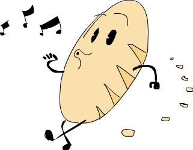

# Zippers 資料結構


儘管 Haskell 的純粹性質帶來很多好處，但他讓一些在非純粹語言很容易處理的一些事情變得要用另一種方法解決。由於 referential transparency，同樣一件事在 Haskell 中是沒有分別的。所以如果我們有一個裝滿 5 的樹，而我們希望把其中一個換成 6，那我們必須要知道我們究竟是想改變哪個 5。我們也必須知道我們身處在這棵樹的哪裡。但在 Haskell 中，每個 5 都長得一樣，我們並不能因為他們在記憶體中的位址不同就把他們區分開來。我們也不能改變任何狀態，當我們想要改變一棵樹的時候，我們實際上是說我們要一棵新的樹，只是他長得很像舊的。一種解決方式是記住一條從根節點到現在這個節點的路徑。我們可以這樣表達：給定一棵樹，先往左走，再往右走，再往左走，然後改變你走到的元素。雖然這是可行的，但這非常沒有效率。如果我們想接連改變一個在附近的節點，我們必須再從根節點走一次。在這個章節中，我們會看到我們可以集中注意在某個資料結構上，這樣讓改變資料結構跟遍歷的動作非常有效率。


## 來走二元樹吧!

我們在生物課中學過，樹有非常多種。所以我們來自己發明棵樹吧！

```
data Tree a = Empty | Node a (Tree a) (Tree a) deriving (Show)      
```

這邊我們的樹不是空的就是有兩棵子樹。來看看一個範例：

```
freeTree :: Tree Char  
freeTree =   
    Node 'P'  
        (Node 'O'  
             (Node 'L'  
              (Node 'N' Empty Empty)  
              (Node 'T' Empty Empty)  
             )  
             (Node 'Y'  
              (Node 'S' Empty Empty)  
              (Node 'A' Empty Empty)  
             )  
        )  
        (Node 'L'  
             (Node 'W'  
                  (Node 'C' Empty Empty)  
                  (Node 'R' Empty Empty)  
             )  
             (Node 'A'  
                  (Node 'A' Empty Empty)  
                  (Node 'C' Empty Empty)  
             )  
        )  
```

畫成圖的話就是像這樣：


注意到 ``W`` 這個節點了嗎？如果我們想要把他變成 ``P``。我們會怎麼做呢？一種方式是用 pattern match 的方式做，直到我們找到那個節點為止。要先往右走再往左走，再改變元素內容，像是這樣：

```
changeToP :: Tree Char -> Tree Char  
changeToP (Node x l (Node y (Node _ m n) r)) = Node x l (Node y (Node 'P' m n) r)  
```

這不只看起來很醜，而且很不容易閱讀。這到底是怎麼回事？我們使用 pattern match 來拆開我們的樹，我們把 root 綁定成 ``x``，把左子樹綁定成 ``l``。對於右子樹我們繼續使用 pattern match。直到我們碰到一個子樹他的 root 是 ``'W'``。到此為止我們再重建整棵樹，新的樹只差在把 ``'W'`` 改成了 ``'P'``。

有沒有比較好的作法呢？有一種作法是我們寫一個函數，他接受一個樹跟一串 list，裡面包含有行走整個樹時的方向。方向可以是 ``L`` 或是 ``R``，分別代表向左走或向右走。我們只要跟隨指令就可以走達指定的位置：

```
data Direction = L | R deriving (Show)  
type Directions = [Direction]  
  
changeToP :: Directions-> Tree Char -> Tree Char  
changeToP (L:ds) (Node x l r) = Node x (changeToP ds l) r  
changeToP (R:ds) (Node x l r) = Node x l (changeToP ds r)  
changeToP [] (Node _ l r) = Node 'P' l r  
```

如果在 list 中的第一個元素是 ``L``，我們會建構一個左子樹變成 ``'P'`` 的新樹。當我們遞迴地呼叫 ``changeToP``，我們只會傳給他剩下的部份，因為前面的部份已經看過了。對於 ``R`` 的 case 也一樣。如果 list 已經消耗完了，那表示我們已經走到我們的目的地，所以我們就回傳一個新的樹，他的 root 被修改成 ``'P'``。

要避免印出整棵樹，我們要寫一個函數告訴我們目的地究竟是什麼元素。

```
elemAt :: Directions -> Tree a -> a  
elemAt (L:ds) (Node _ l _) = elemAt ds l  
elemAt (R:ds) (Node _ _ r) = elemAt ds r  
elemAt [] (Node x _ _) = x  
```

這函數跟 ``changeToP`` 很像，只是他不會記下沿路上的資訊，他只會記住目的地是什麼。我們把 ``'W'`` 變成 ``'P'``，然後用他來查看。


```
ghci> let newTree = changeToP [R,L] freeTree  
ghci> elemAt [R,L] newTree  
'P' 
```

看起來運作正常。在這些函數裡面，包含方向的 list 比較像是一種"focus"，因為他特別指出了一棵子樹。一個像 ``[R]`` 這樣的 list 是聚焦在 root 的右子樹。一個空的 list 代表的是主樹本身。

這個技巧看起來酷炫，但卻不太有效率，特別是在我們想要重複地改變內容的時候。假如我們有一個非常大的樹以及非常長的一串包含方向的 list。我們需要沿著方向從 root 一直走到樹的底部。如果我們想要改變一個鄰近的元素，我們仍需要從 root 開始走到樹的底部。這實在不太令人滿意。

在下一個章節，我們會介紹一個比較好的方法，讓我們可以有效率地改變我們的 focus。

## 凡走過必留下痕跡



我們需要一個比包含一串方向的 list 更好的聚焦的方法。如果我們能夠在從 root 走到指定地點的沿路上撒下些麵包屑，來紀錄我們的足跡呢？當我們往左走，我們便記住我們選擇了左邊，當我們往右走，便記住我們選擇了右邊。

要找個東西來代表我們的麵包屑，就用一串 ``Direction`` (他可以是 ``L`` 或者是 ``R``)，只是我們叫他 ``BreadCrumb`` 而不叫 ``Direction``。這是因為現在我們把這串 direction 反過來看了：

```
type Breadcrumbs = [Direction]
```

這邊有一個函數，他接受一棵樹跟一些麵包屑，並在我們往左走時在 list 的前頭加上 ``L``

```
goLeft :: (Tree a, Breadcrumbs) -> (Tree a, Breadcrumbs)
goLeft (Node _ l _, bs) = (l, L:bs)
```

我們忽略 root 跟右子樹，直接回傳左子樹以及麵包屑，只是在現有的麵包屑前面加上 ``L``。再來看看往右走的函數：

```
goRight :: (Tree a, Breadcrumbs) -> (Tree a, Breadcrumbs)  
goRight (Node _ _ r, bs) = (r, R:bs)  
```

幾乎是一模一樣。我們再來做一個先往右走再往左走的函數，讓他來走我們的 ``freeTree``

```
ghci> goLeft (goRight (freeTree, []))  
(Node 'W' (Node 'C' Empty Empty) (Node 'R' Empty Empty),[L,R])  
```


現在我們有了一棵樹，他的 root 是 ``'W'``，而他的左子樹的 root 是 ``'C'``，右子樹的 root 是 ``'R'``。而由於我們先往右走再往左走，所以麵包屑是 ``[L,R]``。

要再表示得更清楚些，我們能用定義一個 ``-:``

```
x -: f = f x
```

他讓我們可以將值餵給函數這件事反過來寫，先寫值，再來是 ``-:``，最後是函數。所以我們可以寫成 ``(freeTree, []) -: goRight`` 而不是 ``goRight (freeTree, [])``。我們便可以把上面的例子改寫地更清楚。

```
ghci> (freeTree, []) -: goRight -: goLeft  
(Node 'W' (Node 'C' Empty Empty) (Node 'R' Empty Empty),[L,R])  
```

### Going back up
如果我們想要往回上走回我們原來的路徑呢？根據留下的麵包屑，我們知道現在的樹是他父親的左子樹，而他的父親是祖父的右子樹。這些資訊並不足夠我們往回走。看起來要達到這件事情，我們除了單純紀錄方向之外，還必須把其他的資料都記錄下來。在這個案例中，也就是他的父親以及他的右子樹。

一般來說，單單一個麵包屑有足夠的資訊讓我們重建父親的節點。所以他應該要包含所有我們沒有選擇的路徑的資訊，並且他應該要紀錄我們沿路走的方向。同時他不應該包含我們現在鎖定的子樹。因為那棵子樹已經在 tuple 的第一個部份中，如果我們也把他紀錄在麵包屑裡，那就會有重複的資訊。

我們來修改一下我們麵包屑的定義，讓他包含我們之前丟掉的資訊。我們定義一個新的型態，而不用 ``Direction``：

```
data Crumb a = LeftCrumb a (Tree a) | RightCrumb a (Tree a) deriving (Show)
```

我們用 ``LeftCrumb`` 來包含我們沒有走的右子樹，而不僅僅只寫個 ``L``。我們用 ``RightCrumb`` 來包含我們沒有走的左子樹，而不僅僅只寫個 ``R``。

這些麵包屑包含了所有重建樹所需要的資訊。他們像是軟碟一樣存了許多我們的足跡，而不僅僅只是方向而已。

大致上可以把每個麵包屑想像成一個樹的節點，樹的節點有一個洞。當我們往樹的更深層走，麵包屑攜帶有我們所有走過得所有資訊，只除了目前我們鎖定的子樹。他也必須紀錄洞在哪裡。在 ``LeftCrumb`` 的案例中，我們知道我們是向左走，所以我們缺少的便是左子樹。

我們也要把 ``Breadcrumbs`` 的 type synonym 改掉：

```
type Breadcrumbs a = [Crumb a]
```


接著我們修改 ``goLeft`` 跟 ``goRight`` 來紀錄一些我們沒走過的路徑的資訊。不像我們之前選擇忽略他。``goLeft`` 像是這樣：

```
goLeft :: (Tree a, Breadcrumbs a) -> (Tree a, Breadcrumbs a)
goLeft (Node x l r, bs) = (l, LeftCrumb x r:bs)
```

你可以看到跟之前版本的 ``goLeft`` 很像，不只是將 ``L`` 推到 list 的最前端，我們還加入 ``LeftCrumb`` 來表示我們選擇向左走。而且我們在 ``LeftCrumb`` 裡面塞有我們之前走的節點，以及我們選擇不走的右子樹的資訊。

要注意這個函數會假設我們鎖定的子樹並不是 ``Empty``。一個空的樹並沒有任何子樹，所以如果我們選擇在一個空的樹中向左走，就會因為我們對 ``Node`` 做模式匹配而產生錯誤。我們沒有處理 ``Empty`` 的情況。

``goRight`` 也是類似：

```
goRight :: (Tree a, Breadcrumbs a) -> (Tree a, Breadcrumbs a)  
goRight (Node x l r, bs) = (r, RightCrumb x l:bs)  
```

在之前我們只能向左或向右走，現在我們由於紀錄了關於父節點的資訊以及我們選擇不走的路的資訊，而獲得向上走的能力。來看看 ``goUp`` 函數：

```
goUp :: (Tree a, Breadcrumbs a) -> (Tree a, Breadcrumbs a)  
goUp (t, LeftCrumb x r:bs) = (Node x t r, bs)  
goUp (t, RightCrumb x l:bs) = (Node x l t, bs)  
```


我們鎖定了 ``t`` 這棵樹並檢查最新的 ``Crumb``。如果他是 ``LeftCrumb``，那我們就建立一棵新的樹，其中 ``t`` 是他的左子樹並用關於我們沒走過得右子樹的資訊來填寫其他 ``Node`` 的資訊。由於我們使用了麵包屑的資訊來建立父子樹，所以新的 list 移除了我們的麵包屑。

如果我們已經在樹的頂端並使用這個函數的話，他會引發錯誤。等一會我們會用 ``Maybe`` 來表達可能失敗的情況。

有了 ``Tree a`` 跟 ``Breadcrumbs a``，我們就有足夠的資訊來重建整棵樹，並且鎖定其中一棵子樹。這種方式讓我們可以輕鬆的往上，往左，往右走。這樣成對的資料結構我們叫做 Zipper，因為當我們改變鎖定的時候，他表現得很像是拉鍊一樣。所以我們便定義一個 type synonym:

```
type Zipper a = (Tree a, Breadcrumbs a)
```

我個人是比較傾向於命名成 ``Focus``，這樣可以清楚強調我們是鎖定在其中一部分，
至於 Zipper 被更廣泛地使用，所以這邊仍維持叫他做 ``Zipper``。


### Manipulating trees under focus

現在我們具備了移動的能力，我們再來寫一個改變元素的函數，他能改變我們目前鎖定的子樹的 root。

```
modify :: (a -> a) -> Zipper a -> Zipper a  
modify f (Node x l r, bs) = (Node (f x) l r, bs)  
modify f (Empty, bs) = (Empty, bs) 
```

如果我們鎖定一個節點，我們用 ``f`` 改變他的 root。如果我們鎖定一棵空的樹，那就什麼也不做。我們可以移來移去並走到我們想要改變的節點，改變元素後並鎖定在那個節點，之後我們可以很方便的移上移下。

```
ghci> let newFocus = modify (\_ -> 'P') (goRight (goLeft (freeTree,[])))
```

我們往左走，然後往右走並將 root 取代為 ``'P'``，用 ``-:`` 來表達的話就是：

```
ghci> let newFocus = (freeTree,[]) -: goLeft -: goRight -: modify (\_ -> 'P')
```

我們也能往上走並置換節點為 ``'X'``：

```
ghci> let newFocus2 = modify (\_ -> 'X') (goUp newFocus)
```

如果我們用 ``-:`` 表達的話：

```
ghci> let newFocus2 = newFocus -: goUp -: modify (\_ -> 'X')
```

往上走很簡單，畢竟麵包屑中含有我們沒走過的路徑的資訊，只是裡面的資訊是相反的，這有點像是要把襪子反過來才能用一樣。有了這些資訊，我們就不用再從 root 開始走一遍，我們只要把反過來的樹翻過來就好，然後鎖定他。

每個節點有兩棵子樹，即使子樹是空的也是視作有樹。所以如果我們鎖定的是一棵空的子樹我們可以做的事就是把他變成非空的，也就是葉節點。

```
attach :: Tree a -> Zipper a -> Zipper a  
attach t (_, bs) = (t, bs)  
```

我們接受一棵樹跟一個 zipper，回傳一個新的 zipper，鎖定的目標被換成了提供的樹。我們不只可以用這招把空的樹換成新的樹，我們也能把現有的子樹給換掉。讓我們來用一棵樹換掉我們 ``freeTree`` 的最左邊：

```
ghci> let farLeft = (freeTree,[]) -: goLeft -: goLeft -: goLeft -: goLeft  
ghci> let newFocus = farLeft -: attach (Node 'Z' Empty Empty)  
```

``newFocus`` 現在鎖定在我們剛剛接上的樹上，剩下部份的資訊都放在麵包屑裡。如果我們用 ``goUp`` 走到樹的最上層，就會得到跟原來 ``freeTree`` 很像的樹，只差在最左邊多了 ``'Z'``。


### I'm going straight to top, oh yeah, up where the air is fresh and clean!

寫一個函數走到樹的最頂端是很簡單的：

```
topMost :: Zipper a -> Zipper a  
topMost (t,[]) = (t,[])  
topMost z = topMost (goUp z)  
```

如果我們的麵包屑都沒了，就表示我們已經在樹的 root，我們便回傳目前的鎖定目標。晡然，我們便往上走來鎖定到父節點，然後遞迴地呼叫 ``topMost``。我們現在可以在我們的樹上四處移動，呼叫 ``modify`` 或 ``attach`` 進行我們要的修改。我們用 ``topMost`` 來鎖定到 root，便可以滿意地欣賞我們的成果。

## 來看串列

Zippers 幾乎可以套用在任何資料結構上，所以聽到他可以被套用在 list 上可別太驚訝。畢竟，list 就是樹，只是節點只有一個兒子，當我們實作我們自己的 list 的時候，我們定義了下面的型態：

```
data List a = Empty | Cons a (List a) deriving (Show, Read, Eq, Ord)
```


跟我們二元樹的定義比較，我們就可以看出我們把 list 看作樹的原則是正確的。

一串 list 像是 ``[1,2,3]`` 可以被寫作 ``1:2:3:[]``。他由 list 的 head``1`` 以及 list 的 tail ``2:3:[]`` 組成。而 ``2:3:[]`` 又由 ``2`` 跟 ``3:[]`` 組成。至於 ``3:[]``，``3`` 是 head 而 tail 是 ``[]``。

我們來幫 list 做個 zipper。list 改變鎖定的方式分為往前跟往後（tree 分為往上，往左跟往右）。在樹的情形中，鎖定的部份是一棵子樹跟留下的麵包屑。那究竟對於一個 list 而言一個麵包屑是什麼？當我們處理二元樹的時候，我們說麵包屑必須代表 root 的父節點跟其他未走過的子樹。他也必須記得我們是往左或往右走。所以必須要有除了鎖定的子樹以外的所有資訊。

list 比 tree 要簡單，所以我們不需要記住我們是往左或往右，因為我們只有一種方式可以往 list 的更深層走。我們也不需要哪些路徑我們沒有走過的資訊。似乎我們所需要的資訊只有前一個元素。如果我們的 list 是像 ``[3,4,5]``，而且我們知道前一個元素是 ``2``，我們可以把 ``2`` 擺回 list 的 head，成為 ``[2,3,4,5]``。

由於一個單一的麵包屑只是一個元素，我們不需要把他擺進一個型態裡面，就像我們在做 tree zippers 時一樣擺進 ``Crumb``：

```
type ListZipper a = ([a],[a])
```

第一個 list 代表現在鎖定的 list，而第二個代表麵包屑。讓我們寫一下往前跟往後走的函數：

```
goForward :: ListZipper a -> ListZipper a  
goForward (x:xs, bs) = (xs, x:bs)  
  
goBack :: ListZipper a -> ListZipper a  
goBack (xs, b:bs) = (b:xs, bs)  
```

當往前走的時候，我們鎖定了 list 的 tail，而把 head 當作是麵包屑。當我們往回走，我們把最近的麵包屑欻來然後擺到 list 的最前頭。

來看看兩個函數如何運作：

```
ghci> let xs = [1,2,3,4]  
ghci> goForward (xs,[])  
([2,3,4],[1])  
ghci> goForward ([2,3,4],[1])  
([3,4],[2,1])  
ghci> goForward ([3,4],[2,1])  
([4],[3,2,1])  
ghci> goBack ([4],[3,2,1])  
([3,4],[2,1])  
```

我們看到在這個案例中麵包屑只不過是一部分反過來的 list。所有我們走過的元素都被丟進麵包屑裡面，所以要往回走很容易，只要把資訊從麵包屑裡面撿回來就好。

這樣的形式也比較容易看出我們為什麼稱呼他為 Zipper，因為他真的就像是拉鍊一般。

如果你正在寫一個文字編輯器，那你可以用一個裝滿字串的 list 來表達每一行文字。你也可以加一個 Zipper 以便知道現在游標移動到那一行。有了 Zipper 你就很容易的可以新增或刪除現有的每一行。


## 陽春的檔案系統

理解了 Zipper 是如何運作之後，我們來用一棵樹來表達一個簡單的檔案系統，然後用一個 Zipper 來增強他的功能。讓我們可以在資料夾間移動，就像我們平常對檔案系統的操作一般。

這邊我們採用一個比較簡化的版本，檔案系統只有檔案跟資料夾。檔案是資料的基本單位，只是他有一個名字。而資料夾就是用來讓這些檔案比較有結構，並且能包含其他資料夾與檔案。所以說檔案系統中的元件不是一個檔案就是一個資料夾，所以我們便用如下的方法定義型態：

```
type Name = String  
type Data = String  
data FSItem = File Name Data | Folder Name [FSItem] deriving (Show)  
```

一個檔案是由兩個字串組成，代表他的名字跟他的內容。一個資料夾由一個字串跟一個 list 組成，字串代表名字，而 list 是裝有的元件，如果 list 是空的，就代表他是一個空的資料夾。

這邊是一個裝有些檔案與資料夾的資料夾：

```
myDisk :: FSItem  
    myDisk = 
        Folder "root"   
            [ File "goat_yelling_like_man.wmv" "baaaaaa"  
            , File "pope_time.avi" "god bless"  
            , Folder "pics"  
                [ File "ape_throwing_up.jpg" "bleargh"  
                , File "watermelon_smash.gif" "smash!!"  
                , File "skull_man(scary).bmp" "Yikes!"  
                ]  
            , File "dijon_poupon.doc" "best mustard"  
            , Folder "programs"  
                [ File "fartwizard.exe" "10gotofart"  
                , File "owl_bandit.dmg" "mov eax, h00t"  
                , File "not_a_virus.exe" "really not a virus"  
                , Folder "source code"  
                    [ File "best_hs_prog.hs" "main = print (fix error)"  
                    , File "random.hs" "main = print 4"  
                    ]  
                ]  
            ]  
```

這就是目前我的磁碟的內容。

### A zipper for our file system


我們有了一個檔案系統，我們需要一個 Zipper 來讓我們可以四處走動，並且增加、修改或移除檔案跟資料夾。就像二元樹或 list，我們會用麵包屑留下我們未走過路徑的資訊。正如我們說的，一個麵包屑就像是一個節點，只是他包含所有除了我們現在正鎖定的子樹的資訊。


在這個案例中，一個麵包屑應該要像資料夾一樣，只差在他缺少了我們目前鎖定的資料夾的資訊。為什麼要像資料夾而不是檔案呢？因為如果我們鎖定了一個檔案，我們就沒辦法往下走了，所以要留下資訊說我們是從一個檔案走過來的並沒有道理。一個檔案就像是一棵空的樹一樣。

如果我們鎖定在資料夾 ``"root"``，然後鎖定在檔案 ``"dijon_poupon.doc"``，那麵包屑裡的資訊會是什麼樣子呢？他應該要包含上一層資料夾的名字，以及在這個檔案前及之後的所有項目。我們要的就是一個 ``Name`` 跟兩串 list。藉由兩串 list 來表達之前跟之後的元素，我們就完全可以知道我們目前鎖定在哪。

來看看我們麵包屑的型態：

```
data FSCrumb = FSCrumb Name [FSItem] [FSItem] deriving (Show)      
```

這是我們 Zipper 的 type synonym：

```
type FSZipper = (FSItem, [FSCrumb])      
```

要往上走是很容易的事。我們只要拿現有的麵包屑來組出現有的鎖定跟麵包屑：

```
fsUp :: FSZipper -> FSZipper  
fsUp (item, FSCrumb name ls rs:bs) = (Folder name (ls ++ [item] ++ rs), bs) 
```

由於我們的麵包屑有上一層資料夾的名字，跟資料夾中之前跟之後的元素，要往上走不費吹灰之力。

至於要往更深層走呢？如果我們現在在 ``"root"``，而我們希望走到 ``"dijon_poupon.doc"``，那我們會在麵包屑中留下 ``"root"``，在 ``"dijon_poupon.doc"`` 之前的元素，以及在他之後的元素。

這邊有一個函數，給他一個名字，他會鎖定在在現有資料夾中的一個檔案：

```
import Data.List (break)  
  
fsTo :: Name -> FSZipper -> FSZipper  
fsTo name (Folder folderName items, bs) =   
  let (ls, item:rs) = break (nameIs name) items  
  in  (item, FSCrumb folderName ls rs:bs)  
    
nameIs :: Name -> FSItem -> Bool  
nameIs name (Folder folderName _) = name == folderName  
nameIs name (File fileName _) = name == fileName  
```

``fsTo`` 接受一個 ``Name`` 跟 ``FSZipper``，回傳一個新的 ``FSZipper`` 鎖定在某個檔案上。那個檔案必須在現在身處的資料夾才行。這函數不會四處找尋這檔案，他只會看現在的資料夾。


首先我們用 ``break`` 來把身處資料夾中的檔案們分成在我們要找的檔案前的，跟之後的。如果記性好，``break`` 會接受一個 predicate 跟一個 list，並回傳兩個 list 組成的 pair。第一個 list 裝有 predicate 會回傳 ``False`` 的元素，而一旦碰到一個元素回傳 ``True``，他就把剩下的所有元素都放進第二個 list 中。我們用了一個輔助函數叫做 ``nameIs``，他接受一個名字跟一個檔案系統的元素，如果名字相符的話他就會回傳 ``True``。

現在 ``ls`` 一個包含我們要找的元素之前元素的 list。``item`` 就是我們要找的元素，而 ``rs`` 是剩下的部份。有了這些，我們不過就是把 ``break`` 傳回來的東西當作鎖定的目標，來建造一個麵包屑來包含所有必須的資訊。

如果我們要找的元素不在資料夾中，那 ``item:rs`` 這個模式會符合到一個空的 list，便會造成錯誤。如果我們現在的鎖定不是一個資料夾而是一個檔案，我們也會造成一個錯誤而讓程式當掉。

現在我們有能力在我們的檔案系統中移上移下，我們就來嘗試從 root 走到 ``"skull_man(scary).bmp"`` 這個檔案吧：

```
ghci> let newFocus = (myDisk,[]) -: fsTo "pics" -: fsTo "skull_man(scary).bmp"      
```

``newFocus`` 現在是一個鎖定在 ``"skull_man(scary).bmp"的 Zipper。我們把 zipper 的第一個部份拿出來看看：

```
ghci> fst newFocus  
File "skull_man(scary).bmp" "Yikes!"  
```

我們接著往上移動並鎖定在一個鄰近的檔案 ``"watermelon_smash.gif"``：

```
ghci> let newFocus2 = newFocus -: fsUp -: fsTo "watermelon_smash.gif"  
ghci> fst newFocus2  
File "watermelon_smash.gif" "smash!!"  
```


### Manipulating our file system

現在我們知道如何遍歷我們的檔案系統，因此操作也並不是難事。這邊便來寫個重新命名目前鎖定檔案或資料夾的函數：

```
fsRename :: Name -> FSZipper -> FSZipper  
fsRename newName (Folder name items, bs) = (Folder newName items, bs)  
fsRename newName (File name dat, bs) = (File newName dat, bs)  
```

我們可以重新命名 ``"pics"`` 資料夾為 ``"cspi"``：

```
ghci> let newFocus = (myDisk,[]) -: fsTo "pics" -: fsRename "cspi" -: fsUp      
```

我們走到 ``"pics"`` 這個資料夾，重新命名他然後再往回走。

那寫一個新的元素在我們目前的資料夾呢？

```
fsNewFile :: FSItem -> FSZipper -> FSZipper  
fsNewFile item (Folder folderName items, bs) =   
    (Folder folderName (item:items), bs)  
```

注意這個函數會沒辦法處理當我們在鎖定在一個檔案卻要新增元素的情況。

現在要在 ``"pics"`` 資料夾中加一個檔案然後走回 root：

```
ghci> let newFocus = (myDisk,[]) -: fsTo "pics" -: fsNewFile (File "heh.jpg" "lol") -: fsUp      
```

當我們修改我們的檔案系統，他不會真的修改原本的檔案系統，而是回傳一份新的檔案系統。這樣我們就可以存取我們舊有的系統（也就是 ``myDisk``）跟新的系統（``newFocus`` 的第一個部份）使用一個 Zippers，我們就能自動獲得版本控制，代表我們能存取到舊的資料結構。這也不僅限於 Zippers，也是由於 Haskell 的資料結構有 immutable 的特性。但有了 Zipper，對於操作會變得更容易，我們可以自由地在資料結構中走動。

## 小心每一步

到目前為止，我們並沒有特別留意我們在走動時是否會超出界線。不論資料結構是二元樹，List 或檔案系統。舉例來說，我們的 ``goLeft`` 函數接受一個二元樹的 Zipper 並鎖定到他的左子樹：

```
goLeft :: Zipper a -> Zipper a  
goLeft (Node x l r, bs) = (l, LeftCrumb x r:bs)  
```


但如果我們走的樹其實是空的樹呢？也就是說，如果他不是 ``Node`` 而是 ``Empty``？再這情況，我們會因為模式匹配不到東西而造成 runtime error。我們沒有處理空的樹的情形，也就是沒有子樹的情形。到目前為止，我們並沒有試著在左子樹不存在的情形下鎖定左子樹。但要走到一棵空的樹的左子樹並不合理，只是到目前為止我們視而不見而已。

如果我們已經在樹的 root 但仍舊試著往上走呢？這種情形也同樣會造成錯誤。。用了 Zipper 讓我們每一步都好像是我們的最後一步一樣。也就是說每一步都有可能會失敗。這讓你想起什麼嗎？沒錯，就是 Monad。更正確的說是 ``Maybe`` monad，也就是有可能失敗的 context。

我們用 ``Maybe`` monad 來加入可能失敗的 context。我們要把原本接受 Zipper 的函數都改成 monadic 的版本。首先，我們來處理 ``goLeft`` 跟 ``goRight``。函數的失敗有可能反應在他們的結果，這個情況也不利外。所以來看下面的版本：

```
goLeft :: Zipper a -> Maybe (Zipper a)  
goLeft (Node x l r, bs) = Just (l, LeftCrumb x r:bs)  
goLeft (Empty, _) = Nothing  
  
goRight :: Zipper a -> Maybe (Zipper a)  
goRight (Node x l r, bs) = Just (r, RightCrumb x l:bs)  
goRight (Empty, _) = Nothing  
```

然後我們試著在一棵空的樹往左走，我們會得到 ``Nothing``:

```
ghci> goLeft (Empty, [])  
Nothing  
ghci> goLeft (Node 'A' Empty Empty, [])  
Just (Empty,[LeftCrumb 'A' Empty])  
```

看起來不錯。之前的問題是我們在麵包屑用完的情形下想往上走，那代表我們已經在樹的 root。如果我們不注意的話那 ``goUp`` 函數就會丟出錯誤。

```
goUp :: Zipper a -> Zipper a  
goUp (t, LeftCrumb x r:bs) = (Node x t r, bs)  
goUp (t, RightCrumb x l:bs) = (Node x l t, bs) 
```

我們改一改讓他可以失敗得好看些：

```
goUp :: Zipper a -> Maybe (Zipper a)  
goUp (t, LeftCrumb x r:bs) = Just (Node x t r, bs)  
goUp (t, RightCrumb x l:bs) = Just (Node x l t, bs)  
goUp (_, []) = Nothing  
```

如果我們有麵包屑，那我們就能成功鎖定新的節點，如果沒有，就造成一個失敗。

之前這些函數是接受 Zipper 並回傳 Zipper，這代表我們可以這樣操作：

```
gchi> let newFocus = (freeTree,[]) -: goLeft -: goRight
```

但現在我們不回傳 ``Zipper a`` 而回傳 ``Maybe (Zipper a)``。所以沒辦法像上面串起來。我們在之前章節也有類似的問題。他是每次走一步，而他的每一步都有可能失敗。

幸運的是我們可以從之前的經驗中學習，也就是使用 ``>>=``，他接受一個有 context 的值（也就是 ``Maybe (Zipper a)``），會把值餵進函數並保持其他 context 的。所以就像之前的例子，我們把 ``-:`` 換成 ``>>=``。

```
ghci> let coolTree = Node 1 Empty (Node 3 Empty Empty)  
ghci> return (coolTree,[]) >>= goRight  
Just (Node 3 Empty Empty,[RightCrumb 1 Empty])  
ghci> return (coolTree,[]) >>= goRight >>= goRight  
Just (Empty,[RightCrumb 3 Empty,RightCrumb 1 Empty])  
ghci> return (coolTree,[]) >>= goRight >>= goRight >>= goRight  
Nothing  
```

我們用 ``return`` 來把 Zipper 放到一個 ``Just`` 裡面。然後用 ``>>=`` 來餵到 ``goRight`` 的函數中。首先我們做了一棵樹他的左子樹是空的，而右邊是有兩顆空子樹的一個節點。當我們嘗試往右走一步，便會得到成功的結果。往右走兩步也還可以，只是會鎖定在一棵空的子樹上。但往右走三步就沒辦法了，因為我們不能在一棵空子樹上往右走，這也是為什麼結果會是 ``Nothing``。

現在我們具備了安全網，能夠在出錯的時候通知我們。

我們的檔案系統仍有許多情況會造成錯誤，例如試著鎖定一個檔案，或是不存在的資料夾。剩下的就留作習題。
